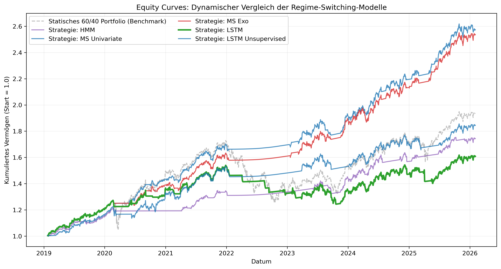
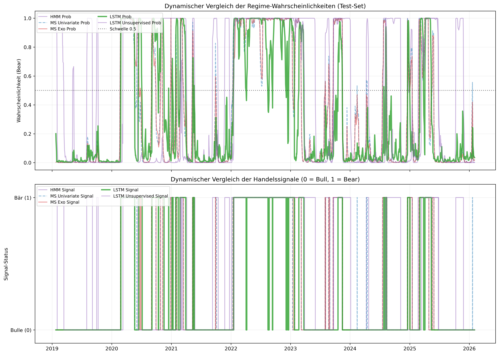

# Dynamische Asset-Allokation mittels Regime-Switching-Modellen

[](https://www.python.org/)
[](LICENSE)

Dieses Repository enthält den Code und die Analysen meiner Master-Thesis zum Thema: 
**"Dynamische Asset-Allokation mittels Regime-Switching-Modellen: Ein Vergleich ökonometrischer Modelle und moderner Machine-Learning-Verfahren zur Reduktion von Maximum Drawdowns"**.

## Ziel der Arbeit

Das Kernziel dieser Master-Thesis ist der **systematische Vergleich** zwischen zwei Paradigmen der Finanzmarktanalyse zur Identifikation von Marktregimes: klassischen **ökonometrischen Modellen** und modernen **Machine-Learning-Verfahren**. 

In einer Zeit zunehmender Marktvolatilität und komplexer Krisenzyklen (wie der Dotcom-Blase, der Finanzkrise 2008 oder der Zinswende 2022) stoßen statische Anlagestrategien oft an ihre Grenzen. Die Arbeit untersucht, inwieweit eine **Dynamische Asset-Allokation (DAA)**, gestützt auf automatisierte Regime-Erkennung, in der Lage ist, das Portfolio aktiv zu schützen.

### Die Untersuchungsschwerpunkte sind:

1.  **Modell-Vergleich:** Evaluierung der Vorhersagegüte von statistisch fundierten ökonometrischen Modellen (z. B. Markov-Switching) gegenüber hochflexiblen Machine-Learning-Architekturen (z. B. LSTM-Netzwerken) unter Einbeziehung von Makro-Indikatoren (VIX, Yield Spreads,...).
2.  **Risikominimierung:** Quantifizierung des Mehrwerts dieser Modelle zur signifikanten **Reduktion von Maximum Drawdowns**. Es wird geprüft, ob die Modelle in der Lage sind, rechtzeitig Signale zur Umschichtung von Risiko-Assets (Aktien) in sichere Häfen (Geldmarkt/Bonds) zu generieren.
3.  **SORR-Prävention:** Die praktische Anwendung fokussiert sich auf die Minderung des **Sequence of Returns Risk (SORR)**. Hierbei soll bewiesen werden, dass eine regimebasierte Steuerung das Pfadrisiko des Vermögensaufbaus glättet und somit die Kapitalsicherheit, insbesondere in der kritischen Phase kurz vor oder zu Beginn der Entnahmephase (Renteneintritt), massiv erhöht.

Durch diesen Vergleich soll aufgezeigt werden, ob die höhere Komplexität moderner KI-Verfahren gegenüber bewährter Ökonometrie einen ökonomisch messbaren Vorteil in der risikoadjustierten Performance liefert.

---

## Methodik & Modelle

In diesem Projekt werden zwei verschiedene Ansätze zur Regime-Erkennung verglichen:

1. **Ökonometrische Modelle:** Diese Modelle basieren auf der Annahme, dass Finanzmärkte stochastischen Prozessen folgen und Regimes als verborgene Zustände (Latent States) mathematisch modelliert werden können.
*   **Markov-Switching-Modelle (MSM):** Ein klassisches Regressionsverfahren, bei dem Parameter (wie Mittelwert und Varianz der Rendite) zwischen Zuständen springen. Die Wechselwahrscheinlichkeiten werden über eine Übergangsmatrix berechnet. In diesem Projekt wird zudem ein **Exogenes MSM** eingesetzt, das Makro-Daten (VIX, Yield Spread) als erklärende Variablen nutzt.
*   **Hidden-Markov-Modelle (HMM):** Ein Unsupervised-Learning-Ansatz aus der Statistik. Das HMM identifiziert Cluster in den Datenverteilungen, um Phasen hoher und niedriger Volatilität voneinander zu trennen, ohne dass vorab gelabelte Daten nötig sind.
2. **Moderne Machine-Learning-Verfahren:** Dieser Ansatz nutzt die Fähigkeit von künstlichen neuronalen Netzen, hochkomplexe, nicht-lineare Zusammenhänge in großen Datenmengen zu identifizieren, ohne explizite statistische Verteilungsannahmen vorauszusetzen.
*   **LSTM-Netzwerke (Long Short-Term Memory):** Eine spezialisierte Form von Recurrent Neural Networks (RNN), die über ein "Gedächtnis" für zeitliche Abhängigkeiten verfügen. In dieser Arbeit wird das LSTM in einem **Supervised-Learning-Setting** eingesetzt: Es lernt, die durch die ökonometrischen Modelle identifizierten Regime-Wechsel unter Berücksichtigung von Zeitreihen-Fenstern (Sequenzen) vorherzusagen.
*   **Unsupervised LSTM (Deep Clustering):** Ein innovativer Ansatz mittels LSTM-Autoencoder. Hierbei lernt das Netzwerk, Markt-Sequenzen in einen hochdimensionalen latenten Raum zu komprimieren, um die „Essenz“ der Marktdynamik zu erfassen. Durch ein anschließendes Clustering (Gaussian Mixture Modeling (GMM)) werden Regimes rein datengetrieben identifiziert, ohne den Einfluss vordefinierter statistischer Labels. Dies dient als objektive Kontrollinstanz, um zu prüfen, ob das RNN eigenständige Risikomuster erkennt, die klassischen Modellen verborgen bleiben.

---

## Aktuelle Ergebnisse

Die folgenden Grafiken werden automatisch generiert und repräsentieren den aktuellen Stand der Backtesting-Simulation auf dem S&P 500 / Long-Bond (60/40) Portfolio.

### 1. Performance-Vergleich (Equity Curves)
Vergleich der kumulierten Rendite zwischen der statischen "Buy & Hold"-Strategie und den aktiven Regime-Switching-Modellen.



### 2. Regime-Erkennung im Detail
Visualisierung der berechneten Wahrscheinlichkeiten für ein Bärenmarkt-Regime über den Testzeitraum.



### 3. Zusammenfassung der Kennzahlen
| Kategorie | Kennzahlen | Relevanz für die Thesis |
| :--- | :--- | :--- |
| **Risikoschutz (SORR)** | **Max Drawdown, Calmar Ratio** | Die primäre Zielgröße. Misst die Effektivität der Verlustvermeidung und das Verhältnis von Rendite zu maximalem Drawdown. |
| **Risikoadjustierung** | **Sortino Ratio, Sharpe Ratio** | Bewertet, ob die Modelle eine Überrendite pro Risikoeinheit liefern. Die Sortino Ratio ist hierbei zentral, da sie gezielt das Abwärtsrisiko (Downside) betrachtet. |
| **Wachstumsdynamik** | **Total Return, CAGR (p.a.)** | Zeigt, ob die Modelle trotz der defensiven Ausrichtung in Bärenmärkten langfristig in der Lage sind, den Markt (Buy & Hold) zu schlagen. |
| **Modellstabilität** | **Regime-Wechsel, Volatilität** | Evaluiert die praktische Umsetzbarkeit. Eine hohe Anzahl an Wechseln ("Churning") deutet auf Instabilität und hohe Transaktionskosten hin. |


👉 **Detaillierte statistische Auswertungen, Tabellen und Einzelauswertungen findest du in der [Statistics.md](./Statistics.md).**

---

## Projektstruktur
- `jupyter/` : Ablageort der Jupyter-Notebook-Files mit der gesamten Pipeline.
- `assets/` : Ordner für persistierte Grafiken und Statistiken.
- `data/` : Lokale Cache-Daten der Yahoo Finance API.
- `README.md` : Projektübersicht.
- `Statistics.md` : Tiefergehende Analyse der Modellergebnisse.

---

## Installation & Start

1. Repository klonen:
   ```bash
   git clone https://github.com/DEIN-PROFIL/regime-switching-daa.git
2. Abhängigkeiten installieren
   ```bash
   pip install yfinance pandas numpy matplotlib scikit-learn tensorflow statsmodels hmmlearn
3. Das Notebook `regime_switching_daa.ipynb` ausführen, um die Ergebnisse zu aktualisieren.

---

## Ausblick & Offene Punkte (Roadmap)

Um die Robustheit und Praxistauglichkeit der dynamischen Asset-Allokation weiter zu steigern, sind folgende Entwicklungsschritte geplant:

### 1. Modell-Erweiterungen
*   **Modell-Varianz:** Integration weiterer populärer Regime-Switching-Ansätze (z. B. GARCH-Modelle, Random Forests oder Gradient Boosting Verfahren) in das Vergleichs-Framework.
*   **Hyperparameter-Optimierung:** Implementierung einer systematischen (ggf. automatisierten) Suche nach optimalen Parametern (z. B. Sensitivitätsanalyse der `window_size`).

### 2. Analyse & Infrastruktur
*   **Erweiterte Visualisierung:** Aufbau umfangreicherer Dashboards zur explorativen Datenanalyse und zur grafischen Aufarbeitung der Modell-Fehlentscheidungen.
*   **Workflow-Optimierung:** Kontinuierliche Verfeinerung der Repository-Struktur und der automatisierten Dokumentations-Pipelines für eine maximale Reproduzierbarkeit.

---

## Lizenz

Dieses Projekt ist unter der MIT-Lizenz lizenziert. Weitere Details findest du in der Datei [LICENSE](./LICENSE).

Autor: Tom Maurer B.Sc.

Master-Thesis
