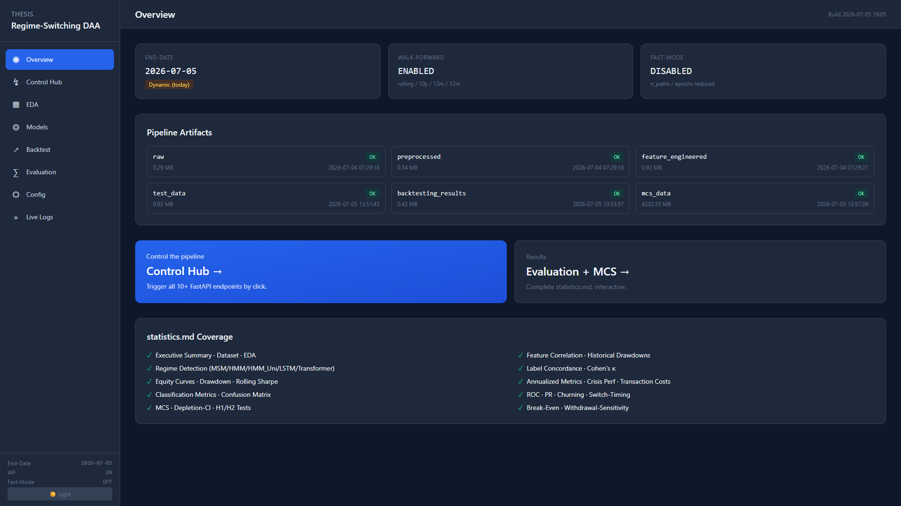
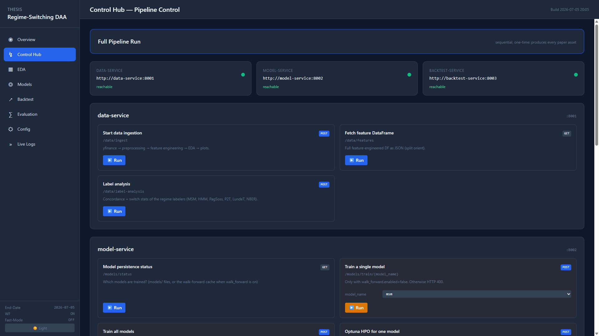
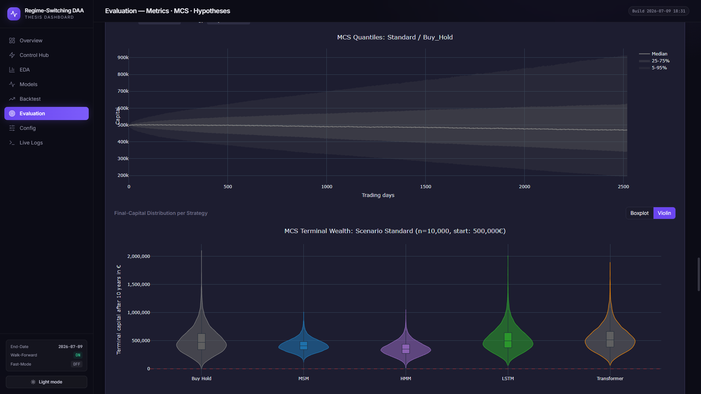
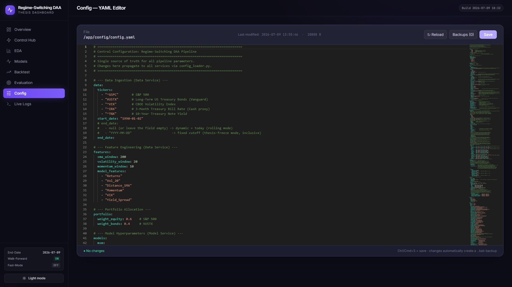
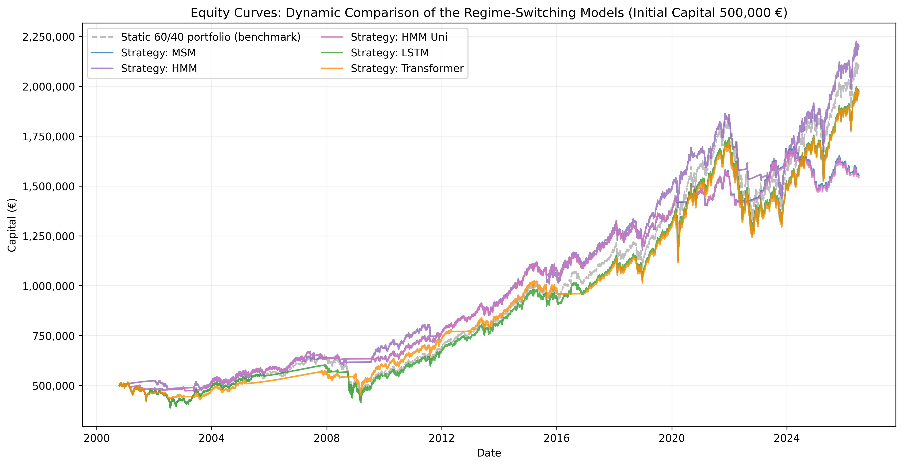
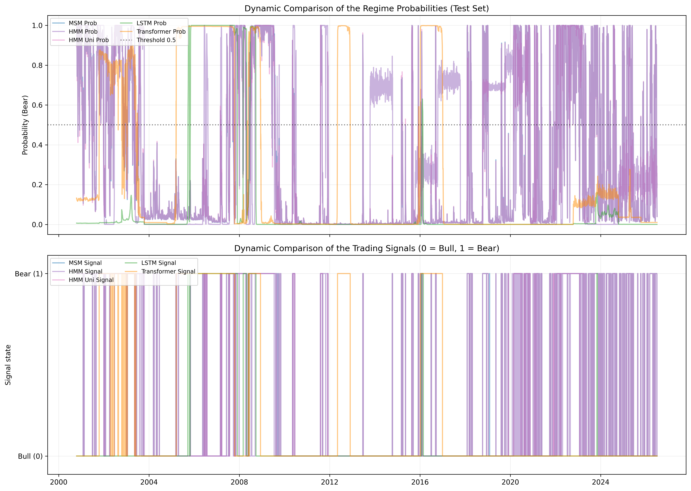
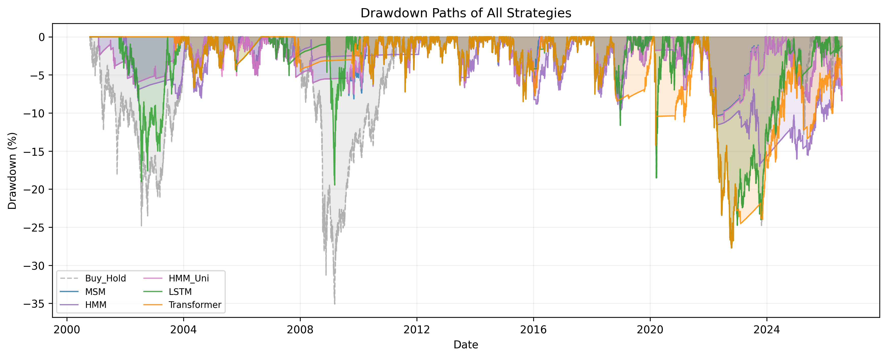
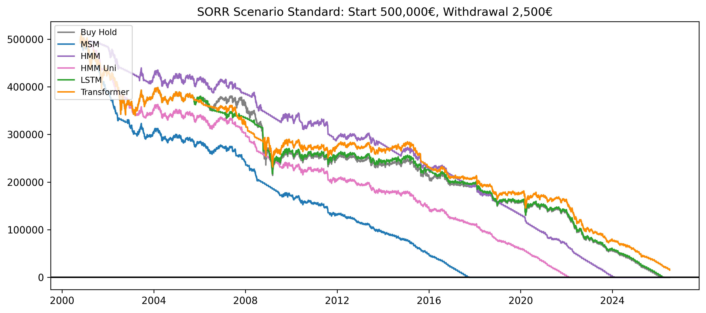
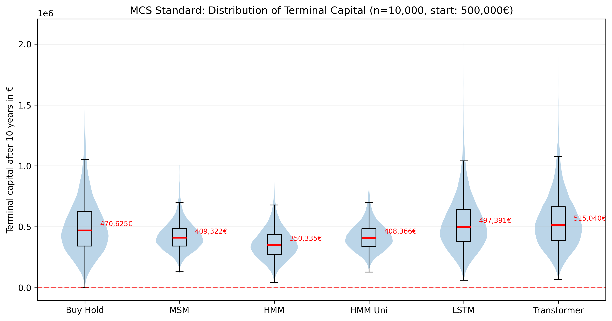

# Dynamic Asset Allocation Using Regime-Switching Models

[](https://www.python.org/)
[](LICENSE)

> **Note:** This work continues the master's thesis of Tom Maurer towards a scientific publication. Original thesis repository: [Torim98/regime-switching-daa](https://github.com/Torim98/regime-switching-daa).

This repository contains the code and analyses of my master's thesis:
**"Dynamic Asset Allocation Using Regime-Switching Models: A Comparison of Econometric Models and Modern Machine-Learning Methods for Reducing Maximum Drawdowns"**.

## Objective

The core objective of this work is a **systematic comparison** of two paradigms of financial market analysis for identifying market regimes: classical **econometric models** and modern **machine-learning methods**.

In periods of elevated market volatility and complex crisis cycles (such as the dot-com bubble, the 2008 financial crisis, or the 2022 interest rate reversal), static investment strategies are particularly exposed to **Sequence of Returns Risk (SORR)**, the risk that market declines at the beginning of a withdrawal phase cause irreversible damage to capital. This project investigates how **dynamic asset allocation (DAA)**, based on **automated regime detection** (bull vs. bear), can be used to smooth portfolio risk and substantially improve capital preservation in retirement by shifting into the money market (cash) in a timely manner.

### Research focus:

1.  **Model comparison:** Evaluation of the predictive performance of statistically grounded econometric models (e.g., Markov switching) versus highly flexible machine-learning architectures (e.g., LSTM networks, Transformers), incorporating macro indicators (VIX, yield spreads, ...).
2.  **Risk reduction:** Quantification of the added value of these models for a significant **reduction of maximum drawdowns**. The analysis examines whether the models can generate timely signals for reallocating risk assets (equities) into safe havens (money market/bonds).
3.  **SORR mitigation:** The practical application focuses on mitigating **Sequence of Returns Risk (SORR)**. The aim is to show that regime-based allocation smooths the path risk of wealth accumulation and thereby substantially improves capital preservation, particularly in the critical phase shortly before or at the beginning of the withdrawal phase (retirement).

This comparison is intended to show whether the higher complexity of modern AI methods provides an economically measurable advantage in risk-adjusted performance over established econometrics.

---

## Methodology & Models

This project compares two different approaches to regime detection:

1. **Econometric models:** These models are based on the assumption that financial markets follow stochastic processes and that regimes can be modeled mathematically as latent states.
*   **Markov-Switching Models (MSM):** A classical regression approach in which parameters (such as the mean and variance of returns) switch between states. Transition probabilities are computed via a transition matrix.
*   **Hidden Markov Models (HMM):** An unsupervised learning approach from statistics. The HMM identifies clusters in the data distributions to separate phases of high and low volatility without requiring pre-labeled data.
*   **Univariate HMM (HMM_Uni):** An ablation variant of the HMM that receives only the 60/40 portfolio returns as input, i.e., the same input space as the MSM. In the MSM-vs-HMM comparison, it separates the architectural effect (clustering vs. Markov-switching regression) from the information contribution of the extended features (VIX, yield spread).
2. **Modern machine-learning methods:** This approach uses the ability of artificial neural networks to identify highly complex, non-linear relationships in large datasets without requiring explicit statistical distributional assumptions.
*   **LSTM networks (Long Short-Term Memory):** A specialized form of recurrent neural networks (RNN) with a "memory" for temporal dependencies. In this work, the LSTM is used in a **supervised learning setting**, trained on Pagan-Sossounov labels (see label analysis via POST /data/label-analysis or src/data/labels/), analogous to the Transformer.
*   **Transformer network (multi-head self-attention):** An attention-based architecture that, unlike recurrent networks, can process **all time steps of a sequence in parallel**. Through the multi-head self-attention mechanism, the model learns which historical time points within a window are most relevant for the current regime classification. A positional encoding preserves the temporal order of the input data. The Transformer is used in a **supervised setting** (trained on Pagan-Sossounov labels, see label analysis via POST /data/label-analysis or src/data/labels/) and serves to test hypothesis H2: whether attention-based architectures achieve higher predictive performance than econometric models and recurrent networks.

---

## Technology Stack

The research environment is built on a modern data-science stack that combines stability with high computational performance:

*   **Programming language:** Python 3.11+
*   **Data sources:** Yahoo Finance API (`yfinance`)
*   **Data processing:** `Pandas`, `NumPy`, `PyArrow` (Parquet engine)
*   **Econometrics & statistics:** `Statsmodels` (Markov regression), `hmmlearn` (Hidden Markov Models), `SciPy`
*   **Machine learning:** `TensorFlow` / `Keras` (LSTM architectures), `PyTorch` (Transformer), `Scikit-Learn`
*   **Hyperparameter optimization:** `Optuna` (exhaustive grid for the econometric models, multivariate TPE for the deep-learning models)
*   **Reporting:** `Matplotlib` (visualization), `Seaborn` (heatmaps), `Tabulate` (Markdown export)
*   **Microservices:** `FastAPI`, `Uvicorn`, `Docker` / `Docker Compose`

---

## Architecture

The project runs on a containerized microservice architecture. All services share the same business logic (`src/`), configuration (`config/config.yaml`), and data persistence (medallion architecture).

Four containerized FastAPI services cover the entire pipeline and the frontend:

| Service | Port | Description |
|---------|------|-------------|
| **Data Service** | 8001 | Data acquisition, preprocessing, feature engineering, EDA |
| **Model Service** | 8002 | Training & prediction (MSM, HMM, HMM_Uni, LSTM, Transformer) |
| **Backtest Service** | 8003 | Backtesting, SORR, Monte Carlo simulation, reporting |
| **Dashboard Service** | 8004 | Interactive UI: EDA/backtest/evaluation visualization, control hub for all pipeline endpoints, YAML config editor, live log streaming |

The pipeline services communicate via shared filesystem volumes; the dashboard service reads the same artifacts read-only and calls the other services through an `httpx` proxy. Orchestration via `docker-compose`.

**Further documentation:**
* [Microservice Architecture & Setup](docs/microservice-architecture.md)
* [Dashboard Service (UI & Control Hub)](docs/dashboard-service.md)
* [Sequence Diagram: Microservice Pipeline](docs/microservice-sequence-diagram.md)
* [API Endpoints & Routes](docs/fastapi-endpoints.md)

> Since all services are based on FastAPI, an interactive **Swagger UI** is available for each service after startup (via `docker-compose up`):
> * Data Service: [http://localhost:8001/docs](http://localhost:8001/docs)
> * Model Service: [http://localhost:8002/docs](http://localhost:8002/docs)
> * Backtest Service: [http://localhost:8003/docs](http://localhost:8003/docs)
> * Dashboard Service: [http://localhost:8004/docs](http://localhost:8004/docs)
>
> The **interactive frontend** itself runs at [http://localhost:8004/](http://localhost:8004/) (bound to `127.0.0.1` only, dev-only). It triggers all pipeline steps with a single click, visualizes all artifacts with Plotly, allows editing `config.yaml` with automatic backup/rollback, and streams container logs via WebSocket (equivalent to `docker compose logs -f`).

### Dashboard (Screenshots)

| Overview | Control Hub |
|:---:|:---:|
|  |  |
| Status tiles, pipeline artifacts, coverage map | Trigger all endpoints with one click, health tiles, JSON viewer |

| Evaluation | Config Editor |
|:---:|:---:|
|  |  |
| Interactive Plotly charts, MCS quantiles, hypothesis tests | Monaco YAML editor with backup/restore, dirty state |

---

## Engineering Concepts

The pipeline is built on established concepts from software engineering and quantitative finance to ensure the validity of the results:

### Data Persistence & Decoupling
To decouple the pipeline steps from one another and use memory efficiently, intermediate results are stored in the **Apache Parquet format**. Compared to CSV, Parquet offers higher performance and preserves data-type integrity (especially timestamps), which is essential for time-series analysis. Data storage follows a **[medallion model](./docs/data-architecture.md)** (Bronze → Silver → Gold) for a clear separation of raw data, cleaned intermediate results, and final analysis outputs.

### Shared Business Logic
All domain logic is encapsulated in reusable Python modules under `src/`. All FastAPI services import from the same modules, which guarantees consistency across the entire pipeline.

### Model Persistence & Caching
Trained models (MSM, HMM, LSTM, Transformer) are cached in the `models/` directory. This makes it possible to skip computationally expensive training and load pre-trained models instead. The behavior is controlled via `model_persistence.enabled` in `config.yaml`. If the option is enabled and the model files exist, training is skipped automatically. Otherwise, training runs normally and the result is stored for future runs.

### Walk-Forward Validation
A configurable walk-forward framework is available for robust out-of-sample evaluation (`walk_forward.enabled: true` in `config.yaml`). Instead of a single 80/20 split, rolling folds are generated (10 years training, 12 months test, 12 months step), with each model retrained per fold. The OOS predictions of all folds are aggregated into a continuous series. A fingerprint-based Parquet cache prevents unnecessary retraining when the configuration is unchanged. In walk-forward mode, model persistence is disabled since each fold produces its own model. A per-fold bear-market coverage diagnostic (`assets/bear_coverage.md`, generated during evaluation and reproducible via `python -m src.backtest.bear_coverage`) quantifies how much crisis exposure the OOS windows actually carry (see [Limitations](docs/limitations.md)).

### Avoiding Look-Ahead Bias
A critical aspect of backtesting is preventing information leakage from the future. All generated trading signals are systematically shifted by one time step ($T+1$). Decisions are therefore made exclusively on the basis of historical information available at the time of trading.

### Data-Driven Automation (Dynamic Matching)
The framework is **fully dynamic**. A dedicated matching algorithm automatically identifies new model outputs based on a defined naming scheme (`Model_Signal`). New model architectures can therefore be integrated without manually adapting the code for backtesting, evaluation, or reporting. See [How to Add a ML Model](docs/how-to-add-ml-model.md).

### Hyperparameter Optimization (Optuna)
All model parameters are searched using the walk-forward splits as inner cross-validation. The econometric models (MSM, HMM, HMM_Uni) are searched exhaustively via a `GridSampler`; the deep-learning models (LSTM, Transformer) via a multivariate TPE sampler. The objective is a configurable risk metric (default: the Martin ratio, CAGR / Ulcer index) computed on the **pooled** OOS return series across all folds, which aligns the search with the sequence-of-returns-risk goal instead of a symmetric median Sharpe. Optuna only observes OOS metrics, so the search introduces no look-ahead bias. Selection and evaluation are time-separated: the search runs on the development folds only (`tune_until`), while the final walk-forward run uses all folds, keeping the holdout (COVID, 2022) selection-free. Results are persisted in a SQLite database at `models/optuna_studies.db` (resumable), and a post-HPO analysis pass reports convergence, objective sensitivity, the Deflated Sharpe Ratio, PBO and multi-seed robustness under `assets/`. Full description: [docs/hyperparameter-optimization.md](docs/hyperparameter-optimization.md).
In addition, the econometric models use only **filtered regime probabilities** P(regime_t | data up to t): the MSM uses `filtered_marginal_probabilities` (statsmodels), and both HMM variants use an explicit forward pass without backward recursion. Smoothed posteriors (forward-backward, e.g., hmmlearn's `predict_proba`) would carry information from the future of the test window into the signal and systematically bias the OOS results.

### Realistic Cost Simulation
The simulation accounts for real market frictions:
*   **Transaction costs:** Every reallocation between the portfolio and cash incurs a fee (0.1%).
*   **Liquidity fees:** Withdrawals during invested market phases incur additional selling fees, while withdrawals from cash holdings are free of charge.

### Automated Reporting (Live Docs)
The file `statistics.md` is regenerated at the end of every pipeline run. Markdown tables and PNG assets are embedded directly into the document, providing complete and always up-to-date documentation of the research results.

### Interactive Control Hub & Visualization
The **Dashboard Service** (`:8004`) provides a modern zero-build frontend (Tailwind + Plotly + HTMX + Alpine.js + Monaco). It covers four areas: (1) interactive visualization of all pipeline artifacts including full `statistics.md` coverage, (2) a **control hub** that calls all FastAPI endpoints of the three pipeline services with a single click (via `httpx` proxy with long read timeouts for walk-forward runs), (3) a **YAML config editor** with server-side validation, atomic swap, and automatic rollback on reload errors, and (4) **live log streaming** via WebSocket file tail. The service remains bound to `127.0.0.1` (dev-only) and modifies nothing in the pipeline artifacts except `config/config.yaml` (with `.bak` backup).

---

## Quickstart: Docker Compose (one command)

```bash
git clone https://github.com/Torim98/regime-switching-daa-paper.git
cd regime-switching-daa-paper
docker-compose up --build -d

# Option 1: run the pipeline via curl
curl -X POST http://localhost:8001/data/ingest
curl -X POST http://localhost:8002/models/optimize-all    # Optional: hyperparameter optimization
curl -X POST http://localhost:8002/models/train-all
curl -X POST http://localhost:8003/backtest/run
curl -X POST http://localhost:8003/backtest/evaluate

# Option 2: interactive dashboard in the browser (recommended)
#   http://localhost:8004/        ← EDA, backtest, evaluation, MCS, config editor, live logs
#   http://localhost:8004/hub     ← Trigger all pipeline endpoints with one click
#
# Swagger UIs: http://localhost:8001/docs, :8002/docs, :8003/docs, :8004/docs
```

---

## The Research Pipeline (Modular Design)

The pipeline is designed as a sequence of service endpoints. Each step builds on the persisted data (Parquet, medallion architecture) of its predecessor:

1.  **Data Service** (`POST /data/ingest`): Download (YFinance) and cleaning of the multi-asset data (equities, bonds, cash), feature engineering (technical and macroeconomic indicators), and EDA.
2.  **Data Service** (`POST /data/label-analysis`) *(optional)*: Comparison of alternative regime labelers (Pagan-Sossounov, Peak-to-Trough, Lunde-Timmermann, NBER) against MSM/HMM. Produces a concordance matrix and switch statistics; justifies the label choice (Pagan-Sossounov) for LSTM and Transformer.
3.  **Model Service** (`POST /models/optimize-all`) *(optional)*: Hyperparameter optimization via Optuna (grid for the econometric models, TPE for the deep-learning models) with walk-forward as inner CV, on the development folds only. Executed once before the final run; `POST /models/hpo-analysis` then generates the post-HPO reports.
4.  **Model Service** (`POST /models/train-all`): Training of the regime-switching models (MSM, HMM, HMM_Uni, LSTM, Transformer). With `walk_forward.enabled: false`, a classic 80/20 split with optional model persistence; with `true`, rolling walk-forward validation with OOS caching.
5.  **Backtest Service** (`POST /backtest/run`): Simulation of realistic investment scenarios including variable withdrawals and transaction costs.
6.  **Backtest Service** (`POST /backtest/evaluate`): Stress tests via bootstrap Monte Carlo simulation (block or stationary, selectable via `evaluation.mcs.bootstrap_method`), hypothesis tests, and automated consolidation of all results into `docs/statistics.md`.
7.  **Backtest Service** (`POST /backtest/bootstrap-robustness`) *(optional)*: Re-runs the MCS with both resampling schemes (block and stationary, same seed, no re-training) and writes `assets/bootstrap_robustness.md` comparing depletion rate and median terminal capital (Issue #7).

---

## Current Results (Live Update)

The following figures are generated automatically and represent the current state of the backtesting simulation on the S&P 500 / long-bond (60/40) portfolio.

### 1. Performance Comparison (Equity Curves)
Comparison of cumulative returns between the static buy-and-hold strategy and the active regime-switching models.



### 2. Regime Detection in Detail
Visualization of the estimated bear-market regime probabilities over the test period.



### 3. Drawdown Profile
Drawdowns of all strategies over time. Shows where regime switching reduces crisis drawdowns.



### 4. Summary of Metrics
| Category | Metrics | Relevance for the thesis |
| :--- | :--- | :--- |
| **Downside protection (SORR)** | **Max drawdown, Calmar ratio** | The primary target metric. Measures the effectiveness of loss avoidance and the ratio of return to maximum drawdown. |
| **Risk adjustment** | **Sortino ratio, Sharpe ratio** | Assesses whether the models deliver excess return per unit of risk. The Sortino ratio is central here, as it specifically considers downside risk. |
| **Growth dynamics** | **Total return, CAGR (p.a.)** | Shows whether the models, despite their defensive positioning in bear markets, can outperform the market (buy and hold) in the long run. |
| **Model stability** | **Regime switches, volatility** | Evaluates practical feasibility. A high number of switches ("churning") indicates instability and high transaction costs. |

### 5. Risk Profile (SORR Stress Test)
Simulation of a withdrawal phase: how long does the capital last under market shocks and monthly pension payments?



### 6. Statistical Significance (Monte Carlo Simulation)
To assess statistical significance, 10,000 artificial market paths were simulated via stationary bootstrap (Politis & Romano 1994; selectable via `evaluation.mcs.bootstrap_method`, block bootstrap as the alternative).



Detailed statistical evaluations, tables, and individual analyses: **[statistics.md](./docs/statistics.md)**

---

## Project Structure

```
regime-switching-daa/
├── assets/          Generated figures and statistics (PNG, Markdown)
├── config/          Central configuration (config.yaml, config_loader.py)
├── data/            Medallion architecture (bronze/ silver/ gold/)
├── docs/            Project documentation
├── jupyter/		 Exploratory notebooks (additional thesis analyses)
├── logs/            Service log files
├── models/          Persisted model files (.pkl, .keras, .pt) + Optuna DB
├── services/        FastAPI microservices
│   ├── data_service/
│   ├── model_service/
│   ├── backtest_service/
│   └── dashboard_service/   Interactive frontend (UI, control hub, config editor, live logs)
├── src/             Shared business logic
│   ├── data/        Ingestion, preprocessing, feature engineering, EDA, plots
│   ├── models/      MSM, HMM, HMM_Uni, LSTM, Transformer, plots
│   └── backtest/    Engine, walk-forward, optimize, SORR, evaluation, reporting, plots
├── docker-compose.yml
├── pyproject.toml
└── README.md
```

---

## Documentation

| Document | Description |
|----------|-------------|
| [Repository Index](docs/index.md) | Navigation hub: categorized listing of all repo files |
| [Data Architecture](docs/data-architecture.md) | Medallion model (Bronze/Silver/Gold) |
| [Microservice Architecture](docs/microservice-architecture.md) | Services, endpoints, volumes, logging |
| [Dashboard Service](docs/dashboard-service.md) | UI page structure, control hub, config editor, WebSocket log streaming, security |
| [Sequence Diagram: Microservices](docs/microservice-sequence-diagram.md) | Mermaid sequence diagram of the microservice pipeline |
| [How to Add a ML Model](docs/how-to-add-ml-model.md) | Integration guide for new models |
| [Statistics (Live)](docs/statistics.md) | Auto-generated results and tables |
| [FastAPI Endpoints](docs/fastapi-endpoints.md) | API routes and parameters of all four services |

---

## Reproducibility

MSM is fully deterministic (maximum-likelihood estimation without a random source). HMM and HMM_Uni depend on the EM initialization: a single fit is seed-sensitive (the multivariate HMM in particular), so the walk-forward uses multi-start EM (`models.hmm.n_init`) and keeps the highest training-likelihood fit. LSTM and Transformer are non-deterministic (random weight initialization, batch shuffling, GPU); the walk-forward averages a seed ensemble (`walk_forward.dl_ensemble_size`) to stabilize the predictions before thresholding. The residual seed sensitivity of every model is quantified in `assets/seed_sensitivity.md` (generated by `src/backtest/seed_sensitivity.py`, also runnable from the dashboard). Any remaining deviations cascade into backtesting, SORR, and the Monte Carlo simulation.

---

## Limitations

Certain influencing factors were deliberately excluded from the scope of the thesis. Since all models and the benchmark operate under identical conditions, the relative comparison remains unaffected. Details and rationale: **[Limitations & Scope Boundaries](docs/limitations.md)**

---

## License

This project is licensed under the MIT License. See the [LICENSE](./LICENSE) file for details.

**Authors:** Tom Maurer M.Sc.; Prof. Dr. Christian Müller-Kett; Prof. Dr. Thomas Zöller<br>
**Academic context:** Continuation of a [master's thesis project](https://github.com/Torim98/regime-switching-daa) in quantitative finance / data science for publication purposes.
