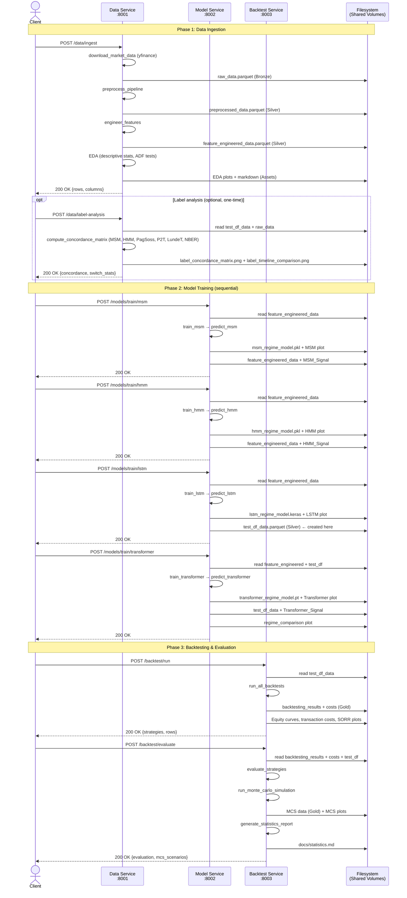
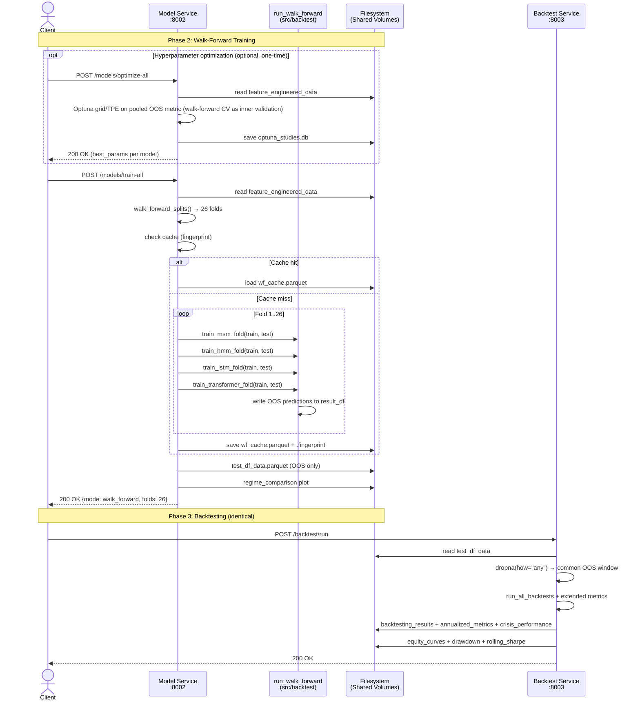
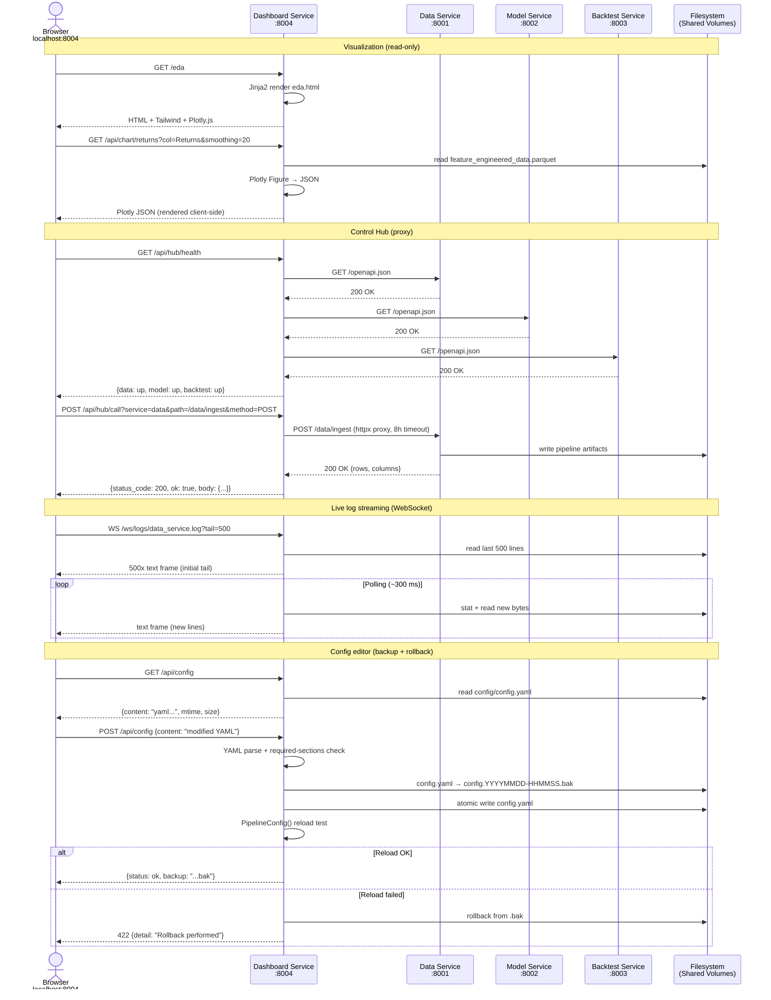

# Sequence Diagram: Microservice Pipeline

## Inference Run (End-to-End)

## Walk-Forward Mode (`walk_forward.enabled: true`)

## Dashboard Service: Control Hub & Visualization

The Dashboard Service (`:8004`) is not a pipeline step but a UI layer on top. It reads the artifacts read-only from the filesystem and proxies pipeline calls to the three services. The following diagram shows the typical interaction paths.

