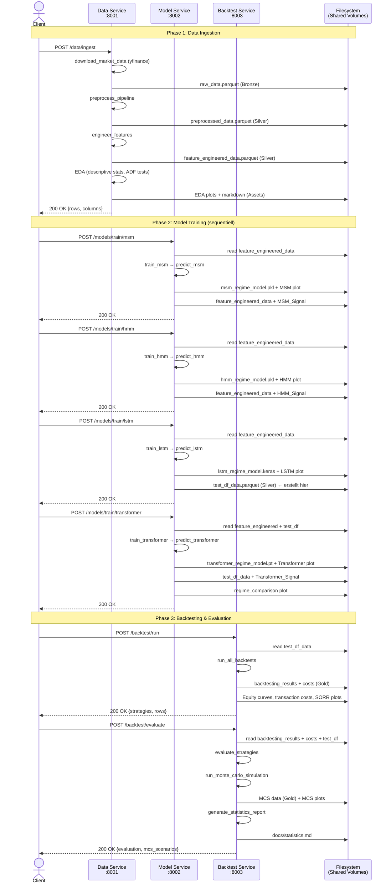
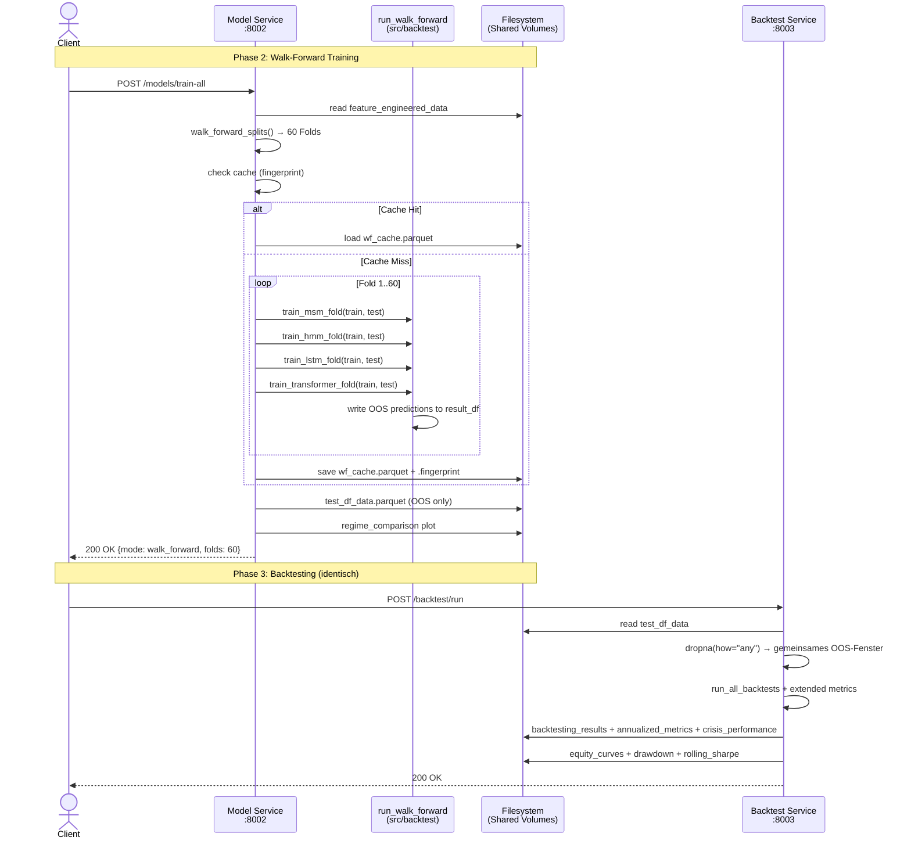

# Sequenzdiagramm: Microservice Pipeline

## Inferenz-Durchlauf (End-to-End)

```mermaid
sequenceDiagram
    actor Client
    participant DS as Data Service<br/>:8001
    participant MS as Model Service<br/>:8002
    participant BS as Backtest Service<br/>:8003
    participant FS as Filesystem<br/>(Shared Volumes)

    Note over Client,FS: Phase 1: Data Ingestion
    Client->>DS: POST /data/ingest
    DS->>DS: download_market_data (yfinance)
    DS->>FS: raw_data.parquet (Bronze)
    DS->>DS: preprocess_pipeline
    DS->>FS: preprocessed_data.parquet (Silver)
    DS->>DS: engineer_features
    DS->>FS: feature_engineered_data.parquet (Silver)
    DS->>DS: EDA (descriptive stats, ADF tests)
    DS->>FS: EDA plots + markdown (Assets)
    DS-->>Client: 200 OK {rows, columns}

    Note over Client,FS: Phase 2: Model Training (sequentiell)
    Client->>MS: POST /models/train/msm
    MS->>FS: read feature_engineered_data
    MS->>MS: train_msm → predict_msm
    MS->>FS: msm_regime_model.pkl + MSM plot
    MS->>FS: feature_engineered_data + MSM_Signal
    MS-->>Client: 200 OK

    Client->>MS: POST /models/train/hmm
    MS->>FS: read feature_engineered_data
    MS->>MS: train_hmm → predict_hmm
    MS->>FS: hmm_regime_model.pkl + HMM plot
    MS->>FS: feature_engineered_data + HMM_Signal
    MS-->>Client: 200 OK

    Client->>MS: POST /models/train/lstm
    MS->>FS: read feature_engineered_data
    MS->>MS: train_lstm → predict_lstm
    MS->>FS: lstm_regime_model.keras + LSTM plot
    MS->>FS: test_df_data.parquet (Silver) ← erstellt hier
    MS-->>Client: 200 OK

    Client->>MS: POST /models/train/transformer
    MS->>FS: read feature_engineered + test_df
    MS->>MS: train_transformer → predict_transformer
    MS->>FS: transformer_regime_model.pt + Transformer plot
    MS->>FS: test_df_data + Transformer_Signal
    MS->>FS: regime_comparison plot
    MS-->>Client: 200 OK

    Note over Client,FS: Phase 3: Backtesting & Evaluation
    Client->>BS: POST /backtest/run
    BS->>FS: read test_df_data
    BS->>BS: run_all_backtests
    BS->>FS: backtesting_results + costs (Gold)
    BS->>FS: Equity curves, transaction costs, SORR plots
    BS-->>Client: 200 OK {strategies, rows}

    Client->>BS: POST /backtest/evaluate
    BS->>FS: read backtesting_results + costs + test_df
    BS->>BS: evaluate_strategies
    BS->>BS: run_monte_carlo_simulation
    BS->>FS: MCS data (Gold) + MCS plots
    BS->>BS: generate_statistics_report
    BS->>FS: docs/statistics.md
    BS-->>Client: 200 OK {evaluation, mcs_scenarios}
```

## Walk-Forward-Modus (`walk_forward.enabled: true`)

```mermaid
sequenceDiagram
    actor Client
    participant MS as Model Service<br/>:8002
    participant WF as run_walk_forward<br/>(src/backtest)
    participant FS as Filesystem<br/>(Shared Volumes)
    participant BS as Backtest Service<br/>:8003

    Note over Client,FS: Phase 2: Walk-Forward Training
    Client->>MS: POST /models/train-all
    MS->>FS: read feature_engineered_data
    MS->>MS: walk_forward_splits() → 60 Folds
    MS->>MS: check cache (fingerprint)
    alt Cache Hit
        MS->>FS: load wf_cache.parquet
    else Cache Miss
        loop Fold 1..60
            MS->>WF: train_msm_fold(train, test)
            MS->>WF: train_hmm_fold(train, test)
            MS->>WF: train_lstm_fold(train, test)
            MS->>WF: train_transformer_fold(train, test)
            WF->>WF: write OOS predictions to result_df
        end
        MS->>FS: save wf_cache.parquet + .fingerprint
    end
    MS->>FS: test_df_data.parquet (OOS only)
    MS->>FS: regime_comparison plot
    MS-->>Client: 200 OK {mode: walk_forward, folds: 60}

    Note over Client,FS: Phase 3: Backtesting (identisch)
    Client->>BS: POST /backtest/run
    BS->>FS: read test_df_data
    BS->>BS: dropna(how="any") → gemeinsames OOS-Fenster
    BS->>BS: run_all_backtests + extended metrics
    BS->>FS: backtesting_results + annualized_metrics + crisis_performance
    BS->>FS: equity_curves + drawdown + rolling_sharpe
    BS-->>Client: 200 OK
```