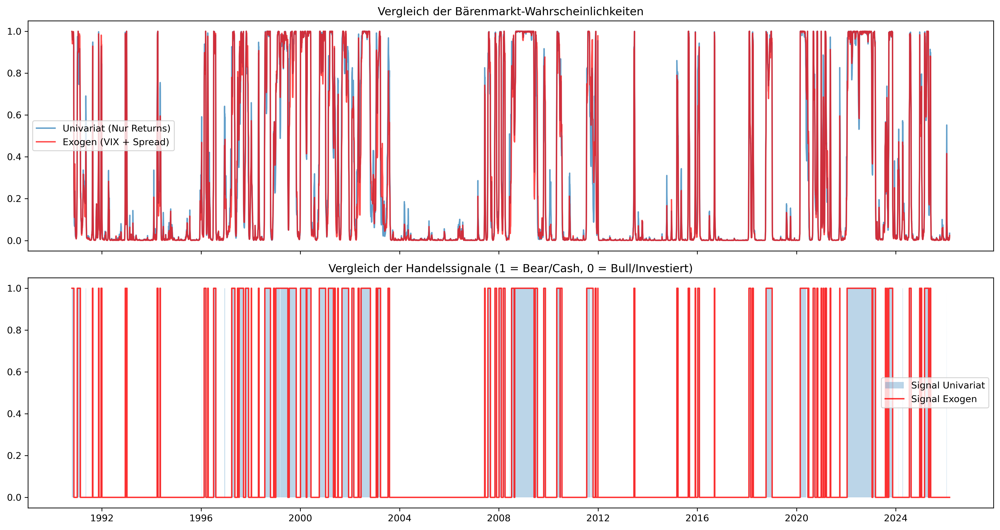
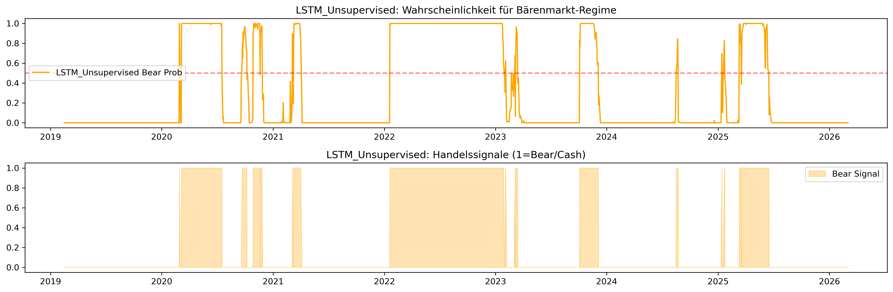

# Detaillierte statistische Auswertung & Forschungsergebnisse

Diese Seite dokumentiert die numerischen und grafischen Ergebnisse der Forschungs-Pipeline. Alle Auswertungen basieren auf dem Datensatz bis zum gestrigen Tag und werden automatisiert aktualisiert.

---

## 1. Executive Summary: Performance & Risiko
Ein direkter Vergleich der Kernkennzahlen über den gesamten **Out-of-Sample Testzeitraum**.

| Strategie         |   Final Wealth | Total Return   | Max Drawdown   |
|:------------------|---------------:|:---------------|:---------------|
| Buy_Hold          |         1.8801 | +88.01%        | -27.10%        |
| HMM               |         1.7249 | +72.49%        | -5.64%         |
| MS_Univariate     |         2.497  | +149.70%       | -6.25%         |
| MS_Exo            |         2.4328 | +143.28%       | -5.44%         |
| LSTM              |         1.7632 | +76.32%        | -13.04%        |
| LSTM_Unsupervised |         1.6856 | +68.56%        | -10.53%        |
| Transformer       |         1.5324 | +53.24%        | -8.00%         |

> **Kernaussage:** Vergleiche den **Max Drawdown** der aktiven Strategien mit der Buy & Hold Benchmark. Ziel der Arbeit ist eine signifikante Reduktion dieses Werts zur Minderung des SORR.

---

## 2. Datenbasis & Baseline Portfolio
Grundlage der Untersuchung ist ein globaler Multi-Asset-Ansatz.

### 60/40 Portfolio Kapitalkurve
Die Abbildung zeigt die kumulierte Wertentwicklung des statischen Referenzportfolios (60% Aktien / 40% Anleihen).

*   **Datenquelle:** S&P 500 (`^GSPC`) und Vanguard Long-Term Treasury (`VUSTX`).
*   **Reproduzierbarkeit:** Der bereinigte Datensatz inkl. aller Features ist hinterlegt unter: `data/02_feature_engineered_data.parquet`.

---

## 3. Regime-Erkennung der Einzelmodelle
Hier werden die Identifikations-Ergebnisse der Modell-Kategorien (Statistik, Clustering, Deep Learning) visualisiert.

### A. Hidden Markov Model (Unsupervised Clustering)

### B. Markov-Switching-Modelle (Ökonometrie)
Vergleich zwischen univariatem Ansatz und exogenem Ansatz (unter Berücksichtigung von VIX & Yield Spread).

### C. LSTM-Netzwerk (Deep Learning)
Vorhersage der Marktphasen durch das neuronale Netzwerk (trainiert auf Markov-Labels).

### D. Unsupervised LSTM-Netzwerk (Deep Learning)
Identifikation von Marktregimes mittels eines LSTM-Autoencoders in Kombination mit Gaussian Mixture Modeling (GMM). Im Gegensatz zum Supervised-Ansatz lernt dieses Modell ohne vordefinierte Labels (wie HMM oder Markov) und identifiziert Regime-Strukturen rein datengetrieben durch die Kompression und Rekonstruktion zeitlicher Sequenzen.

### E. Transformer-Netzwerk (Attention-basierte Regime-Erkennung)
"Klassifikation von Marktregimes mittels eines Transformer-Encoders mit Multi-Head Self-Attention und Positional Encoding. Im Gegensatz zu rekurrenten Architekturen (LSTM) verarbeitet der Transformer alle Zeitschritte einer Sequenz parallel und lernt über den Attention-Mechanismus, welche historischen Datenpunkte die höchste Relevanz für die aktuelle Regime-Klassifikation besitzen. Trainiert im Supervised-Setting auf Markov-Labels.

### F. Globaler Regime-Vergleich
Detaillierte Gegenüberstellung der Wahrscheinlichkeiten und harten Signale aller Modelle.

---

## 4. Backtesting & Strategie-Evaluation
Die ökonomische Anwendung der Regime-Signale durch dynamische Umschichtung in den Geldmarkt.

### Equity Curves im Vergleich

### Umfassende Kennzahlen-Matrix
Detaillierte statistische Analyse inklusive risikoadjustierter Kennzahlen (Sharpe, Sortino, Calmar).

| Strategie         | Total Return   | CAGR (p.a.)   | Volatilität   | Max Drawdown   |   Sharpe Ratio |   Sortino Ratio |   Calmar Ratio |   Regime-Wechsel | Gesamtkosten (Gebühren)   |
|:------------------|:---------------|:--------------|:--------------|:---------------|---------------:|----------------:|---------------:|-----------------:|:--------------------------|
| Buy Hold          | 86.73%         | 9.27%         | 12.61%        | -27.10%        |           0.77 |            0.99 |           0.34 |                0 | 0.00%                     |
| HMM               | 71.31%         | 7.94%         | 4.83%         | -5.64%         |           1.61 |            1.51 |           1.41 |               31 | 3.10%                     |
| MS Univariate     | 148.00%        | 13.76%        | 6.33%         | -6.25%         |           2.08 |            2.7  |           2.2  |               42 | 4.20%                     |
| MS Exo            | 141.62%        | 13.34%        | 6.41%         | -5.44%         |           1.99 |            2.58 |           2.45 |               38 | 3.80%                     |
| LSTM              | 75.12%         | 8.28%         | 8.14%         | -13.04%        |           1.02 |            1.26 |           0.63 |               30 | 3.00%                     |
| LSTM Unsupervised | 67.41%         | 7.59%         | 7.47%         | -10.53%        |           1.02 |            1.21 |           0.72 |               34 | 3.40%                     |
| Transformer       | 52.20%         | 6.14%         | 6.53%         | -8.00%         |           0.95 |            1.06 |           0.77 |               54 | 5.40%                     |

### Transaktionskosten

Diese Grafik zeigt die kumulierten Transaktionskosten im Zeitverlauf. Steile Anstiege deuten auf instabile Regime-Wechsel ("Churning") hin.

Stress-Test: Sequence of Returns Risk (SORR)
Außerdem wurde die Überlebensdauer des Kapitals in einer simulierten Entnahmephase (Ruhestandsszenario) durchgeführt.

### SORR-Simulation: Vergleich der Entnahmeszenarien

In dieser Tabelle werden verschiedene Stress-Szenarien (Standard, Aggressiv, Geringes Kapital) gegenübergestellt.

|                                      | Endkapital   | Status        |
|:-------------------------------------|:-------------|:--------------|
| ('Standard', 'Buy Hold')             | 646,886.32 € | Kapitalerhalt |
| ('Standard', 'HMM')                  | 575,161.36 € | Kapitalerhalt |
| ('Standard', 'MS Univariate')        | 899,251.03 € | Kapitalerhalt |
| ('Standard', 'MS Exo')               | 865,987.54 € | Kapitalerhalt |
| ('Standard', 'LSTM')                 | 600,876.93 € | Kapitalerhalt |
| ('Standard', 'LSTM Unsupervised')    | 561,182.00 € | Kapitalerhalt |
| ('Standard', 'Transformer')          | 505,822.54 € | Kapitalerhalt |
| ('Aggressive', 'Buy Hold')           | 474,831.96 € | Kapitalerhalt |
| ('Aggressive', 'HMM')                | 406,322.45 € | Kapitalerhalt |
| ('Aggressive', 'MS Univariate')      | 694,805.09 € | Kapitalerhalt |
| ('Aggressive', 'MS Exo')             | 660,709.73 € | Kapitalerhalt |
| ('Aggressive', 'LSTM')               | 436,042.35 € | Kapitalerhalt |
| ('Aggressive', 'LSTM Unsupervised')  | 395,650.79 € | Kapitalerhalt |
| ('Aggressive', 'Transformer')        | 352,730.17 € | Kapitalerhalt |
| ('Low_Capital', 'Buy Hold')          | 330,780.34 € | Kapitalerhalt |
| ('Low_Capital', 'HMM')               | 288,817.18 € | Kapitalerhalt |
| ('Low_Capital', 'MS Univariate')     | 471,401.97 € | Kapitalerhalt |
| ('Low_Capital', 'MS Exo')            | 451,166.59 € | Kapitalerhalt |
| ('Low_Capital', 'LSTM')              | 305,581.30 € | Kapitalerhalt |
| ('Low_Capital', 'LSTM Unsupervised') | 281,532.13 € | Kapitalerhalt |
| ('Low_Capital', 'Transformer')       | 252,462.73 € | Kapitalerhalt |

Abbildung der Kapitalentwicklung der unterschiedlichen Szenarien:

### MCS: Block-Bootstrap Robustness-Check

Um die statistische Signifikanz zu prüfen, wurden 1.000 künstliche Marktpfade mittels Block-Bootstrap simuliert.

|                                      | Ruin-Wahrscheinlichkeit   | Median Endkapital   |
|:-------------------------------------|:--------------------------|:--------------------|
| ('Standard', 'Buy Hold')             | 0.00%                     | 793,324.31 €        |
| ('Standard', 'HMM')                  | 0.00%                     | 629,977.03 €        |
| ('Standard', 'MS Univariate')        | 0.00%                     | 1,277,197.69 €      |
| ('Standard', 'MS Exo')               | 0.00%                     | 1,234,694.95 €      |
| ('Standard', 'LSTM')                 | 0.00%                     | 639,890.05 €        |
| ('Standard', 'LSTM Unsupervised')    | 0.00%                     | 604,878.72 €        |
| ('Standard', 'Transformer')          | 0.00%                     | 493,383.64 €        |
| ('Aggressive', 'Buy Hold')           | 0.00%                     | 469,792.44 €        |
| ('Aggressive', 'HMM')                | 0.00%                     | 384,686.47 €        |
| ('Aggressive', 'MS Univariate')      | 0.00%                     | 894,262.40 €        |
| ('Aggressive', 'MS Exo')             | 0.00%                     | 851,946.57 €        |
| ('Aggressive', 'LSTM')               | 0.00%                     | 408,691.58 €        |
| ('Aggressive', 'LSTM Unsupervised')  | 0.00%                     | 350,243.09 €        |
| ('Aggressive', 'Transformer')        | 0.00%                     | 255,199.10 €        |
| ('Low_Capital', 'Buy Hold')          | 1.00%                     | 354,639.02 €        |
| ('Low_Capital', 'HMM')               | 0.00%                     | 295,481.15 €        |
| ('Low_Capital', 'MS Univariate')     | 0.00%                     | 598,246.14 €        |
| ('Low_Capital', 'MS Exo')            | 0.00%                     | 587,170.08 €        |
| ('Low_Capital', 'LSTM')              | 0.00%                     | 312,296.41 €        |
| ('Low_Capital', 'LSTM Unsupervised') | 0.00%                     | 258,446.82 €        |
| ('Low_Capital', 'Transformer')       | 0.00%                     | 198,773.46 €        |

Verteilung der Endkapitalwerte:

Wahrscheinlichkeitskorridore:

Die schattierten Bereiche zeigen das 5% bis 95% Konfidenzintervall der Kapitalentwicklung.

---

## Forschungsnotizen & Methodik
- **Cash-Komponente:** Bei einem "Bear"-Signal schichtet die Strategie in den aktuellen Geldmarktzins (**^IRX**) um.
- **Vermeidung von Look-ahead Bias:** Alle Signale werden für das Backtesting um einen Tag zeitversetzt (`shift(1)`), um reale Handelsbedingungen zu simulieren.
- **Feature-Set:** Die Modelle nutzen Renditen, Volatilität (20d), SMA-Abstand, Momentum, VIX und Yield Spread.
- **Kostensimulation:** Es wird eine pauschale Gebühr von 10 Basispunkten (0,1%) pro Umschichtung berechnet.
- **SORR-Spezifika:** Bei Entnahmen in "Bull"-Phasen wird eine zusätzliche Liquiditätsgebühr von 0,1% auf den Entnahmebetrag erhoben (Asset-Verkäufe). In "Bear"-Phasen (Cash) entfällt diese.

---
**Zuletzt aktualisiert:** 04.03.2026 15:37 
**Fast Mode Status zur Laufzeit:** TRUE (Development Mode) 
*Generiert durch die automatisierte ETL-Pipeline (Notebook 99).*
