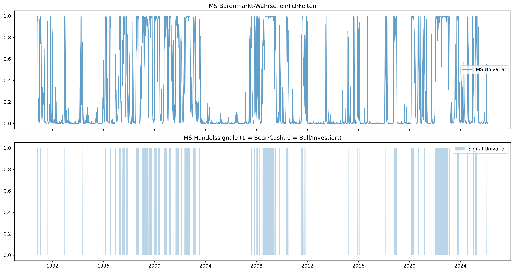

# Detaillierte statistische Auswertung & Forschungsergebnisse

Diese Seite dokumentiert die numerischen und grafischen Ergebnisse der Forschungs-Pipeline. Alle Auswertungen basieren auf dem Datensatz bis zum gestrigen Tag und werden automatisiert aktualisiert.

---

## 1. Executive Summary: Performance & Risiko
Ein direkter Vergleich der Kernkennzahlen über den gesamten **Out-of-Sample Testzeitraum**.

| Strategie   |   Final Wealth | Total Return   | Max Drawdown   |
|:------------|---------------:|:---------------|:---------------|
| Buy_Hold    |         1.8705 | +87.05%        | -27.10%        |
| HMM         |         1.7109 | +71.09%        | -5.64%         |
| MS          |         2.4842 | +148.42%       | -6.25%         |
| LSTM        |         1.3332 | +33.32%        | -20.86%        |
| Transformer |         1.541  | +54.10%        | -8.42%         |

> **Kernaussage:** Vergleiche den **Max Drawdown** der aktiven Strategien mit der Buy & Hold Benchmark. Ziel der Arbeit ist eine signifikante Reduktion dieses Werts zur Minderung des SORR.

---

## 2. Datenbasis & Baseline Portfolio
Grundlage der Untersuchung ist ein globaler Multi-Asset-Ansatz.

### 60/40 Portfolio Kapitalkurve
Die Abbildung zeigt die kumulierte Wertentwicklung des statischen Referenzportfolios (60% Aktien / 40% Anleihen).

*   **Datenquelle:** S&P 500 (`^GSPC`) und Vanguard Long-Term Treasury (`VUSTX`).
*   **Reproduzierbarkeit:** Der bereinigte Datensatz inkl. aller Features ist hinterlegt unter: `data/02_feature_engineered_data.parquet`.

---

## 3. Regime-Erkennung der Einzelmodelle
Hier werden die Identifikations-Ergebnisse der Modell-Kategorien (Statistik, Clustering, Deep Learning) visualisiert.

### A. Hidden Markov Model (Unsupervised Clustering)

### B. Markov-Switching-Modelle (Ökonometrie)
Identifikation von Bull- und Bear-Regimes mittels eines univariaten Zwei-Regime-Markov-Switching-Modells auf Basis der S&P 500-Renditen.

### C. LSTM-Netzwerk (Deep Learning)
Vorhersage der Marktphasen durch das neuronale Netzwerk (trainiert auf Markov-Labels).

### D. Transformer-Netzwerk (Attention-basierte Regime-Erkennung)
"Klassifikation von Marktregimes mittels eines Transformer-Encoders mit Multi-Head Self-Attention und Positional Encoding. Im Gegensatz zu rekurrenten Architekturen (LSTM) verarbeitet der Transformer alle Zeitschritte einer Sequenz parallel und lernt über den Attention-Mechanismus, welche historischen Datenpunkte die höchste Relevanz für die aktuelle Regime-Klassifikation besitzen. Trainiert im Supervised-Setting auf Markov-Labels.

### E. Globaler Regime-Vergleich
Detaillierte Gegenüberstellung der Wahrscheinlichkeiten und harten Signale aller Modelle.

---

## 4. Backtesting & Strategie-Evaluation
Die ökonomische Anwendung der Regime-Signale durch dynamische Umschichtung in den Geldmarkt.

### Equity Curves im Vergleich

### Umfassende Kennzahlen-Matrix
Detaillierte statistische Analyse inklusive risikoadjustierter Kennzahlen (Sharpe, Sortino, Calmar).

| Strategie   | Total Return   | CAGR (p.a.)   | Volatilität   | Max Drawdown   |   Sharpe Ratio |   Sortino Ratio |   Calmar Ratio |   Regime-Wechsel | Gesamtkosten (Gebühren)   |
|:------------|:---------------|:--------------|:--------------|:---------------|---------------:|----------------:|---------------:|-----------------:|:--------------------------|
| Buy Hold    | 86.69%         | 9.28%         | 12.61%        | -27.10%        |           0.77 |            0.99 |           0.34 |                0 | 0.00%                     |
| HMM         | 70.76%         | 7.90%         | 4.83%         | -5.64%         |           1.6  |            1.5  |           1.4  |               31 | 3.10%                     |
| MS          | 147.95%        | 13.78%        | 6.33%         | -6.25%         |           2.08 |            2.7  |           2.2  |               42 | 4.20%                     |
| LSTM        | 33.07%         | 4.14%         | 9.73%         | -20.86%        |           0.47 |            0.34 |           0.2  |               44 | 4.50%                     |
| Transformer | 53.81%         | 6.31%         | 7.02%         | -8.42%         |           0.91 |            1.03 |           0.75 |               72 | 7.20%                     |

### Transaktionskosten

Diese Grafik zeigt die kumulierten Transaktionskosten im Zeitverlauf. Steile Anstiege deuten auf instabile Regime-Wechsel ("Churning") hin.

Stress-Test: Sequence of Returns Risk (SORR)
Außerdem wurde die Überlebensdauer des Kapitals in einer simulierten Entnahmephase (Ruhestandsszenario) durchgeführt.

### SORR-Simulation: Vergleich der Entnahmeszenarien

In dieser Tabelle werden verschiedene Stress-Szenarien (Standard, Aggressiv, Geringes Kapital) gegenübergestellt.

|                                | Endkapital   | Status        |
|:-------------------------------|:-------------|:--------------|
| ('Standard', 'Buy Hold')       | 646,215.82 € | Kapitalerhalt |
| ('Standard', 'HMM')            | 572,773.37 € | Kapitalerhalt |
| ('Standard', 'MS')             | 898,432.37 € | Kapitalerhalt |
| ('Standard', 'LSTM')           | 404,594.04 € | Kapitalerhalt |
| ('Standard', 'Transformer')    | 504,371.18 € | Kapitalerhalt |
| ('Aggressive', 'Buy Hold')     | 473,866.94 € | Kapitalerhalt |
| ('Aggressive', 'HMM')          | 404,157.34 € | Kapitalerhalt |
| ('Aggressive', 'MS')           | 693,637.95 € | Kapitalerhalt |
| ('Aggressive', 'LSTM')         | 248,141.36 € | Kapitalerhalt |
| ('Aggressive', 'Transformer')  | 345,572.82 € | Kapitalerhalt |
| ('Low_Capital', 'Buy Hold')    | 330,279.87 € | Kapitalerhalt |
| ('Low_Capital', 'HMM')         | 287,458.68 € | Kapitalerhalt |
| ('Low_Capital', 'MS')          | 470,794.62 € | Kapitalerhalt |
| ('Low_Capital', 'LSTM')        | 190,605.53 € | Kapitalerhalt |
| ('Low_Capital', 'Transformer') | 249,689.92 € | Kapitalerhalt |

Abbildung der Kapitalentwicklung der unterschiedlichen Szenarien:

### MCS: Block-Bootstrap Robustness-Check

Um die statistische Signifikanz zu prüfen, wurden 1.000 künstliche Marktpfade mittels Block-Bootstrap simuliert.

|                                | Ruin-Wahrscheinlichkeit   | Median Endkapital   |
|:-------------------------------|:--------------------------|:--------------------|
| ('Standard', 'Buy Hold')       | 0.00%                     | 758,332.94 €        |
| ('Standard', 'HMM')            | 0.00%                     | 617,184.79 €        |
| ('Standard', 'MS')             | 0.00%                     | 1,254,215.88 €      |
| ('Standard', 'LSTM')           | 0.00%                     | 392,740.72 €        |
| ('Standard', 'Transformer')    | 0.00%                     | 477,762.53 €        |
| ('Aggressive', 'Buy Hold')     | 1.00%                     | 400,965.89 €        |
| ('Aggressive', 'HMM')          | 0.00%                     | 358,984.35 €        |
| ('Aggressive', 'MS')           | 0.00%                     | 868,846.86 €        |
| ('Aggressive', 'LSTM')         | 14.00%                    | 168,398.91 €        |
| ('Aggressive', 'Transformer')  | 0.00%                     | 270,812.04 €        |
| ('Low_Capital', 'Buy Hold')    | 0.00%                     | 359,138.13 €        |
| ('Low_Capital', 'HMM')         | 0.00%                     | 283,414.74 €        |
| ('Low_Capital', 'MS')          | 0.00%                     | 592,025.72 €        |
| ('Low_Capital', 'LSTM')        | 0.00%                     | 148,386.84 €        |
| ('Low_Capital', 'Transformer') | 0.00%                     | 221,409.97 €        |

Verteilung der Endkapitalwerte:

Wahrscheinlichkeitskorridore:

Die schattierten Bereiche zeigen das 5% bis 95% Konfidenzintervall der Kapitalentwicklung.

---

## Forschungsnotizen & Methodik
- **Cash-Komponente:** Bei einem "Bear"-Signal schichtet die Strategie in den aktuellen Geldmarktzins (**^IRX**) um.
- **Vermeidung von Look-ahead Bias:** Alle Signale werden für das Backtesting um einen Tag zeitversetzt (`shift(1)`), um reale Handelsbedingungen zu simulieren.
- **Feature-Set:** Die Modelle nutzen Renditen, Volatilität (20d), SMA-Abstand, Momentum, VIX und Yield Spread.
- **Kostensimulation:** Es wird eine pauschale Gebühr von 10 Basispunkten (0,1%) pro Umschichtung berechnet.
- **SORR-Spezifika:** Bei Entnahmen in "Bull"-Phasen wird eine zusätzliche Liquiditätsgebühr von 0,1% auf den Entnahmebetrag erhoben (Asset-Verkäufe). In "Bear"-Phasen (Cash) entfällt diese.

---
**Zuletzt aktualisiert:** 05.03.2026 16:27 
**Fast Mode Status zur Laufzeit:** TRUE (Development Mode) 
*Generiert durch die automatisierte ETL-Pipeline (Notebook 99).*
