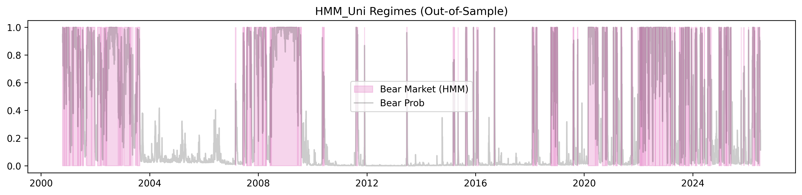

# Detaillierte statistische Auswertung & Forschungsergebnisse

Diese Seite dokumentiert die numerischen und grafischen Ergebnisse der Forschungs-Pipeline. Alle Auswertungen basieren auf dem Datensatz bis zum gestrigen Tag (2026-07-02) und werden automatisiert aktualisiert.

---

## 1. Executive Summary: Performance & Risiko
Ein direkter Vergleich der Kernkennzahlen über den gesamten **Out-of-Sample Testzeitraum**.

| Strategie   | Final Wealth   | Total Return   | Max Drawdown   |
|:------------|:---------------|:---------------|:---------------|
| Buy_Hold    | 2,107,074 €    | +321.41%       | -35.08%        |
| MSM         | 1,495,737 €    | +199.15%       | -28.59%        |
| HMM         | 1,132,757 €    | +126.55%       | -18.92%        |
| HMM_Uni     | 1,480,647 €    | +196.13%       | -26.26%        |
| LSTM        | 2,047,353 €    | +309.47%       | -28.36%        |
| Transformer | 1,852,975 €    | +270.59%       | -32.57%        |

> **Kernaussage:** Vergleiche den **Max Drawdown** der aktiven Strategien mit der Buy & Hold Benchmark. Ziel der Arbeit ist eine signifikante Reduktion dieses Werts zur Minderung des SORR.

---

## 2. Datenbasis & Baseline Portfolio
Grundlage der Untersuchung ist ein globaler Multi-Asset-Ansatz.

### Explorative Datenanalyse (EDA)
**Deskriptive Statistik der Basiszeitreihen:**
| Zeitreihe     |   Mittelwert (tägl.) |   Std.Abw. (tägl.) |     Min |     Max |   Schiefe (Skew) |   Kurtosis |
|:--------------|---------------------:|-------------------:|--------:|--------:|-----------------:|-----------:|
| Returns_GSPC  |             0.000331 |           0.011356 | -0.1277 |  0.1096 |          -0.3643 |    10.855  |
| Returns_VUSTX |             0.000214 |           0.007253 | -0.0605 |  0.0654 |          -0.0313 |     4.5138 |
| Returns       |             0.000284 |           0.006884 | -0.0662 |  0.0584 |          -0.2805 |     7.6569 |
| VIX           |            19.4554   |           7.74463  |  9.14   | 82.69   |           2.207  |     8.722  |
| TNX_10Y       |             4.24468  |           1.92761  |  0.499  |  9.09   |           0.326  |    -0.6301 |
| IRX_3M        |             2.71378  |           2.19771  | -0.105  |  7.99   |           0.1923 |    -1.2512 |

**Prüfung auf Stationarität (Augmented Dickey-Fuller Test):**
| Zeitreihe     |   ADF-Statistik |     p-Wert |   Krit. Wert (5%) | Stationär?   |
|:--------------|----------------:|-----------:|------------------:|:-------------|
| Returns_GSPC  |        -17.5541 | 4.128e-30  |           -2.8619 | Ja           |
| Returns_VUSTX |        -18.7211 | 2.0327e-30 |           -2.8619 | Ja           |
| Returns       |        -21.0033 | 0          |           -2.8619 | Ja           |
| VIX           |         -7.3107 | 1.2665e-10 |           -2.8619 | Ja           |
| TNX_10Y       |         -2.3442 | 0.1581     |           -2.8619 | Nein         |
| IRX_3M        |         -2.3482 | 0.15691    |           -2.8619 | Nein         |

**Volatilitätscluster und Autokorrelation (Heteroskedastizität):**

### Feature-Korrelation
Pearson-Korrelationsmatrix der sechs Modell-Features zur Prüfung auf Multikollinearität.

### SORR Kontext: Historische Drawdowns
Darstellung der extremsten Verlustphasen des 60/40 Portfolios als Motivation für den aktiven Kapitalschutz.

### 60/40 Portfolio Kapitalkurve
Die Abbildung zeigt die kumulierte Wertentwicklung des statischen Referenzportfolios (60% Aktien / 40% Anleihen).

*   **Datenquelle:** S&P 500 (`^GSPC`) und Vanguard Long-Term Treasury (`VUSTX`).
*   **Reproduzierbarkeit:** Der bereinigte Datensatz inkl. aller Features ist hinterlegt unter: `data/02_feature_engineered_data.parquet`.

---

## 3. Regime-Erkennung der Einzelmodelle
Hier werden die Identifikations-Ergebnisse der Modell-Kategorien (Statistik, Clustering, Deep Learning) visualisiert.

### A. Markov-Switching-Modelle (Ökonometrie)
Identifikation von Bull- und Bear-Regimes mittels eines univariaten Zwei-Regime-Markov-Switching-Modells auf Basis der S&P 500-Renditen.

### B. Hidden Markov Model (Unsupervised Clustering)

### C. Univariates HMM (Ablation, Issue #3)
Robustheitscheck für den MSM-vs-HMM-Architekturvergleich: identischer
Input-Raum wie das MSM (nur 60/40-Renditen). Isoliert den Architektureffekt
(Clustering vs. Markov-Switching-Regression) vom Informationsbeitrag der
erweiterten Features (VIX, Yield Spread).

### D. LSTM-Netzwerk (Deep Learning)
Vorhersage der Marktphasen durch das neuronale Netzwerk (trainiert auf Pagan-Sossounov-Labels).

### E. Transformer-Netzwerk (Attention-basierte Regime-Erkennung)
Klassifikation von Marktregimes mittels eines Transformer-Encoders mit Multi-Head Self-Attention und Positional Encoding. Im Gegensatz zu rekurrenten Architekturen (LSTM) verarbeitet der Transformer alle Zeitschritte einer Sequenz parallel und lernt über den Attention-Mechanismus, welche historischen Datenpunkte die höchste Relevanz für die aktuelle Regime-Klassifikation besitzen. Trainiert im Supervised-Setting auf Pagan-Sossounov-Labels.

### F. Globaler Regime-Vergleich
Detaillierte Gegenüberstellung der Wahrscheinlichkeiten und harten Signale aller Modelle.

### G. Hyperparameter-Optimierung (Optuna)
Bayessche Suche über den Hyperparameter-Raum aller vier Modelle mittels Walk-Forward-Validierung als innere CV. Optimierungsziel ist der mediane OOS-Sharpe-Ratio über die subgesampelten Folds; geprunete Trials nutzen den Median-Pruner. Die hier ausgewiesenen Werte wurden 1:1 in die `config.yaml` übernommen und für den finalen Walk-Forward-Lauf verwendet.

# Optuna — Beste Hyperparameter

_Generiert am 2026-04-21 22:01:55_  
Optimierungs-Metrik: **Sharpe (Median OOS)**

## Übersicht

| Modell | Best Score | ✓ Complete | ✗ Pruned | Total |
|:---|---:|---:|---:|---:|
| **MSM** | 0.9308 | 23 | 27 | 50 |
| **HMM** | 1.2843 | 50 | 0 | 50 |
| **LSTM** | 1.4595 | 16 | 14 | 30 |
| **Transformer** | 1.0530 | 19 | 11 | 30 |

### MSM — Best Score `0.9308`

| Parameter | Wert |
|:---|---:|
| `threshold` | `0.7` |

### HMM — Best Score `1.2843`

| Parameter | Wert |
|:---|---:|
| `covariance_type` | `tied` |
| `threshold` | `0.35` |

### LSTM — Best Score `1.4595`

| Parameter | Wert |
|:---|---:|
| `window_size` | `120` |
| `units_l1` | `32` |
| `units_l2` | `64` |
| `learning_rate` | `1.053e-04` |
| `dropout` | `0.4` |
| `epochs` | `40` |
| `threshold` | `0.3` |

### Transformer — Best Score `1.0530`

| Parameter | Wert |
|:---|---:|
| `d_model` | `32` |
| `n_heads` | `4` |
| `n_layers` | `3` |
| `dim_feedforward` | `128` |
| `learning_rate` | `3.282e-05` |
| `dropout` | `0.1` |
| `epochs` | `40` |
| `window_size` | `40` |
| `threshold` | `0.55` |

**Diagnose-Plots pro Modell** (Optimization History · Param-Importance · Slice · Contour):

| Modell | History | Importance | Slice | Contour |
|:---|:---|:---|:---|:---|
| MSM         |          |          |          | — ¹                                            |
| HMM         |          |          |          |          |
| LSTM        |         |         |         |         |
| Transformer |  |  |  |  |

¹ MSM hat nur einen Hyperparameter (`threshold`) im Search-Space — der Contour-Plot wäre degeneriert und entfällt.

### G. Label-Konkordanz (Auswahl der Trainings-Labels)
Vergleich der Regime-Labeler (MSM, HMM, Pagan-Sossounov, Peak-to-Trough, Lunde-Timmermann, NBER) zur Begründung der Label-Wahl für die Supervised-Modelle. Pagan-Sossounov wurde aufgrund seiner hohen Konkordanz mit NBER-Rezessionsperioden als Trainingsziel für LSTM und Transformer gewählt.

---

## 4. Backtesting & Strategie-Evaluation
Die ökonomische Anwendung der Regime-Signale durch dynamische Umschichtung in den Geldmarkt.

### Walk-Forward-Schema
Rollierende Train/Test-Fenster über den gesamten Untersuchungszeitraum. Jede Zeile entspricht einem Fold; der blaue Balken markiert das Trainingsfenster, der orange Balken das OOS-Testfenster. Die strikte chronologische Trennung verhindert Look-ahead Bias.

### Equity Curves im Vergleich

### Annualisierte Performance-Metriken
Normalisierte Kennzahlen (CAGR, Sharpe, Sortino, Calmar) für den Vergleich über unterschiedlich lange Evaluationszeiträume.

| Strategie   | CAGR   | Ann. Volatilität   |   Sharpe Ratio |   Sortino Ratio | Max Drawdown   |   Calmar Ratio |   OOS-Tage |   OOS-Jahre |
|:------------|:-------|:-------------------|---------------:|----------------:|:---------------|---------------:|-----------:|------------:|
| Buy_Hold    | +5.77% | 11.17%             |          0.558 |           0.729 | -35.08%        |          0.165 |       6462 |        25.6 |
| MSM         | +4.37% | 7.30%              |          0.622 |           0.771 | -28.59%        |          0.153 |       6462 |        25.6 |
| HMM         | +3.24% | 6.78%              |          0.505 |           0.529 | -18.92%        |          0.171 |       6462 |        25.6 |
| HMM_Uni     | +4.33% | 6.76%              |          0.66  |           0.789 | -26.26%        |          0.165 |       6462 |        25.6 |
| LSTM        | +5.65% | 10.81%             |          0.563 |           0.707 | -28.36%        |          0.199 |       6462 |        25.6 |
| Transformer | +5.24% | 10.72%             |          0.53  |           0.66  | -32.57%        |          0.161 |       6462 |        25.6 |

### Klassifikationsmetriken (vs. NBER-Rezessionen als Ground Truth)
Vergleich der Modelle als binäre Rezessionsklassifikatoren (Precision, Recall, F1).

| Modell      |   Precision |   Recall |    F1 |   TN |   FP |   FN |   TP |
|:------------|------------:|---------:|------:|-----:|-----:|-----:|-----:|
| MSM         |       0.3   |    0.765 | 0.431 | 4831 | 1046 |  138 |  448 |
| HMM         |       0.193 |    0.84  | 0.314 | 3817 | 2060 |   94 |  492 |
| HMM_Uni     |       0.274 |    0.846 | 0.415 | 4566 | 1311 |   90 |  496 |
| LSTM        |       0.133 |    0.133 | 0.133 | 5368 |  509 |  508 |   78 |
| Transformer |       0.329 |    0.285 | 0.305 | 5536 |  341 |  419 |  167 |

**ROC- und Precision-Recall-Kurven** (schwellenunabhängiger Vergleich über `*_Prob`):

### Signal-Churning & Whipsaw-Analyse
Quantifizierung der Wechselhäufigkeit und Anteil sehr kurzer Regime-Phasen („Whipsaws").

| Modell      |   Signalwechsel |   Whipsaws (<5T) | Whipsaw-Anteil   |   Ø Phase (Tage) |   Median Phase (Tage) | Kumul. Kosten   |
|:------------|----------------:|-----------------:|:-----------------|-----------------:|----------------------:|:----------------|
| MSM         |             369 |              209 | 56.5%            |             17.5 |                     4 | 36.90%          |
| HMM         |             141 |               64 | 45.1%            |             45.5 |                     6 | 14.10%          |
| HMM_Uni     |             339 |              181 | 53.2%            |             19   |                     4 | 33.90%          |
| LSTM        |              14 |                5 | 33.3%            |            430.9 |                    36 | 1.40%           |
| Transformer |              54 |               30 | 54.5%            |            117.5 |                     3 | 5.40%           |

### Regime-Wahrscheinlichkeits-Heatmap
Zeitverlauf der Bear-Wahrscheinlichkeiten aller Modelle.

### Threshold-Sensitivität
Variation der Entscheidungs-Schwelle pro Modell. Zeigt, wie robust Final Wealth, Max Drawdown und Anzahl der Regime-Wechsel gegenüber einer veränderten Bull/Bear-Klassifikations-Grenze sind (Kap. 4.1 — Glättung).

**MSM**

|   Threshold | Final Wealth   | Max Drawdown   |   Wechsel |
|------------:|:---------------|:---------------|----------:|
|        0.25 | 1,537,857 €    | -12.13%        |       301 |
|        0.3  | 1,359,728 €    | -16.68%        |       313 |
|        0.35 | 1,370,280 €    | -20.19%        |       319 |
|        0.4  | 1,386,037 €    | -21.55%        |       313 |
|        0.5  | 1,471,577 €    | -25.39%        |       325 |

**HMM**

|   Threshold | Final Wealth   | Max Drawdown   |   Wechsel |
|------------:|:---------------|:---------------|----------:|
|        0.4  | 1,155,433 €    | -20.94%        |        97 |
|        0.45 | 1,059,426 €    | -25.13%        |        83 |
|        0.5  | 1,035,188 €    | -26.82%        |        87 |
|        0.55 | 1,038,026 €    | -28.12%        |        83 |
|        0.6  | 949,712 €      | -33.98%        |        97 |

**HMM_Uni**

|   Threshold | Final Wealth   | Max Drawdown   |   Wechsel |
|------------:|:---------------|:---------------|----------:|
|        0.4  | 1,359,674 €    | -24.79%        |       315 |
|        0.45 | 1,382,452 €    | -24.41%        |       323 |
|        0.5  | 1,480,647 €    | -26.26%        |       339 |
|        0.55 | 1,489,953 €    | -23.24%        |       337 |
|        0.6  | 1,679,441 €    | -26.81%        |       341 |

**LSTM**

|   Threshold | Final Wealth   | Max Drawdown   |   Wechsel |
|------------:|:---------------|:---------------|----------:|
|         0.2 | 2,052,402 €    | -28.18%        |        12 |
|         0.3 | 2,047,353 €    | -28.36%        |        14 |
|         0.4 | 2,015,987 €    | -28.82%        |        14 |
|         0.5 | 2,015,987 €    | -28.82%        |        14 |

**Transformer**

|   Threshold | Final Wealth   | Max Drawdown   |   Wechsel |
|------------:|:---------------|:---------------|----------:|
|        0.3  | 1,452,618 €    | -28.05%        |        90 |
|        0.4  | 1,700,745 €    | -27.71%        |        80 |
|        0.45 | 1,792,416 €    | -28.23%        |        72 |
|        0.5  | 1,811,552 €    | -31.77%        |        56 |
|        0.6  | 1,833,486 €    | -32.26%        |        56 |

### Time-to-Recovery
Alle Drawdown-Phasen jenseits der Mindesttiefe (gemäß `extended.ttr_min_dd`) mit Peak-, Trough- und Recovery-Datum sowie Dauer in Handelstagen. Eine offene (noch nicht erholte) Phase wird im Recovery-Feld mit „—" markiert.

**Buy_Hold**

| Peak       | Trough     | Recovery   | Max DD   |   Drawdown-Dauer (T) |   Recovery-Dauer (T) |   Gesamt (T) |
|:-----------|:-----------|:-----------|:---------|---------------------:|---------------------:|-------------:|
| 2000-11-01 | 2000-12-20 | 2001-02-01 | -5.10%   |                   49 |                   43 |           92 |
| 2001-02-02 | 2002-07-23 | 2004-03-05 | -24.04%  |                  536 |                  591 |         1127 |
| 2004-03-08 | 2004-05-10 | 2004-11-04 | -6.37%   |                   63 |                  178 |          241 |
| 2007-11-01 | 2009-03-09 | 2011-04-28 | -34.97%  |                  494 |                  780 |         1274 |
| 2011-07-25 | 2011-08-08 | 2011-10-14 | -6.59%   |                   14 |                   67 |           81 |
| 2013-05-22 | 2013-06-24 | 2013-10-22 | -5.37%   |                   33 |                  120 |          153 |
| 2015-03-23 | 2015-08-25 | 2016-04-13 | -8.39%   |                  155 |                  232 |          387 |
| 2016-08-01 | 2016-11-14 | 2017-04-17 | -5.64%   |                  105 |                  154 |          259 |
| 2018-01-29 | 2018-02-08 | 2018-08-24 | -6.93%   |                   10 |                  197 |          207 |
| 2018-08-30 | 2018-12-24 | 2019-03-21 | -11.45%  |                  116 |                   87 |          203 |
| 2020-02-21 | 2020-03-18 | 2020-06-08 | -18.31%  |                   26 |                   82 |          108 |
| 2020-09-03 | 2020-10-30 | 2020-12-08 | -5.20%   |                   57 |                   39 |           96 |
| 2021-12-28 | 2022-10-14 | 2024-11-29 | -27.55%  |                  290 |                  777 |         1067 |
| 2024-12-09 | 2025-04-08 | 2025-07-03 | -12.22%  |                  120 |                   86 |          206 |
| 2026-02-26 | 2026-03-27 | 2026-04-17 | -6.69%   |                   29 |                   21 |           50 |

**MSM**

| Peak       | Trough     | Recovery   | Max DD   |   Drawdown-Dauer (T) |   Recovery-Dauer (T) |   Gesamt (T) |
|:-----------|:-----------|:-----------|:---------|---------------------:|---------------------:|-------------:|
| 2001-02-02 | 2003-02-12 | 2007-04-20 | -27.85%  |                  740 |                 1528 |         2268 |
| 2007-06-05 | 2009-08-06 | 2010-11-04 | -15.37%  |                  793 |                  455 |         1248 |
| 2011-07-25 | 2011-10-03 | 2012-01-17 | -7.98%   |                   70 |                  106 |          176 |
| 2015-02-26 | 2016-01-20 | 2016-03-18 | -6.77%   |                  328 |                   58 |          386 |
| 2016-08-01 | 2016-11-14 | 2017-04-18 | -5.84%   |                  105 |                  155 |          260 |
| 2018-01-29 | 2018-04-25 | 2018-08-20 | -5.80%   |                   86 |                  117 |          203 |
| 2018-08-30 | 2019-01-14 | 2019-06-07 | -9.46%   |                  137 |                  144 |          281 |
| 2020-09-03 | 2021-03-24 | 2021-08-30 | -10.20%  |                  202 |                  159 |          361 |
| 2021-12-28 | 2022-04-06 | 2023-04-06 | -10.67%  |                   99 |                  365 |          464 |
| 2023-07-20 | 2023-10-19 | 2024-06-05 | -10.89%  |                   91 |                  230 |          321 |
| 2024-12-09 | 2025-01-13 | 2025-09-05 | -6.46%   |                   35 |                  235 |          270 |
| 2025-10-29 | 2026-03-19 | 2026-05-29 | -6.25%   |                  141 |                   71 |          212 |

**HMM**

| Peak       | Trough     | Recovery   | Max DD   |   Drawdown-Dauer (T) |   Recovery-Dauer (T) |   Gesamt (T) |
|:-----------|:-----------|:-----------|:---------|---------------------:|---------------------:|-------------:|
| 2002-03-07 | 2002-06-13 | 2003-06-16 | -6.63%   |                   98 |                  368 |          466 |
| 2003-06-17 | 2003-07-21 | 2003-12-31 | -5.16%   |                   34 |                  163 |          197 |
| 2004-03-08 | 2004-05-10 | 2004-11-04 | -6.37%   |                   63 |                  178 |          241 |
| 2008-05-20 | 2008-07-28 | 2009-11-16 | -8.46%   |                   69 |                  476 |          545 |
| 2010-05-04 | 2010-07-16 | 2010-11-04 | -7.14%   |                   73 |                  111 |          184 |
| 2011-07-25 | 2011-12-14 | 2012-06-29 | -7.85%   |                  142 |                  198 |          340 |
| 2013-05-22 | 2013-06-24 | 2014-10-21 | -5.37%   |                   33 |                  484 |          517 |
| 2015-03-23 | 2015-09-28 | 2016-06-03 | -9.82%   |                  189 |                  249 |          438 |
| 2018-01-29 | 2021-03-18 | 2021-11-05 | -13.45%  |                 1144 |                  232 |         1376 |
| 2021-11-10 | 2023-10-27 | 2024-06-12 | -18.52%  |                  716 |                  229 |          945 |
| 2024-12-09 | 2025-04-08 | 2025-08-04 | -12.80%  |                  120 |                  118 |          238 |
| 2025-10-29 | 2026-03-27 | 2026-05-06 | -6.95%   |                  149 |                   40 |          189 |

**HMM_Uni**

| Peak       | Trough     | Recovery   | Max DD   |   Drawdown-Dauer (T) |   Recovery-Dauer (T) |   Gesamt (T) |
|:-----------|:-----------|:-----------|:---------|---------------------:|---------------------:|-------------:|
| 2001-02-02 | 2003-04-11 | 2006-10-04 | -25.28%  |                  798 |                 1272 |         2070 |
| 2007-06-05 | 2009-08-06 | 2011-01-14 | -16.28%  |                  793 |                  526 |         1319 |
| 2011-07-25 | 2011-10-03 | 2012-01-17 | -7.98%   |                   70 |                  106 |          176 |
| 2015-02-26 | 2016-01-20 | 2016-04-01 | -7.67%   |                  328 |                   72 |          400 |
| 2016-08-01 | 2016-11-14 | 2017-04-18 | -5.90%   |                  105 |                  155 |          260 |
| 2018-01-29 | 2019-01-14 | 2019-04-30 | -8.82%   |                  350 |                  106 |          456 |
| 2021-01-26 | 2021-03-25 | 2021-07-23 | -6.70%   |                   58 |                  120 |          178 |
| 2021-12-28 | 2022-05-19 | 2023-03-03 | -6.70%   |                  142 |                  288 |          430 |
| 2023-07-20 | 2023-10-03 | 2024-02-01 | -6.76%   |                   75 |                  121 |          196 |
| 2024-07-17 | 2025-05-06 | 2025-10-27 | -10.37%  |                  293 |                  174 |          467 |
| 2025-10-29 | 2026-03-13 | —          | -5.98%   |                  135 |                  nan |          nan |

**LSTM**

| Peak       | Trough     | Recovery   | Max DD   |   Drawdown-Dauer (T) |   Recovery-Dauer (T) |   Gesamt (T) |
|:-----------|:-----------|:-----------|:---------|---------------------:|---------------------:|-------------:|
| 2000-11-01 | 2000-12-20 | 2001-02-01 | -5.10%   |                   49 |                   43 |           92 |
| 2001-02-02 | 2002-07-23 | 2004-03-05 | -24.04%  |                  536 |                  591 |         1127 |
| 2004-03-08 | 2004-05-10 | 2004-11-04 | -6.37%   |                   63 |                  178 |          241 |
| 2007-11-01 | 2009-03-09 | 2010-04-15 | -28.24%  |                  494 |                  402 |          896 |
| 2010-05-04 | 2010-07-02 | 2010-09-13 | -5.36%   |                   59 |                   73 |          132 |
| 2011-07-25 | 2011-08-08 | 2011-10-14 | -6.59%   |                   14 |                   67 |           81 |
| 2013-05-22 | 2013-06-24 | 2013-10-22 | -5.37%   |                   33 |                  120 |          153 |
| 2015-03-23 | 2015-08-25 | 2016-04-13 | -8.39%   |                  155 |                  232 |          387 |
| 2016-08-01 | 2016-11-14 | 2017-04-17 | -5.64%   |                  105 |                  154 |          259 |
| 2018-01-29 | 2018-12-24 | 2019-03-29 | -11.62%  |                  329 |                   95 |          424 |
| 2020-02-21 | 2020-03-18 | 2020-06-08 | -18.31%  |                   26 |                   82 |          108 |
| 2020-09-03 | 2020-10-30 | 2020-12-08 | -5.20%   |                   57 |                   39 |           96 |
| 2021-12-28 | 2022-10-14 | 2024-11-29 | -27.55%  |                  290 |                  777 |         1067 |
| 2024-12-09 | 2025-04-08 | 2025-07-03 | -12.22%  |                  120 |                   86 |          206 |
| 2026-02-26 | 2026-03-27 | 2026-04-17 | -6.69%   |                   29 |                   21 |           50 |

**Transformer**

| Peak       | Trough     | Recovery   | Max DD   |   Drawdown-Dauer (T) |   Recovery-Dauer (T) |   Gesamt (T) |
|:-----------|:-----------|:-----------|:---------|---------------------:|---------------------:|-------------:|
| 2000-11-01 | 2000-12-20 | 2001-02-01 | -5.10%   |                   49 |                   43 |           92 |
| 2001-02-02 | 2002-07-23 | 2004-03-05 | -24.04%  |                  536 |                  591 |         1127 |
| 2004-03-08 | 2004-05-10 | 2004-11-04 | -6.37%   |                   63 |                  178 |          241 |
| 2007-07-20 | 2009-03-09 | 2011-01-14 | -32.42%  |                  598 |                  676 |         1274 |
| 2011-07-25 | 2011-08-08 | 2011-10-14 | -6.59%   |                   14 |                   67 |           81 |
| 2013-05-22 | 2013-06-24 | 2013-10-22 | -5.37%   |                   33 |                  120 |          153 |
| 2015-03-23 | 2015-08-25 | 2016-07-08 | -8.39%   |                  155 |                  318 |          473 |
| 2016-08-01 | 2016-11-14 | 2017-04-17 | -5.64%   |                  105 |                  154 |          259 |
| 2018-01-29 | 2018-02-08 | 2018-08-24 | -6.93%   |                   10 |                  197 |          207 |
| 2018-08-30 | 2018-12-24 | 2019-06-07 | -11.45%  |                  116 |                  165 |          281 |
| 2020-02-21 | 2020-03-18 | 2020-06-08 | -18.31%  |                   26 |                   82 |          108 |
| 2020-09-03 | 2020-10-30 | 2020-12-08 | -5.20%   |                   57 |                   39 |           96 |
| 2021-12-28 | 2022-10-14 | 2024-11-29 | -27.55%  |                  290 |                  777 |         1067 |
| 2024-12-09 | 2025-04-08 | 2025-08-08 | -10.79%  |                  120 |                  122 |          242 |
| 2026-02-26 | 2026-03-27 | 2026-04-17 | -6.69%   |                   29 |                   21 |           50 |

### Krisen-Performance
Return und Max Drawdown während historischer Krisenperioden — der zentrale Nachweis für den Tail-Risk-Schutz der Regime-Switching-Modelle.

| Krise                                | ('Return', 'Buy_Hold')   | ('Return', 'HMM')   | ('Return', 'HMM_Uni')   | ('Return', 'LSTM')   | ('Return', 'MSM')   | ('Return', 'Transformer')   | ('Max Drawdown', 'Buy_Hold')   | ('Max Drawdown', 'HMM')   | ('Max Drawdown', 'HMM_Uni')   | ('Max Drawdown', 'LSTM')   | ('Max Drawdown', 'MSM')   | ('Max Drawdown', 'Transformer')   |
|:-------------------------------------|:-------------------------|:--------------------|:------------------------|:---------------------|:--------------------|:----------------------------|:-------------------------------|:--------------------------|:------------------------------|:---------------------------|:--------------------------|:----------------------------------|
| COVID Crash (2020-02 – 2020-03)      | -8.55%                   | -6.60%              | +0.73%                  | -8.55%               | +5.87%              | -8.55%                      | -18.53%                        | -6.72%                    | -1.81%                        | -18.53%                    | -1.81%                    | -18.53%                           |
| Dot-Com (2000-03 – 2002-10)          | -15.77%                  | -0.95%              | -16.21%                 | -15.77%              | -23.94%             | -15.77%                     | -24.81%                        | -7.15%                    | -20.84%                       | -24.81%                    | -26.53%                   | -24.81%                           |
| EU-Schuldenkrise (2011-07 – 2011-11) | +4.10%                   | -7.09%              | -1.84%                  | +4.10%               | -1.84%              | +4.10%                      | -7.24%                         | -8.17%                    | -8.61%                        | -7.24%                     | -8.61%                    | -7.24%                            |
| GFC (2007-10 – 2009-03)              | -26.99%                  | -4.06%              | -10.26%                 | -18.73%              | -11.72%             | -23.24%                     | -35.08%                        | -8.78%                    | -11.12%                       | -28.36%                    | -13.30%                   | -31.74%                           |
| Zinsanstieg (2022-01 – 2022-10)      | -24.20%                  | -12.94%             | -2.97%                  | -24.20%              | -4.59%              | -24.20%                     | -26.98%                        | -14.56%                   | -5.96%                        | -26.98%                    | -9.96%                    | -26.98%                           |

### Switch-Timing relativ zum Drawdown-Peak
Zeitlicher Abstand zwischen dem ersten Bear-Signal des Modells und dem Drawdown-Trough des Buy & Hold-Portfolios je Krise. Positiv = Modell reagierte frühzeitig, negativ = zu spät.

| Krise   | Modell      | DD-Trough   | 1. Bear-Signal   |   Lead (Tage) |
|:--------|:------------|:------------|:-----------------|--------------:|
| GFC     | MSM         | 2009-03-09  | 2007-10-01       |           525 |
| COVID   | MSM         | 2020-03-18  | 2020-02-24       |            23 |
| 2022    | MSM         | 2022-10-14  | 2022-01-05       |           282 |
| GFC     | HMM         | 2009-03-09  | 2007-10-22       |           504 |
| COVID   | HMM         | 2020-03-18  | 2020-02-03       |            44 |
| 2022    | HMM         | 2022-10-14  | 2022-01-21       |           266 |
| GFC     | HMM_Uni     | 2009-03-09  | 2007-10-01       |           525 |
| COVID   | HMM_Uni     | 2020-03-18  | 2020-02-24       |            23 |
| 2022    | HMM_Uni     | 2022-10-14  | 2022-01-05       |           282 |
| GFC     | LSTM        | 2009-03-09  | 2007-10-01       |           525 |
| COVID   | LSTM        | 2020-03-18  |                  |           nan |
| 2022    | LSTM        | 2022-10-14  |                  |           nan |
| GFC     | Transformer | 2009-03-09  | 2008-01-17       |           417 |
| COVID   | Transformer | 2020-03-18  |                  |           nan |
| 2022    | Transformer | 2022-10-14  |                  |           nan |

### Drawdown-Verlauf

### Rollierender Sharpe Ratio
Zeitvariierender, risikoadjustierter Rendite-Vergleich über ein rollendes 252-Tage-Fenster.

### Umfassende Kennzahlen-Matrix
Detaillierte statistische Analyse inklusive risikoadjustierter Kennzahlen (Sharpe, Sortino, Calmar).

| Strategie   | Total Return   | CAGR (p.a.)   | Volatilität   | Max Drawdown   |   Sharpe Ratio |   Sortino Ratio |   Calmar Ratio |   Regime-Wechsel | Gesamtkosten (Gebühren)   |   Ulcer Index |
|:------------|:---------------|:--------------|:--------------|:---------------|---------------:|----------------:|---------------:|-----------------:|:--------------------------|--------------:|
| Buy Hold    | 321.49%        | 5.76%         | 11.17%        | -35.08%        |           0.56 |            0.73 |           0.16 |                0 | 0.00%                     |          9.07 |
| MSM         | 199.20%        | 4.36%         | 7.30%         | -28.59%        |           0.62 |            0.77 |           0.15 |              369 | 37.00%                    |          9.8  |
| HMM         | 126.59%        | 3.23%         | 6.78%         | -18.92%        |           0.5  |            0.53 |           0.17 |              141 | 14.20%                    |          5.23 |
| HMM Uni     | 196.19%        | 4.31%         | 6.76%         | -26.26%        |           0.66 |            0.79 |           0.16 |              339 | 34.00%                    |          8.48 |
| LSTM        | 309.55%        | 5.64%         | 10.81%        | -28.36%        |           0.56 |            0.71 |           0.2  |               14 | 1.40%                     |          8.01 |
| Transformer | 270.66%        | 5.23%         | 10.72%        | -32.57%        |           0.53 |            0.66 |           0.16 |               54 | 5.40%                     |          8.68 |

### Transaktionskosten

Diese Grafik zeigt die kumulierten Transaktionskosten im Zeitverlauf. Steile Anstiege deuten auf instabile Regime-Wechsel ("Churning") hin.

Stress-Test: Sequence of Returns Risk (SORR)
Außerdem wurde die Überlebensdauer des Kapitals in einer simulierten Entnahmephase (Ruhestandsszenario) durchgeführt.

### SORR-Simulation: Vergleich der Entnahmeszenarien

In dieser Tabelle werden verschiedene Stress-Szenarien (Standard, Aggressiv, Geringes Kapital) gegenübergestellt.

|                                | Endkapital   | Status           |
|:-------------------------------|:-------------|:-----------------|
| ('Standard', 'Buy Hold')       | 0.00 €       | Erschöpft (2026) |
| ('Standard', 'MSM')            | 0.00 €       | Erschöpft (2017) |
| ('Standard', 'HMM')            | 0.00 €       | Erschöpft (2024) |
| ('Standard', 'HMM Uni')        | 0.00 €       | Erschöpft (2020) |
| ('Standard', 'LSTM')           | 0.00 €       | Erschöpft (2024) |
| ('Standard', 'Transformer')    | 0.00 €       | Erschöpft (2023) |
| ('Aggressive', 'Buy Hold')     | 0.00 €       | Erschöpft (2011) |
| ('Aggressive', 'MSM')          | 0.00 €       | Erschöpft (2009) |
| ('Aggressive', 'HMM')          | 0.00 €       | Erschöpft (2013) |
| ('Aggressive', 'HMM Uni')      | 0.00 €       | Erschöpft (2010) |
| ('Aggressive', 'LSTM')         | 0.00 €       | Erschöpft (2011) |
| ('Aggressive', 'Transformer')  | 0.00 €       | Erschöpft (2011) |
| ('Low_Capital', 'Buy Hold')    | 0.00 €       | Erschöpft (2015) |
| ('Low_Capital', 'MSM')         | 0.00 €       | Erschöpft (2011) |
| ('Low_Capital', 'HMM')         | 0.00 €       | Erschöpft (2016) |
| ('Low_Capital', 'HMM Uni')     | 0.00 €       | Erschöpft (2013) |
| ('Low_Capital', 'LSTM')        | 0.00 €       | Erschöpft (2014) |
| ('Low_Capital', 'Transformer') | 0.00 €       | Erschöpft (2014) |

Abbildung der Kapitalentwicklung der unterschiedlichen Szenarien:

### MCS: Block-Bootstrap Robustness-Check

Um die statistische Signifikanz zu prüfen, wurden 10.000 künstliche Marktpfade mittels Block-Bootstrap simuliert.

|                                | Ruin-Wahrscheinlichkeit   | Median Endkapital   |
|:-------------------------------|:--------------------------|:--------------------|
| ('Standard', 'Buy Hold')       | 0.01%                     | 471,809.48 €        |
| ('Low_Capital', 'Buy Hold')    | 0.82%                     | 199,313.32 €        |
| ('Aggressive', 'LSTM')         | 4.76%                     | 220,196.51 €        |
| ('Standard', 'Transformer')    | 0.00%                     | 434,933.54 €        |
| ('Standard', 'LSTM')           | 0.00%                     | 465,051.57 €        |
| ('Standard', 'HMM')            | 0.00%                     | 335,167.89 €        |
| ('Standard', 'MSM')            | 0.00%                     | 393,261.49 €        |
| ('Aggressive', 'MSM')          | 3.26%                     | 165,650.43 €        |
| ('Aggressive', 'Buy Hold')     | 5.43%                     | 228,200.12 €        |
| ('Aggressive', 'Transformer')  | 6.84%                     | 196,717.54 €        |
| ('Aggressive', 'HMM Uni')      | 2.28%                     | 164,771.25 €        |
| ('Aggressive', 'HMM')          | 5.51%                     | 121,771.33 €        |
| ('Low_Capital', 'HMM')         | 0.14%                     | 129,653.71 €        |
| ('Low_Capital', 'MSM')         | 0.05%                     | 159,237.99 €        |
| ('Standard', 'HMM Uni')        | 0.00%                     | 392,266.69 €        |
| ('Low_Capital', 'HMM Uni')     | 0.07%                     | 157,635.95 €        |
| ('Low_Capital', 'LSTM')        | 0.43%                     | 195,705.43 €        |
| ('Low_Capital', 'Transformer') | 0.88%                     | 183,209.73 €        |

Verteilung der Endkapitalwerte:

Wahrscheinlichkeitskorridore:

Die schattierten Bereiche zeigen das 5% bis 95% Konfidenzintervall der Kapitalentwicklung.

### Depletion Rate mit 95%-Konfidenzintervall
Wilson-CI für die Ruin-Wahrscheinlichkeit (P[Endkapital ≤ 0]) je Szenario × Strategie.

|                                | Depletion Rate   | 95%-CI unten   | 95%-CI oben   | n_ruin / n_paths   |
|:-------------------------------|:-----------------|:---------------|:--------------|:-------------------|
| ('Standard', 'Buy_Hold')       | 0.01%            | 0.00%          | 0.06%         | 1/10000            |
| ('Standard', 'MSM')            | 0.00%            | 0.00%          | 0.04%         | 0/10000            |
| ('Standard', 'HMM')            | 0.00%            | 0.00%          | 0.04%         | 0/10000            |
| ('Standard', 'HMM_Uni')        | 0.00%            | 0.00%          | 0.04%         | 0/10000            |
| ('Standard', 'LSTM')           | 0.00%            | 0.00%          | 0.04%         | 0/10000            |
| ('Standard', 'Transformer')    | 0.00%            | 0.00%          | 0.04%         | 0/10000            |
| ('Aggressive', 'Buy_Hold')     | 5.43%            | 5.00%          | 5.89%         | 543/10000          |
| ('Aggressive', 'MSM')          | 3.26%            | 2.93%          | 3.63%         | 326/10000          |
| ('Aggressive', 'HMM')          | 5.51%            | 5.08%          | 5.97%         | 551/10000          |
| ('Aggressive', 'HMM_Uni')      | 2.28%            | 2.01%          | 2.59%         | 228/10000          |
| ('Aggressive', 'LSTM')         | 4.76%            | 4.36%          | 5.19%         | 476/10000          |
| ('Aggressive', 'Transformer')  | 6.84%            | 6.36%          | 7.35%         | 684/10000          |
| ('Low_Capital', 'Buy_Hold')    | 0.82%            | 0.66%          | 1.02%         | 82/10000           |
| ('Low_Capital', 'MSM')         | 0.05%            | 0.02%          | 0.12%         | 5/10000            |
| ('Low_Capital', 'HMM')         | 0.14%            | 0.08%          | 0.23%         | 14/10000           |
| ('Low_Capital', 'HMM_Uni')     | 0.07%            | 0.03%          | 0.14%         | 7/10000            |
| ('Low_Capital', 'LSTM')        | 0.43%            | 0.32%          | 0.58%         | 43/10000           |
| ('Low_Capital', 'Transformer') | 0.88%            | 0.71%          | 1.08%         | 88/10000           |

### Hypothesentests (gepaarter Wilcoxon, α = 0.05)
**H1 — Regime-Switching reduziert MaxDD vs. Buy & Hold:**

| Modell      | Median MaxDD (Modell)   | Median MaxDD (B&H)   | Δ Median   |   Wilcoxon p | H1 (α=0.05)   |
|:------------|:------------------------|:---------------------|:-----------|-------------:|:--------------|
| MSM         | -68.34%                 | -59.50%              | -8.84 pp   |         1    | abgelehnt     |
| HMM         | -76.49%                 | -59.50%              | -17.00 pp  |         1    | abgelehnt     |
| HMM_Uni     | -68.53%                 | -59.50%              | -9.04 pp   |         1    | abgelehnt     |
| LSTM        | -60.72%                 | -59.50%              | -1.23 pp   |         0.96 | abgelehnt     |
| Transformer | -64.17%                 | -59.50%              | -4.67 pp   |         1    | abgelehnt     |

**H2 — Transformer dominiert Ökonometrie und LSTM im Endvermögen:**

| Vergleich            | Median Transformer   | Median MSM   | Δ Median   |   Wilcoxon p | H2 (α=0.05)   | Median HMM   | Median LSTM   |
|:---------------------|:---------------------|:-------------|:-----------|-------------:|:--------------|:-------------|:--------------|
| Transformer vs. MSM  | 196,718 €            | 165,650 €    | +31,067 €  |     6.87e-81 | bestätigt     | nan          | nan           |
| Transformer vs. HMM  | 196,718 €            | nan          | +74,946 €  |     0        | bestätigt     | 121,771 €    | nan           |
| Transformer vs. LSTM | 196,718 €            | nan          | -23,479 €  |     1        | abgelehnt     | nan          | 220,197 €     |

### Break-Even-Transaktionskosten
Ab welcher Kostenquote (in Basispunkten pro Umschichtung) verliert das aktive Switching seinen Renditevorteil gegenüber Buy & Hold?

| Modell      |   Final @10bps |   B&H Final |   Break-Even (bps) |
|:------------|---------------:|------------:|-------------------:|
| MSM         |          2.991 |       4.214 |                  5 |
| HMM         |          2.266 |       4.214 |                  0 |
| HMM_Uni     |          2.961 |       4.214 |                  0 |
| LSTM        |          4.095 |       4.214 |                  0 |
| Transformer |          3.706 |       4.214 |                  0 |

### Entnahmeraten-Sensitivität (3.5 % / 4 % / 5 %)
Robustheit der SORR-Ergebnisse bei variierenden jährlichen Entnahmen.

| Strategie   | ('Endkapital', '3.5%')   | ('Endkapital', '4.0%')   | ('Endkapital', '5.0%')   | ('Status', '3.5%')   | ('Status', '4.0%')   | ('Status', '5.0%')   |
|:------------|:-------------------------|:-------------------------|:-------------------------|:---------------------|:---------------------|:---------------------|
| Buy_Hold    | 871,962 €                | 695,461 €                | 342,458 €                | Kapitalerhalt        | Kapitalerhalt        | Kapitalerhalt        |
| HMM         | 425,628 €                | 324,580 €                | 122,482 €                | Kapitalerhalt        | Kapitalerhalt        | Kapitalerhalt        |
| HMM_Uni     | 494,851 €                | 353,983 €                | 72,247 €                 | Kapitalerhalt        | Kapitalerhalt        | Kapitalerhalt        |
| LSTM        | 819,477 €                | 644,011 €                | 293,080 €                | Kapitalerhalt        | Kapitalerhalt        | Kapitalerhalt        |
| MSM         | 428,386 €                | 275,867 €                | 0 €                      | Kapitalerhalt        | Kapitalerhalt        | Erschöpft (2025)     |
| Transformer | 715,642 €                | 553,116 €                | 228,064 €                | Kapitalerhalt        | Kapitalerhalt        | Kapitalerhalt        |

---

## Forschungsnotizen & Methodik
- **Cash-Komponente:** Bei einem "Bear"-Signal schichtet die Strategie in den aktuellen Geldmarktzins (**^IRX**) um.
- **Vermeidung von Look-ahead Bias:** Alle Signale werden für das Backtesting um einen Tag zeitversetzt (`shift(1)`), um reale Handelsbedingungen zu simulieren.
- **Feature-Set:** Die Modelle nutzen Renditen, Volatilität (20d), SMA-Abstand, Momentum, VIX und Yield Spread.
- **Kostensimulation:** Es wird eine pauschale Gebühr von 10 Basispunkten (0,1%) pro Umschichtung berechnet.
- **SORR-Spezifika:** Bei Entnahmen in "Bull"-Phasen wird eine zusätzliche Liquiditätsgebühr von 0,1% auf den Entnahmebetrag erhoben (Asset-Verkäufe). In "Bear"-Phasen (Cash) entfällt diese.

---

## Modell-Persistierung

Status der Modell-Persistierung für diesen Pipeline-Durchlauf:

- **Persistierung:** AKTIV
- **Modell-Verzeichnis:** `../models`

| Modell | Datei | Status |
|:---|:---|:---|
| MSM | `msm_regime_model.pkl` | Neu trainiert |
| HMM | `hmm_regime_model.pkl` | Neu trainiert |
| LSTM | `lstm_regime_model.keras` | Neu trainiert |
| TRANSFORMER | `transformer_regime_model.pt` | Neu trainiert |

> **Hinweis:** Bei aktivierter Persistierung werden vortrainierte Modelle aus `../models` geladen, sofern die Dateien existieren. Andernfalls wird normal trainiert und das Ergebnis für zukünftige Läufe gespeichert. Bei Änderungen an Hyperparametern müssen die entsprechenden Modelldateien gelöscht werden.

---

**Zuletzt aktualisiert:** 02.07.2026 09:47 
**End date:** `2026-07-02` 
**Fast Mode Status zur Laufzeit:** FALSE (Full Run) 
**Walk-Forward-Validierung:** AKTIV (Modus: rolling, Train: 10J, Test: 12M, Step: 12M) 
**Modell-Persistierung:** AKTIV 
*Generiert durch den Backtest-Service (Reporting).*
