# Detaillierte statistische Auswertung & Forschungsergebnisse

Diese Seite dokumentiert die numerischen und grafischen Ergebnisse der Forschungs-Pipeline. Alle Auswertungen basieren auf dem Datensatz bis zum gestrigen Tag und werden automatisiert aktualisiert.

---

## 1. Executive Summary: Performance & Risiko
Ein direkter Vergleich der Kernkennzahlen über den gesamten **Out-of-Sample Testzeitraum**.

| Strategie   |   Final Wealth | Total Return   | Max Drawdown   |
|:------------|---------------:|:---------------|:---------------|
| Buy_Hold    |         8.9434 | +794.34%       | -34.77%        |
| MSM         |         4.8196 | +381.96%       | -31.61%        |
| HMM         |         5.1219 | +412.19%       | -16.30%        |
| LSTM        |         5.8041 | +480.41%       | -30.35%        |
| Transformer |         3.3307 | +233.07%       | -43.18%        |

> **Kernaussage:** Vergleiche den **Max Drawdown** der aktiven Strategien mit der Buy & Hold Benchmark. Ziel der Arbeit ist eine signifikante Reduktion dieses Werts zur Minderung des SORR.

---

## 2. Datenbasis & Baseline Portfolio
Grundlage der Untersuchung ist ein globaler Multi-Asset-Ansatz.

### Explorative Datenanalyse (EDA)
**Deskriptive Statistik der Basiszeitreihen:**
| Zeitreihe     |   Mittelwert (tägl.) |   Std.Abw. (tägl.) |     Min |     Max |   Schiefe (Skew) |   Kurtosis |
|:--------------|---------------------:|-------------------:|--------:|--------:|-----------------:|-----------:|
| Returns_GSPC  |             0.000323 |           0.01139  | -0.1277 |  0.1096 |          -0.3598 |    10.8109 |
| Returns_VUSTX |             0.000274 |           0.007486 | -0.0605 |  0.1296 |           0.6395 |    14.3723 |
| Returns       |             0.000304 |           0.006935 | -0.0662 |  0.0584 |          -0.2267 |     7.7485 |
| VIX           |            19.4672   |           7.76893  |  9.14   | 82.69   |           2.1999 |     8.6641 |
| TNX_10Y       |             4.23746  |           1.93184  |  0.499  |  9.09   |           0.3305 |    -0.6378 |
| IRX_3M        |             2.7031   |           2.20303  | -0.105  |  7.99   |           0.2023 |    -1.2562 |

**Prüfung auf Stationarität (Augmented Dickey-Fuller Test):**
| Zeitreihe     |   ADF-Statistik |     p-Wert |   Krit. Wert (5%) | Stationär?   |
|:--------------|----------------:|-----------:|------------------:|:-------------|
| Returns_GSPC  |        -17.4811 | 4.4889e-30 |           -2.8619 | Ja           |
| Returns_VUSTX |        -18.1724 | 2.445e-30  |           -2.8619 | Ja           |
| Returns       |        -17.4961 | 4.4106e-30 |           -2.8619 | Ja           |
| VIX           |         -7.2627 | 1.6656e-10 |           -2.8619 | Ja           |
| TNX_10Y       |         -2.3502 | 0.15628    |           -2.8619 | Nein         |
| IRX_3M        |         -2.3417 | 0.15886    |           -2.8619 | Nein         |

**Volatilitätscluster und Autokorrelation (Heteroskedastizität):**
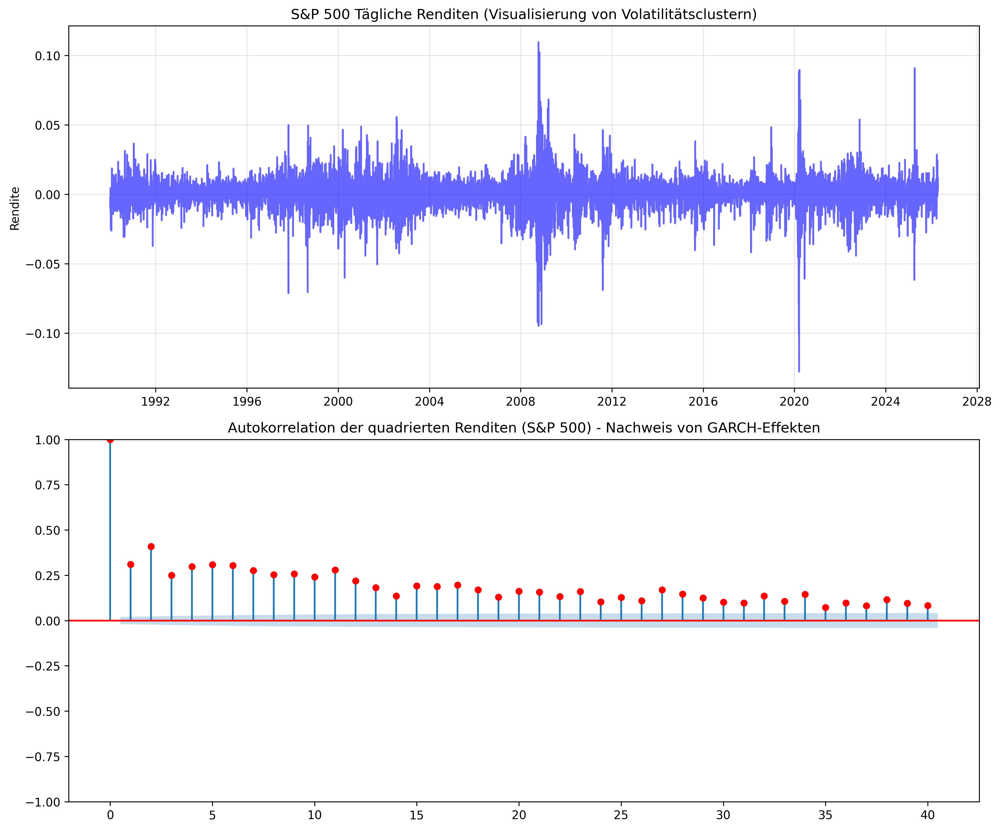

### Feature-Korrelation
Pearson-Korrelationsmatrix der sechs Modell-Features zur Prüfung auf Multikollinearität.

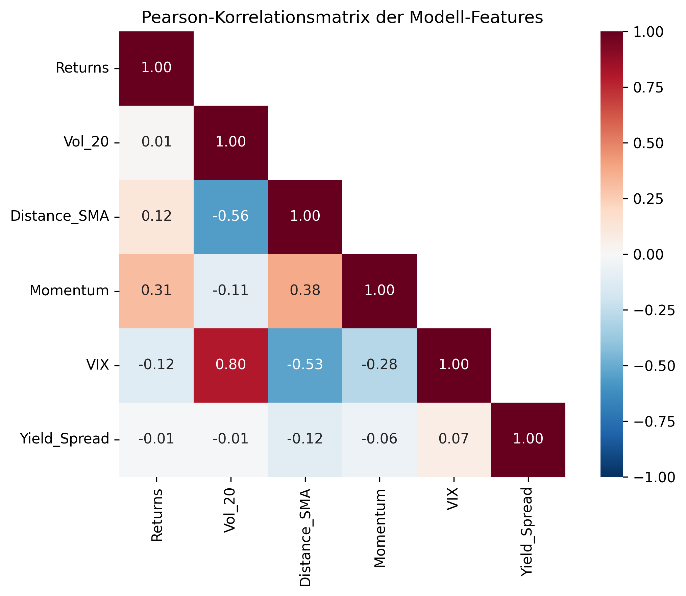

### SORR Kontext: Historische Drawdowns
Darstellung der extremsten Verlustphasen des 60/40 Portfolios als Motivation für den aktiven Kapitalschutz.
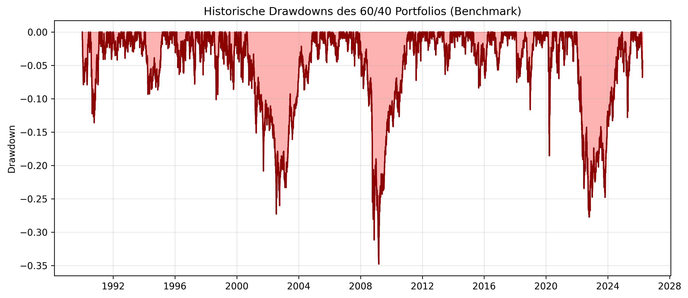

### 60/40 Portfolio Kapitalkurve
Die Abbildung zeigt die kumulierte Wertentwicklung des statischen Referenzportfolios (60% Aktien / 40% Anleihen).

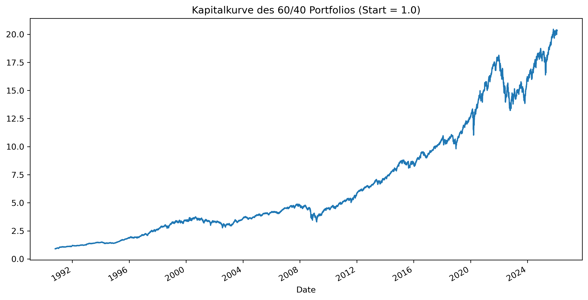

*   **Datenquelle:** S&P 500 (`^GSPC`) und Vanguard Long-Term Treasury (`VUSTX`).
*   **Reproduzierbarkeit:** Der bereinigte Datensatz inkl. aller Features ist hinterlegt unter: `data/02_feature_engineered_data.parquet`.

---

## 3. Regime-Erkennung der Einzelmodelle
Hier werden die Identifikations-Ergebnisse der Modell-Kategorien (Statistik, Clustering, Deep Learning) visualisiert.

### A. Markov-Switching-Modelle (Ökonometrie)
Identifikation von Bull- und Bear-Regimes mittels eines univariaten Zwei-Regime-Markov-Switching-Modells auf Basis der S&P 500-Renditen.
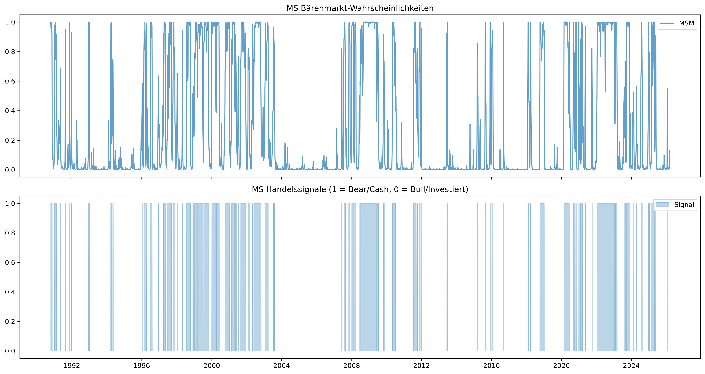

### B. Hidden Markov Model (Unsupervised Clustering)
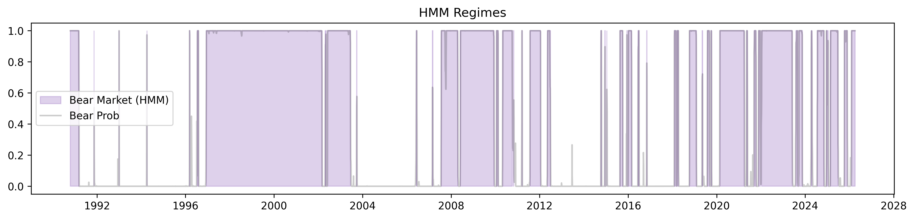

### C. LSTM-Netzwerk (Deep Learning)
Vorhersage der Marktphasen durch das neuronale Netzwerk (trainiert auf Markov-Labels).
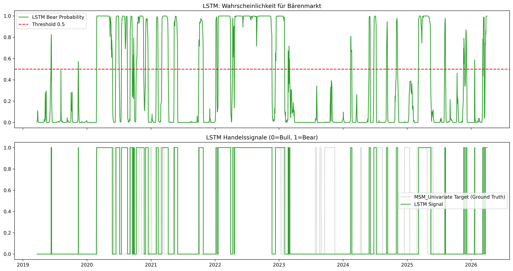

### D. Transformer-Netzwerk (Attention-basierte Regime-Erkennung)
"Klassifikation von Marktregimes mittels eines Transformer-Encoders mit Multi-Head Self-Attention und Positional Encoding. Im Gegensatz zu rekurrenten Architekturen (LSTM) verarbeitet der Transformer alle Zeitschritte einer Sequenz parallel und lernt über den Attention-Mechanismus, welche historischen Datenpunkte die höchste Relevanz für die aktuelle Regime-Klassifikation besitzen. Trainiert im Supervised-Setting auf Markov-Labels.
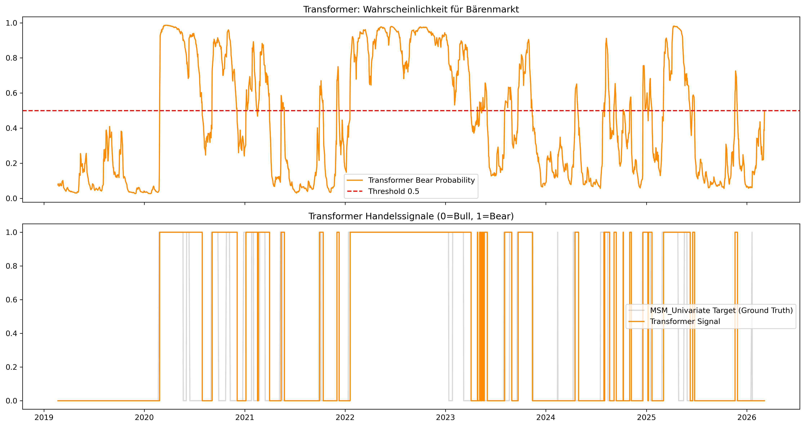

### E. Globaler Regime-Vergleich
Detaillierte Gegenüberstellung der Wahrscheinlichkeiten und harten Signale aller Modelle.

---

## 4. Backtesting & Strategie-Evaluation
Die ökonomische Anwendung der Regime-Signale durch dynamische Umschichtung in den Geldmarkt.

### Equity Curves im Vergleich

### Annualisierte Performance-Metriken
Normalisierte Kennzahlen (CAGR, Sharpe, Sortino, Calmar) für den Vergleich über unterschiedlich lange Evaluationszeiträume.

| Strategie   | CAGR   | Ann. Volatilität   |   Sharpe Ratio |   Sortino Ratio | Max Drawdown   |   Calmar Ratio |   OOS-Tage |   OOS-Jahre |
|:------------|:-------|:-------------------|---------------:|----------------:|:---------------|---------------:|-----------:|------------:|
| Buy_Hold    | +7.48% | 11.33%             |          0.661 |           0.871 | -34.77%        |          0.215 |       7651 |        30.4 |
| MSM         | +5.32% | 7.49%              |          0.71  |           0.846 | -31.61%        |          0.168 |       7651 |        30.4 |
| HMM         | +5.53% | 5.46%              |          1.012 |           1.002 | -16.30%        |          0.339 |       7651 |        30.4 |
| LSTM        | +5.96% | 8.48%              |          0.703 |           0.819 | -30.35%        |          0.197 |       7651 |        30.4 |
| Transformer | +4.04% | 7.41%              |          0.545 |           0.647 | -43.18%        |          0.094 |       7651 |        30.4 |

### Krisen-Performance
Return und Max Drawdown während historischer Krisenperioden — der zentrale Nachweis für den Tail-Risk-Schutz der Regime-Switching-Modelle.

| Krise                                | ('Return', 'Buy_Hold')   | ('Return', 'HMM')   | ('Return', 'LSTM')   | ('Return', 'MSM')   | ('Return', 'Transformer')   | ('Max Drawdown', 'Buy_Hold')   | ('Max Drawdown', 'HMM')   | ('Max Drawdown', 'LSTM')   | ('Max Drawdown', 'MSM')   | ('Max Drawdown', 'Transformer')   |
|:-------------------------------------|:-------------------------|:--------------------|:---------------------|:--------------------|:----------------------------|:-------------------------------|:--------------------------|:---------------------------|:--------------------------|:----------------------------------|
| COVID Crash (2020-02 – 2020-03)      | -8.24%                   | +0.13%              | -2.80%               | +0.73%              | -0.88%                      | -18.53%                        | -0.00%                    | -3.36%                     | -1.81%                    | -3.36%                            |
| Dot-Com (2000-03 – 2002-10)          | -13.31%                  | -5.90%              | -19.88%              | -23.55%             | -34.51%                     | -27.27%                        | -16.30%                   | -25.44%                    | -26.33%                   | -34.82%                           |
| EU-Schuldenkrise (2011-07 – 2011-11) | +4.10%                   | -3.34%              | +4.10%               | -1.37%              | -1.63%                      | -7.24%                         | -4.46%                    | -7.24%                     | -8.17%                    | -7.24%                            |
| GFC (2007-10 – 2009-03)              | -25.67%                  | +1.78%              | -15.84%              | -4.19%              | -1.24%                      | -34.77%                        | -1.17%                    | -20.32%                    | -5.71%                    | -3.33%                            |
| Zinsanstieg (2022-01 – 2022-10)      | -24.20%                  | +0.46%              | -2.20%               | -4.82%              | -6.82%                      | -26.98%                        | -1.28%                    | -3.37%                     | -7.15%                    | -7.40%                            |

### Drawdown-Verlauf
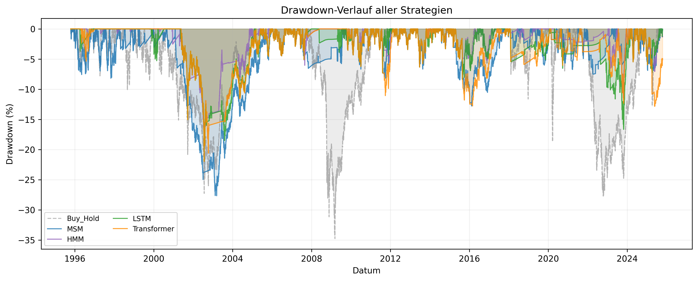

### Rollierender Sharpe Ratio
Zeitvariierender, risikoadjustierter Rendite-Vergleich über ein rollendes 252-Tage-Fenster.

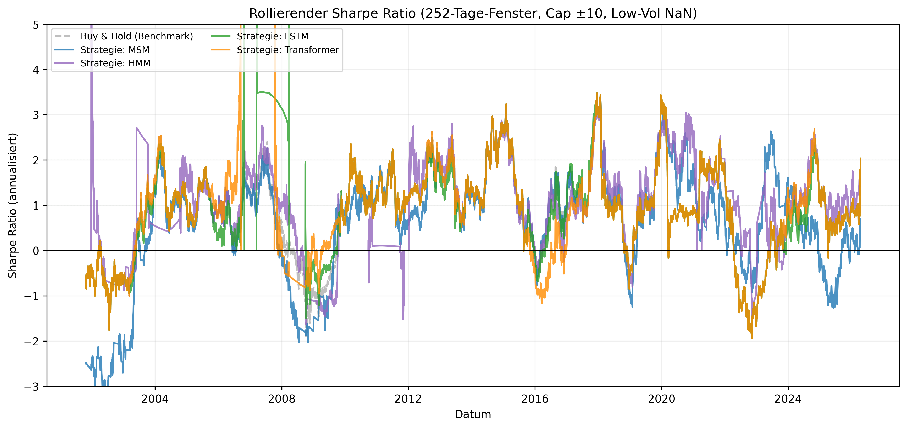

### Umfassende Kennzahlen-Matrix
Detaillierte statistische Analyse inklusive risikoadjustierter Kennzahlen (Sharpe, Sortino, Calmar).

| Strategie   | Total Return   | CAGR (p.a.)   | Volatilität   | Max Drawdown   |   Sharpe Ratio |   Sortino Ratio |   Calmar Ratio |   Regime-Wechsel | Gesamtkosten (Gebühren)   |
|:------------|:---------------|:--------------|:--------------|:---------------|---------------:|----------------:|---------------:|-----------------:|:--------------------------|
| Buy Hold    | 794.41%        | 7.45%         | 11.32%        | -34.77%        |           0.69 |            0.93 |           0.21 |                0 | 0.00%                     |
| MSM         | 382.00%        | 5.30%         | 7.48%         | -31.61%        |           0.73 |            0.88 |           0.17 |              485 | 48.50%                    |
| HMM         | 412.23%        | 5.51%         | 5.46%         | -16.30%        |           1.01 |            1.01 |           0.34 |              136 | 13.70%                    |
| LSTM        | 480.45%        | 5.94%         | 8.48%         | -30.35%        |           0.73 |            0.85 |           0.2  |              162 | 16.10%                    |
| Transformer | 233.10%        | 4.03%         | 7.41%         | -43.18%        |           0.57 |            0.68 |           0.09 |              453 | 45.30%                    |

### Transaktionskosten

Diese Grafik zeigt die kumulierten Transaktionskosten im Zeitverlauf. Steile Anstiege deuten auf instabile Regime-Wechsel ("Churning") hin.

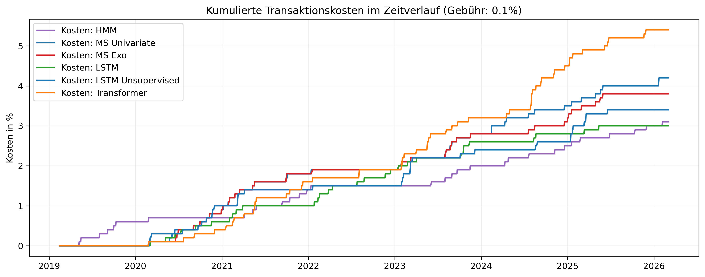

Stress-Test: Sequence of Returns Risk (SORR)
Außerdem wurde die Überlebensdauer des Kapitals in einer simulierten Entnahmephase (Ruhestandsszenario) durchgeführt.

### SORR-Simulation: Vergleich der Entnahmeszenarien

In dieser Tabelle werden verschiedene Stress-Szenarien (Standard, Aggressiv, Geringes Kapital) gegenübergestellt.

|                                | Endkapital     | Status           |
|:-------------------------------|:---------------|:-----------------|
| ('Standard', 'Buy Hold')       | 1,315,694.10 € | Kapitalerhalt    |
| ('Standard', 'MSM')            | 25,128.30 €    | Kapitalerhalt    |
| ('Standard', 'HMM')            | 112,383.68 €   | Kapitalerhalt    |
| ('Standard', 'LSTM')           | 474,613.22 €   | Kapitalerhalt    |
| ('Standard', 'Transformer')    | 0.00 €         | Erschöpft (2022) |
| ('Aggressive', 'Buy Hold')     | 0.00 €         | Erschöpft (2017) |
| ('Aggressive', 'MSM')          | 0.00 €         | Erschöpft (2009) |
| ('Aggressive', 'HMM')          | 0.00 €         | Erschöpft (2008) |
| ('Aggressive', 'LSTM')         | 0.00 €         | Erschöpft (2012) |
| ('Aggressive', 'Transformer')  | 0.00 €         | Erschöpft (2008) |
| ('Low_Capital', 'Buy Hold')    | 158,146.48 €   | Kapitalerhalt    |
| ('Low_Capital', 'MSM')         | 0.00 €         | Erschöpft (2013) |
| ('Low_Capital', 'HMM')         | 0.00 €         | Erschöpft (2013) |
| ('Low_Capital', 'LSTM')        | 0.00 €         | Erschöpft (2019) |
| ('Low_Capital', 'Transformer') | 0.00 €         | Erschöpft (2012) |

Abbildung der Kapitalentwicklung der unterschiedlichen Szenarien:
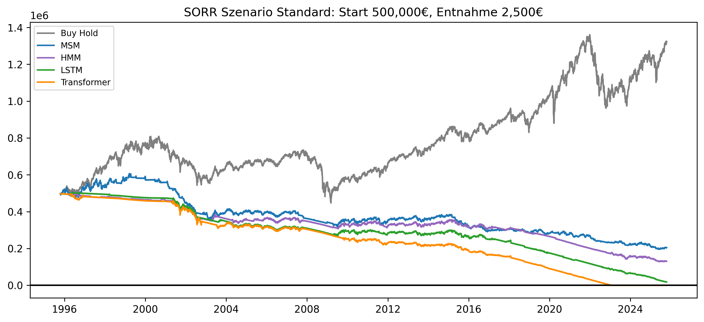
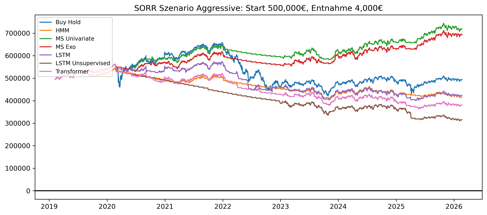
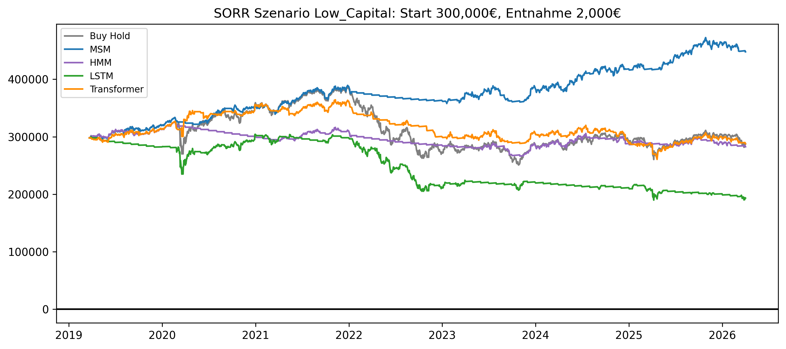

### MCS: Block-Bootstrap Robustness-Check

Um die statistische Signifikanz zu prüfen, wurden 1.000 künstliche Marktpfade mittels Block-Bootstrap simuliert.

|                                | Ruin-Wahrscheinlichkeit   | Median Endkapital   |
|:-------------------------------|:--------------------------|:--------------------|
| ('Standard', 'Buy Hold')       | 0.00%                     | 591,888.03 €        |
| ('Standard', 'MSM')            | 0.00%                     | 447,526.22 €        |
| ('Standard', 'HMM')            | 0.00%                     | 464,986.35 €        |
| ('Standard', 'LSTM')           | 0.00%                     | 479,353.72 €        |
| ('Standard', 'Transformer')    | 0.00%                     | 369,769.49 €        |
| ('Aggressive', 'Buy Hold')     | 2.70%                     | 320,811.93 €        |
| ('Aggressive', 'MSM')          | 1.50%                     | 196,289.19 €        |
| ('Aggressive', 'HMM')          | 0.10%                     | 216,592.84 €        |
| ('Aggressive', 'LSTM')         | 1.30%                     | 248,371.71 €        |
| ('Aggressive', 'Transformer')  | 4.10%                     | 157,676.64 €        |
| ('Low_Capital', 'Buy Hold')    | 0.20%                     | 264,691.48 €        |
| ('Low_Capital', 'MSM')         | 0.10%                     | 186,450.45 €        |
| ('Low_Capital', 'HMM')         | 0.00%                     | 197,962.29 €        |
| ('Low_Capital', 'LSTM')        | 0.00%                     | 203,610.51 €        |
| ('Low_Capital', 'Transformer') | 0.20%                     | 148,852.57 €        |

Verteilung der Endkapitalwerte:

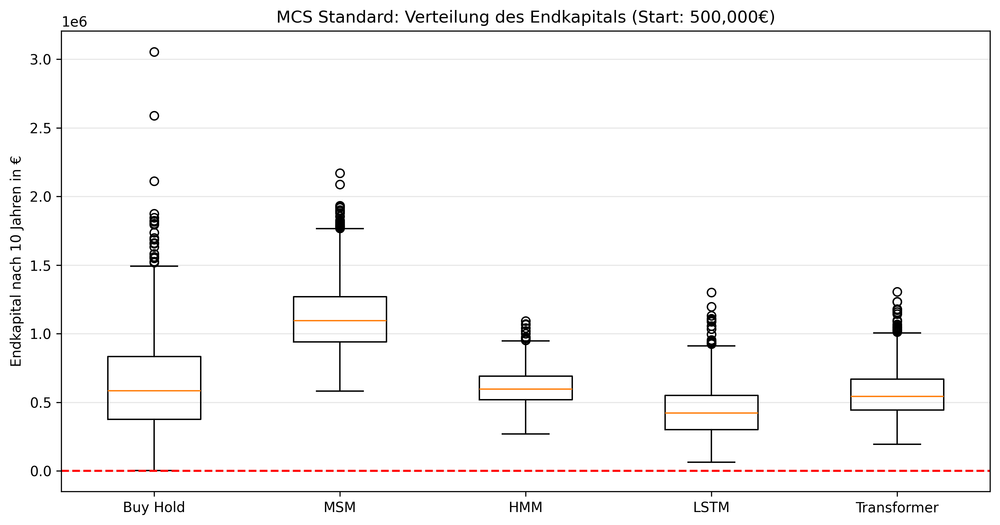
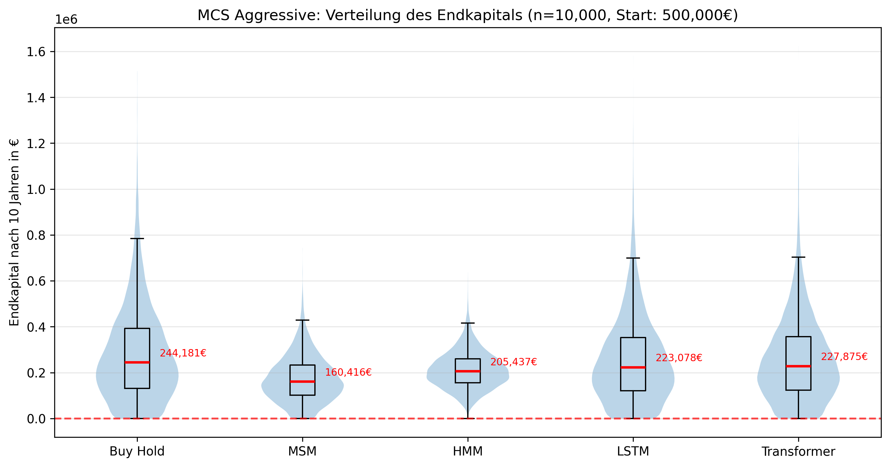
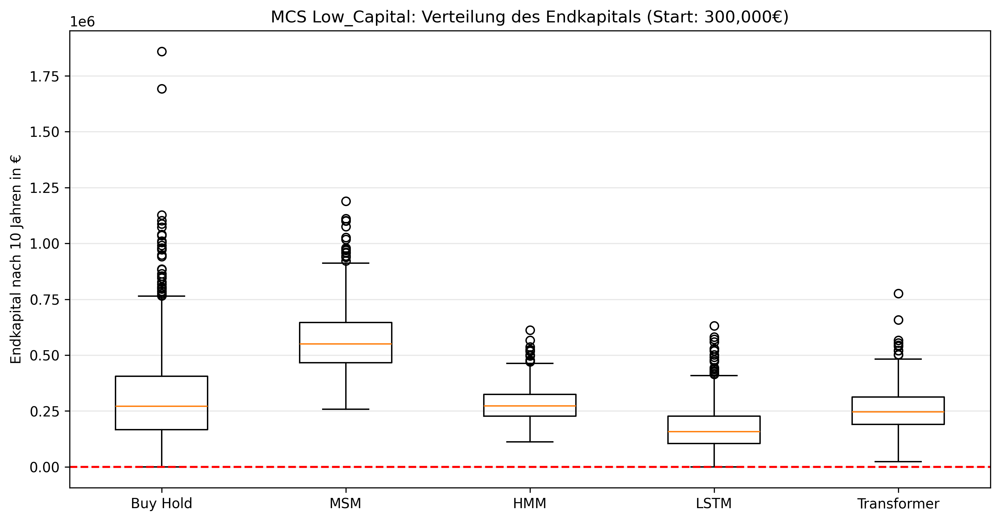

Wahrscheinlichkeitskorridore:

Die schattierten Bereiche zeigen das 5% bis 95% Konfidenzintervall der Kapitalentwicklung.
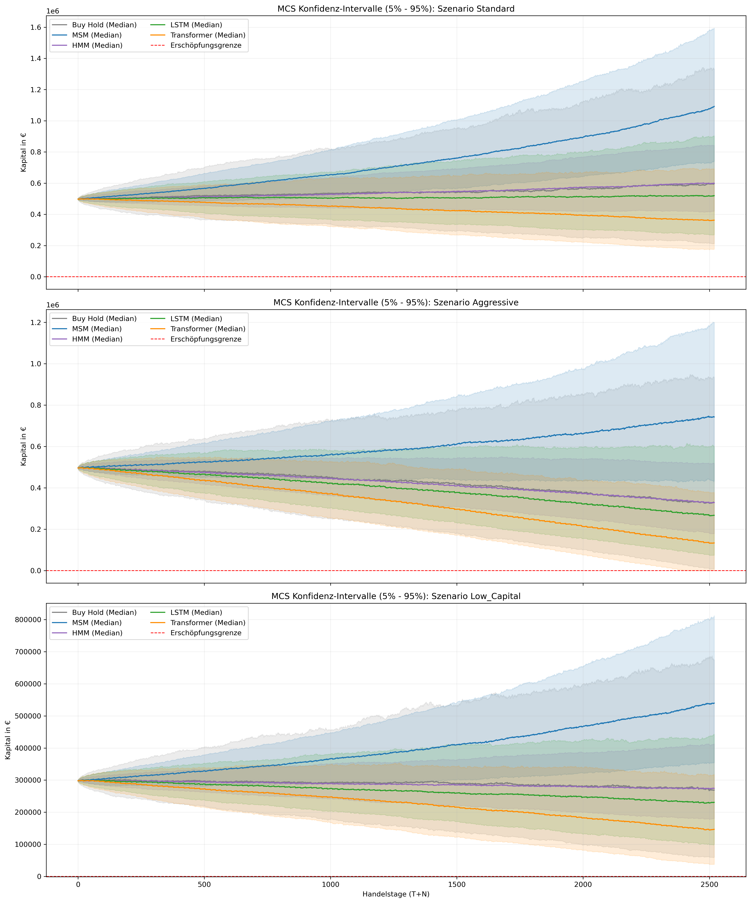

---

## Forschungsnotizen & Methodik
- **Cash-Komponente:** Bei einem "Bear"-Signal schichtet die Strategie in den aktuellen Geldmarktzins (**^IRX**) um.
- **Vermeidung von Look-ahead Bias:** Alle Signale werden für das Backtesting um einen Tag zeitversetzt (`shift(1)`), um reale Handelsbedingungen zu simulieren.
- **Feature-Set:** Die Modelle nutzen Renditen, Volatilität (20d), SMA-Abstand, Momentum, VIX und Yield Spread.
- **Kostensimulation:** Es wird eine pauschale Gebühr von 10 Basispunkten (0,1%) pro Umschichtung berechnet.
- **SORR-Spezifika:** Bei Entnahmen in "Bull"-Phasen wird eine zusätzliche Liquiditätsgebühr von 0,1% auf den Entnahmebetrag erhoben (Asset-Verkäufe). In "Bear"-Phasen (Cash) entfällt diese.

---

## Pipeline-Laufzeiten

Ausführungszeiten der einzelnen Pipeline-Notebooks (monolithischer Notebook-Ansatz).

| Notebook | Start | Ende | Dauer (s) |
|----------|-------|------|-----------|
| 00_dependencies | 18:27:25 | 18:27:27 | 2.7 |
| 01_data_preprocessing | 18:27:27 | 18:27:34 | 7.0 |
| 02_feature_engineering | 18:27:35 | 18:27:39 | 4.6 |
| 03_regime_switching_models | 18:27:39 | 18:27:44 | 4.2 |
| 04_backtesting | 18:27:44 | 18:27:49 | 5.8 |
| 05_evaluation | 18:27:49 | 18:29:50 | 120.6 |
| **Gesamt** | | | **144.9** (2m 24.9s) |

---

## Modell-Persistierung

Status der Modell-Persistierung für diesen Pipeline-Durchlauf:

- **Persistierung:** AKTIV
- **Modell-Verzeichnis:** `../models`

| Modell | Datei | Status |
|:---|:---|:---|
| MSM | `msm_regime_model.pkl` | Neu trainiert |
| HMM | `hmm_regime_model.pkl` | Neu trainiert |
| LSTM | `lstm_regime_model.keras` | Neu trainiert |
| TRANSFORMER | `transformer_regime_model.pt` | Neu trainiert |

> **Hinweis:** Bei aktivierter Persistierung werden vortrainierte Modelle aus `../models` geladen, sofern die Dateien existieren. Andernfalls wird normal trainiert und das Ergebnis für zukünftige Läufe gespeichert. Bei Änderungen an Hyperparametern müssen die entsprechenden Modelldateien gelöscht werden.

---

**Zuletzt aktualisiert:** 11.04.2026 08:31 
**Fast Mode Status zur Laufzeit:** FALSE (Full Run) 
**Walk-Forward-Validierung:** AKTIV (Modus: rolling, Train: 5J, Test: 6M, Step: 6M) 
**Modell-Persistierung:** AKTIV 
*Generiert durch die automatisierte ETL-Pipeline (Notebook 99).*
