# Detailed Statistical Evaluation & Research Results

This page documents the numerical and graphical results of the research pipeline. All evaluations are based on the **frozen dataset** from **1990-01-02** to **2026-07-31** (thesis freeze).

---

## 1. Executive Summary: Performance & Risk
A direct comparison of the core metrics over the entire **out-of-sample test period**.

| Strategy    | Final Wealth   | Total Return   | Max Drawdown   |
|:------------|:---------------|:---------------|:---------------|
| Buy_Hold    | 2,070,561 €    | +314.11%       | -35.08%        |
| MSM         | 1,590,053 €    | +218.01%       | -10.91%        |
| HMM         | 1,057,242 €    | +111.45%       | -17.02%        |
| HMM_Uni     | 1,577,536 €    | +215.51%       | -11.01%        |
| LSTM        | 2,586,400 €    | +417.28%       | -27.71%        |
| Transformer | 1,499,668 €    | +199.93%       | -27.71%        |

> **Key point:** Compare the **max drawdown** of the active strategies with the buy-and-hold benchmark. The objective of this work is a significant reduction of this value to mitigate SORR.

---

## 2. Data Basis & Baseline Portfolio
The analysis is based on a global multi-asset approach.

### Exploratory Data Analysis (EDA)
**Descriptive statistics of the base time series:**
| Time Series   |   Mean (daily) |   Std. Dev. (daily) |     Min |     Max |   Skewness |   Kurtosis |
|:--------------|---------------:|--------------------:|--------:|--------:|-----------:|-----------:|
| Returns_GSPC  |       0.00033  |            0.011348 | -0.1277 |  0.1096 |    -0.364  |    10.8616 |
| Returns_VUSTX |       0.000209 |            0.007249 | -0.0605 |  0.0654 |    -0.0304 |     4.5173 |
| Returns       |       0.000281 |            0.006881 | -0.0662 |  0.0584 |    -0.2805 |     7.6516 |
| VIX           |      19.4499   |            7.73648  |  9.14   | 82.69   |     2.2107 |     8.7497 |
| TNX_10Y       |       4.24552  |            1.92538  |  0.499  |  9.09   |     0.3251 |    -0.6254 |
| IRX_3M        |       2.71619  |            2.19564  | -0.105  |  7.99   |     0.1893 |    -1.2495 |

**Stationarity check (augmented Dickey-Fuller test):**
| Time Series   |   ADF Statistic |    p-Value |   Crit. Value (5%) | Stationary?   |
|:--------------|----------------:|-----------:|-------------------:|:--------------|
| Returns_GSPC  |        -17.5642 | 4.0821e-30 |            -2.8619 | Yes           |
| Returns_VUSTX |        -18.7155 | 2.0338e-30 |            -2.8619 | Yes           |
| Returns       |        -21.0141 | 0          |            -2.8619 | Yes           |
| VIX           |         -7.3175 | 1.2184e-10 |            -2.8619 | Yes           |
| TNX_10Y       |         -2.3356 | 0.16076    |            -2.8619 | No            |
| IRX_3M        |         -2.3494 | 0.15654    |            -2.8619 | No            |

**Volatility clusters and autocorrelation (heteroskedasticity):**
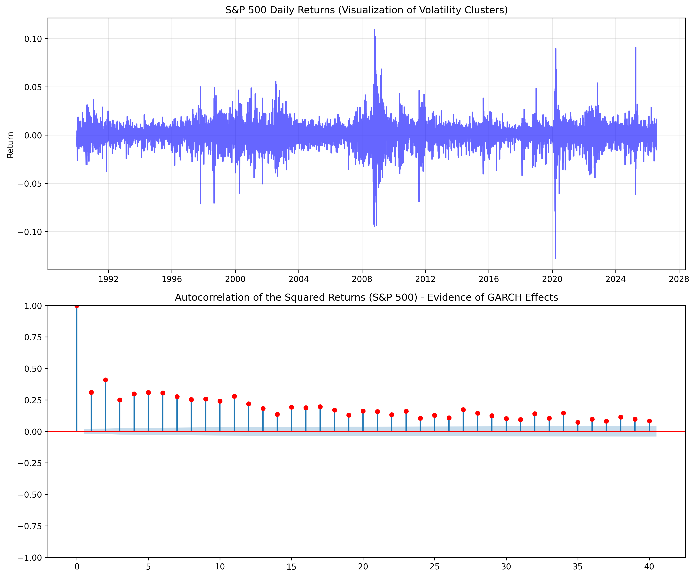

### Feature Correlation
Pearson correlation matrix of the six model features to check for multicollinearity.

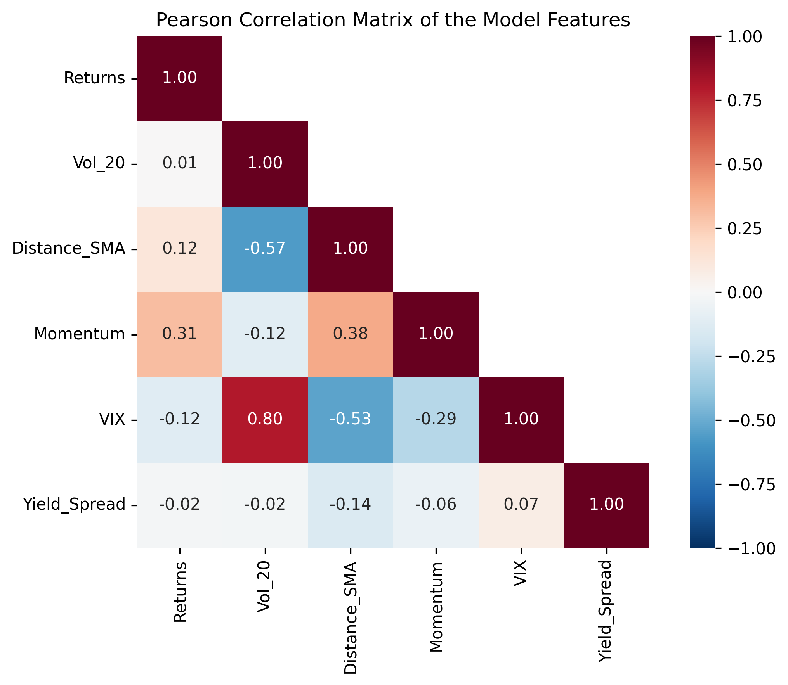

### SORR Context: Historical Drawdowns
The most extreme loss phases of the 60/40 portfolio, shown as motivation for active capital protection.
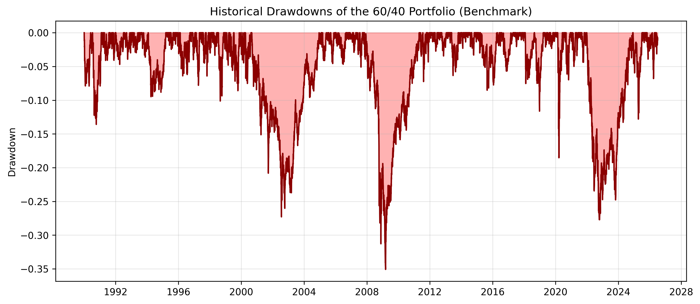

### 60/40 Portfolio Capital Curve
The figure shows the cumulative performance of the static reference portfolio (60% equities / 40% bonds).

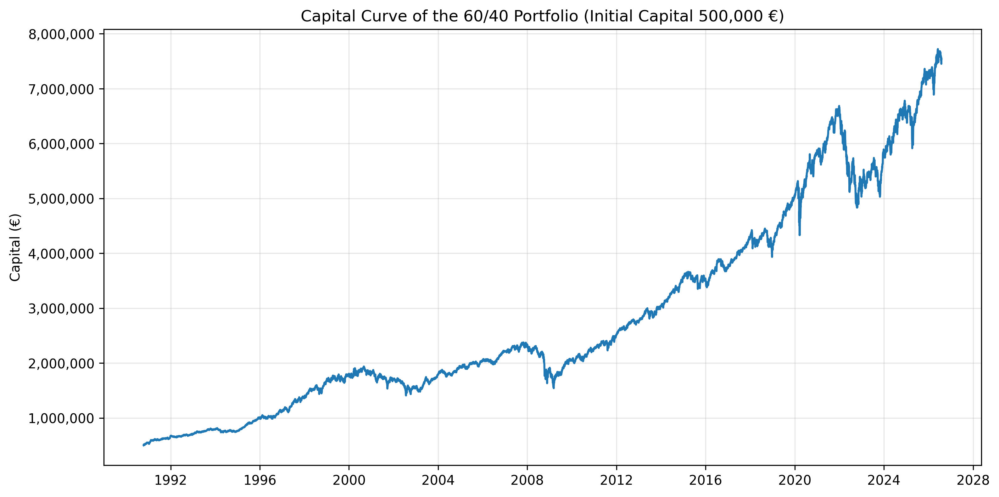

*   **Data source:** S&P 500 (`^GSPC`) and Vanguard Long-Term Treasury (`VUSTX`).
*   **Reproducibility:** The cleaned dataset incl. all features is stored at: `data/02_feature_engineered_data.parquet`.

---

## 3. Regime Detection of the Individual Models
This section visualizes the identification results of the model categories (statistics, clustering, deep learning).

### A. Markov-Switching Models (Econometrics)
Identification of bull and bear regimes using a univariate two-regime Markov-switching model based on S&P 500 returns.
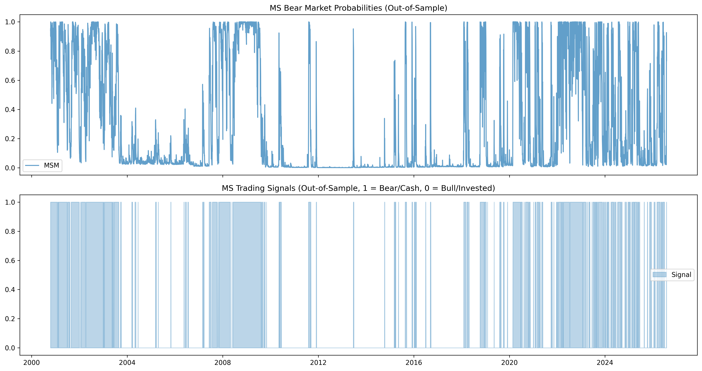

### B. Hidden Markov Model (Unsupervised Clustering)
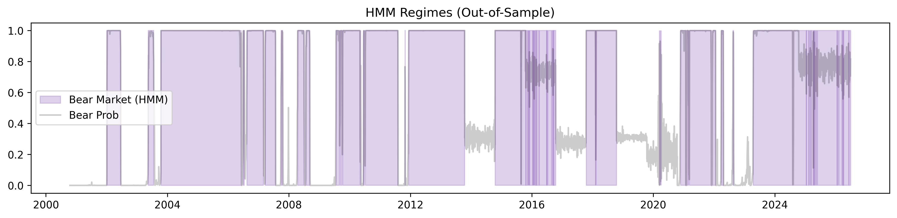

### C. Univariate HMM (Ablation, Issue #3)
Robustness check for the MSM-vs-HMM architecture comparison: identical
input space to the MSM (60/40 returns only). Isolates the architectural effect
(clustering vs. Markov-switching regression) from the information contribution of the
extended features (VIX, yield spread).
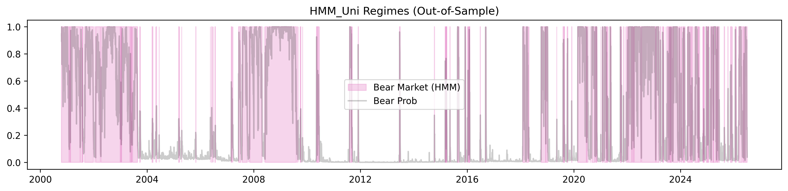

### D. LSTM Network (Deep Learning)
Prediction of market phases by the neural network (trained on Pagan-Sossounov labels).
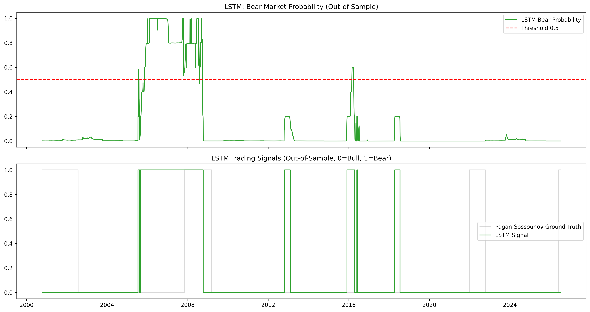

### E. Transformer Network (Attention-Based Regime Detection)
Classification of market regimes using a Transformer encoder with multi-head self-attention and positional encoding. In contrast to recurrent architectures (LSTM), the Transformer processes all time steps of a sequence in parallel and learns via the attention mechanism which historical data points are most relevant for the current regime classification. Trained in a supervised setting on Pagan-Sossounov labels.
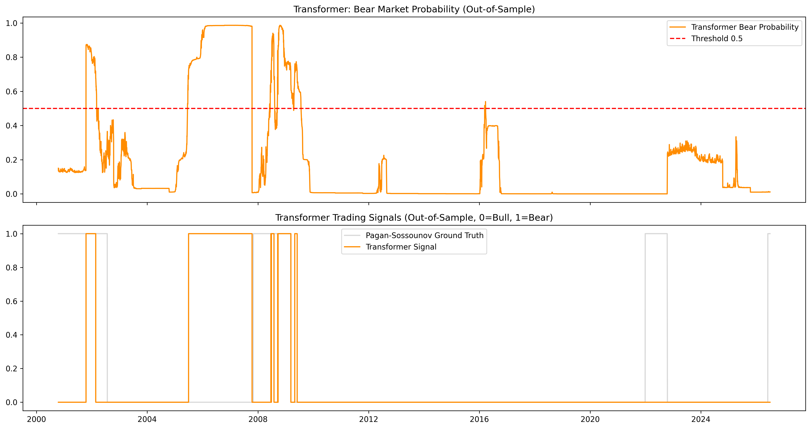

### F. Global Regime Comparison
Detailed comparison of the probabilities and hard signals of all models.

### G. Hyperparameter Optimization (Optuna)
Search over the hyperparameter space of all models using walk-forward validation as inner CV. The objective is the configured risk metric (default: Martin ratio = CAGR / Ulcer index) on the **pooled** OOS return series across all HPO folds. Econometric models are searched exhaustively via GridSampler, the DL models via a multivariate TPESampler. Selection runs on the development folds only (`tune_until`); the holdout folds stay selection-free for the final walk-forward run. The values reported here were adopted into `config.yaml` for the final run.

# Optuna: Best Hyperparameters

_Generated at 2026-08-08 08:37:18_  
Optimization metric: **martin (pooled OOS)**

## Overview

| Model | Best Score | ✓ Complete | ✗ Pruned | Total |
|:---|---:|---:|---:|---:|
| **MSM** | 1.6366 | 36 | 0 | 36 |
| **HMM** | 0.8884 | 108 | 0 | 108 |
| **HMM_Uni** | 1.6261 | 36 | 0 | 36 |
| **LSTM** | 2.3114 | 300 | 0 | 301 |
| **Transformer** | 2.5278 | 400 | 0 | 400 |

### MSM: Best Score `1.6366`

| Parameter | Value |
|:---|---:|
| `threshold` | `0.175` |

Secondary metrics of the best trial (pooled OOS):

| Metric | Value |
|:---|---:|
| sharpe | 0.8784 |
| sortino | 1.0486 |
| calmar | 0.6579 |
| martin | 1.6366 |
| ulcer | 3.2758 |
| max_drawdown | -0.0815 |
| cagr | 0.0536 |

### HMM: Best Score `0.8884`

| Parameter | Value |
|:---|---:|
| `covariance_type` | `diag` |
| `threshold` | `0.975` |

Secondary metrics of the best trial (pooled OOS):

| Metric | Value |
|:---|---:|
| sharpe | 0.5772 |
| sortino | 0.6061 |
| calmar | 0.3276 |
| martin | 0.8884 |
| ulcer | 3.2562 |
| max_drawdown | -0.0883 |
| cagr | 0.0289 |

### HMM_Uni: Best Score `1.6261`

| Parameter | Value |
|:---|---:|
| `threshold` | `0.175` |

Secondary metrics of the best trial (pooled OOS):

| Metric | Value |
|:---|---:|
| sharpe | 0.8702 |
| sortino | 1.0387 |
| calmar | 0.6703 |
| martin | 1.6261 |
| ulcer | 3.2691 |
| max_drawdown | -0.0793 |
| cagr | 0.0532 |

### LSTM: Best Score `2.3114`

| Parameter | Value |
|:---|---:|
| `window_size` | `100` |
| `units_l1` | `32` |
| `units_l2` | `256` |
| `batch_size` | `64` |
| `learning_rate` | `2.440e-05` |
| `dropout` | `0.25` |
| `threshold` | `0.3` |

Secondary metrics of the best trial (pooled OOS):

| Metric | Value |
|:---|---:|
| sharpe | 0.8823 |
| sortino | 1.0285 |
| calmar | 0.3410 |
| martin | 2.3114 |
| ulcer | 2.8716 |
| max_drawdown | -0.1946 |
| cagr | 0.0664 |

### Transformer: Best Score `2.5278`

| Parameter | Value |
|:---|---:|
| `window_size` | `220` |
| `dmodel_nheads` | `128-8` |
| `n_layers` | `4` |
| `dim_feedforward` | `32` |
| `batch_size` | `128` |
| `learning_rate` | `1.115e-05` |
| `dropout` | `0.05` |
| `threshold` | `0.1` |

Secondary metrics of the best trial (pooled OOS):

| Metric | Value |
|:---|---:|
| sharpe | 0.9823 |
| sortino | 1.0888 |
| calmar | 0.6987 |
| martin | 2.5278 |
| ulcer | 2.3539 |
| max_drawdown | -0.0852 |
| cagr | 0.0595 |

**Diagnostic plots per model** (optimization history, parameter importance, slice, contour):

| Model | History | Importance | Slice | Contour |
|:---|:---|:---|:---|:---|
| MSM         | 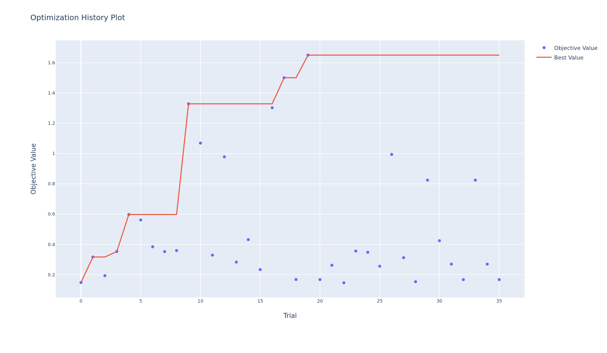         |          | 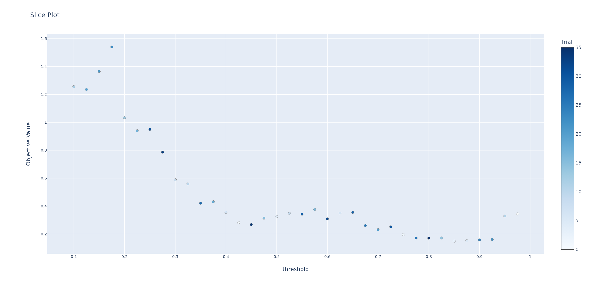         | n/a ¹                                         |
| HMM         | 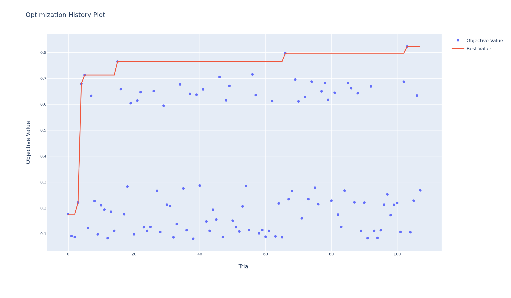         | 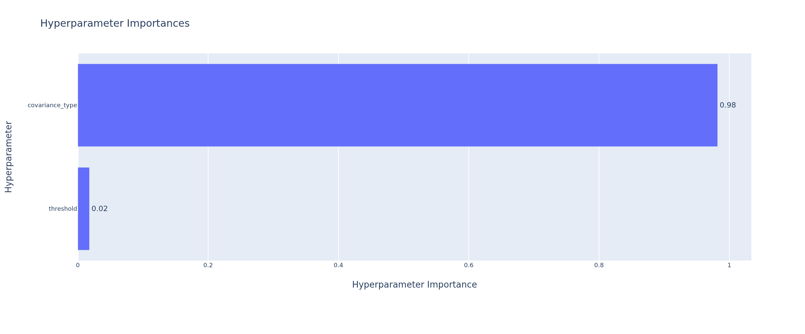         | 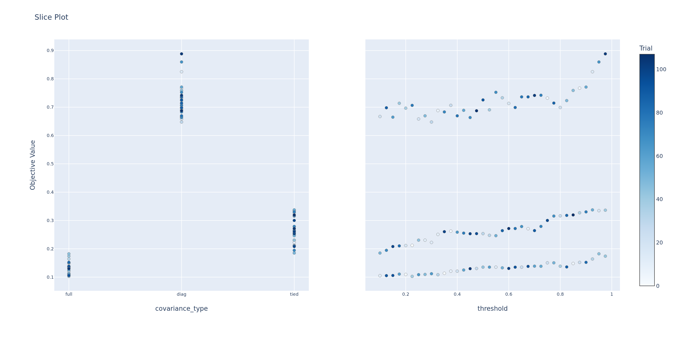         | 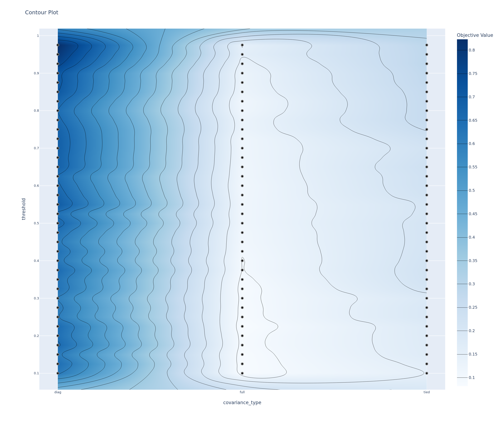         |
| HMM_Uni     | 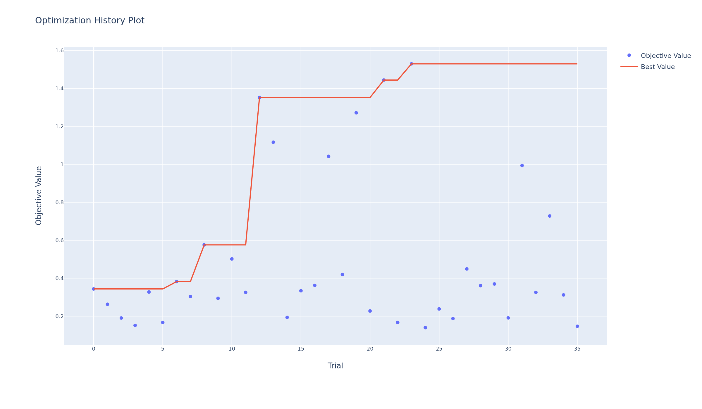     | 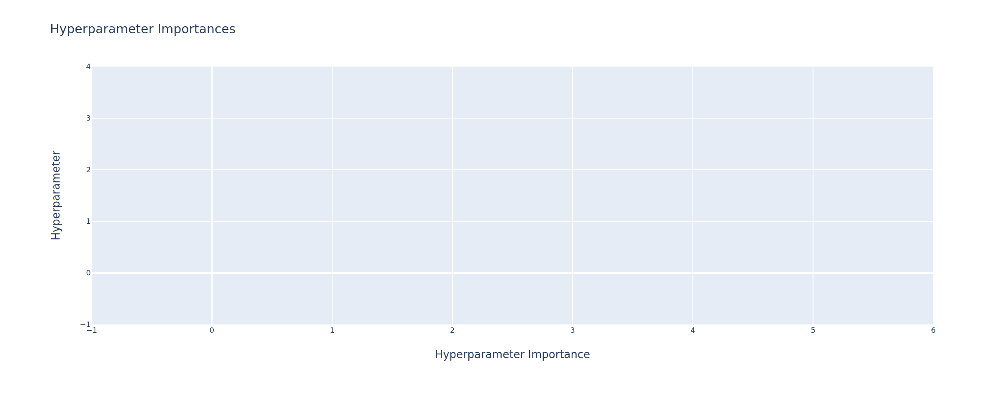     | 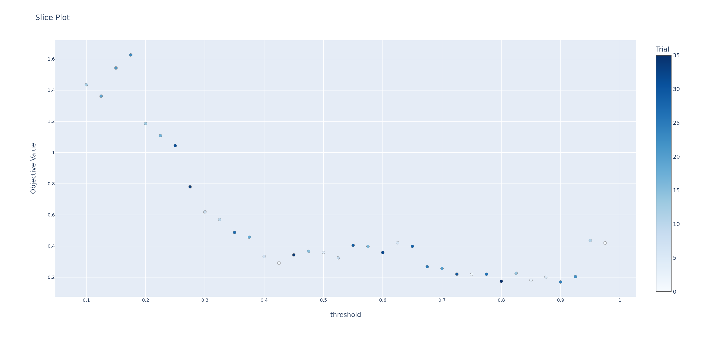     | n/a ¹                                         |
| LSTM        | 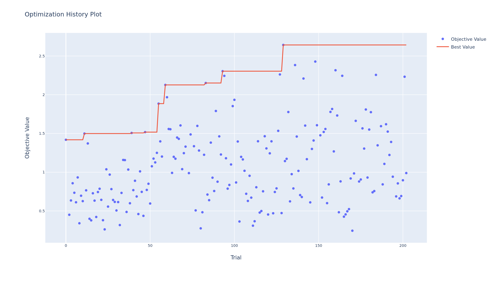        | 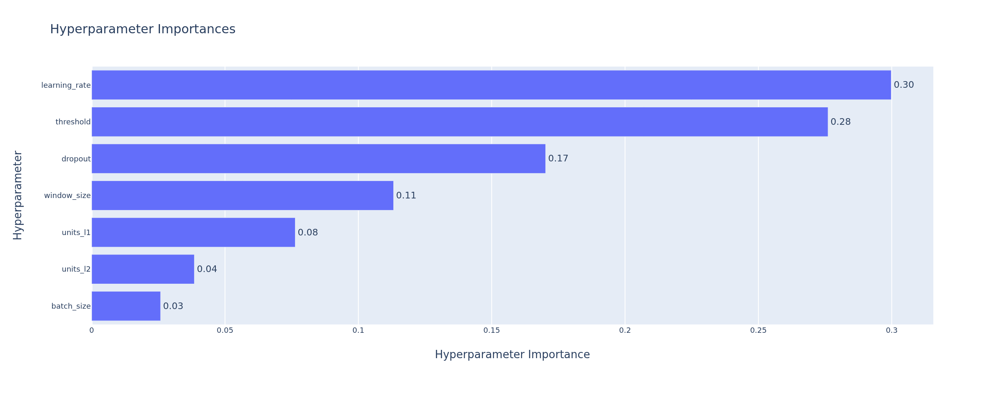        | 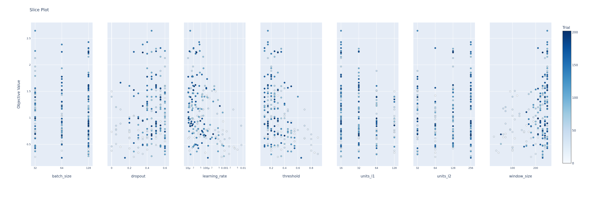        | 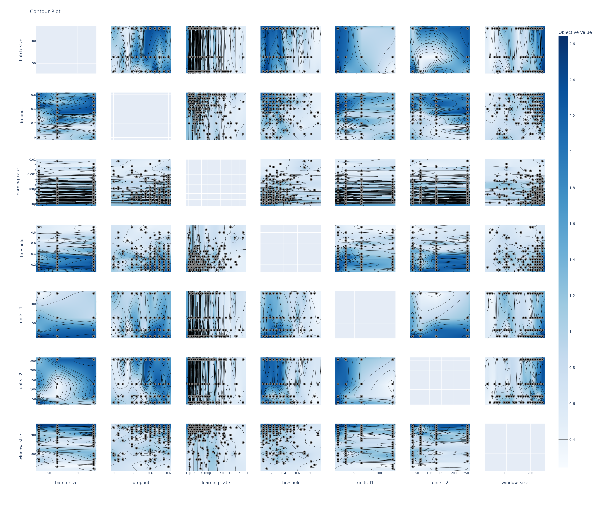        |
| Transformer | 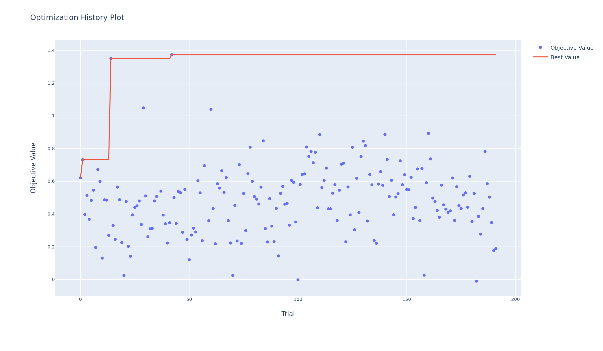 | 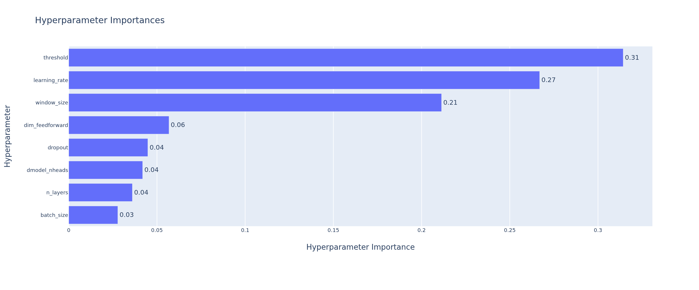 | 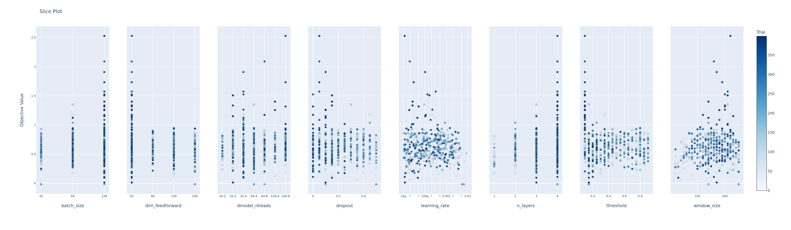 | 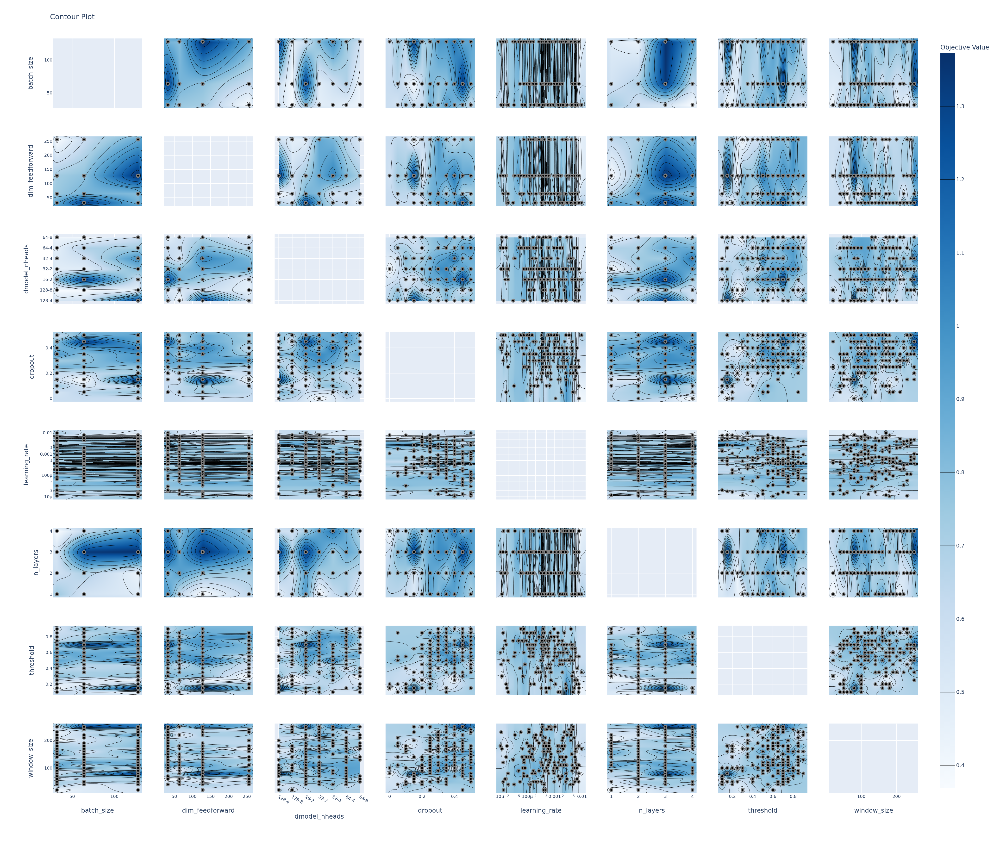 |

¹ MSM and HMM_Uni have only one hyperparameter (`threshold`) in the search space. The contour plot would be degenerate and is omitted.

#### G.1 Convergence & Edge-of-Range Review
Best value and trial, fANOVA importance, and a flag for optima sitting within one grid step of a search bound (indicating the range may be too narrow).

# HPO Convergence & Edge-of-Range Review

_Generated at 2026-08-08 08:37:27_

| model       | metric   |   best_value |   best_trial |   conv_frac |   n_complete |   n_pruned | top_importance                                       | edge_flags                                                                                                                                                        |
|:------------|:---------|-------------:|-------------:|------------:|-------------:|-----------:|:-----------------------------------------------------|:------------------------------------------------------------------------------------------------------------------------------------------------------------------|
| MSM         | martin   |       1.6366 |           23 |        0.66 |           36 |          0 | threshold=1.00                                       | -                                                                                                                                                                 |
| HMM         | martin   |       0.8884 |          103 |        0.96 |          108 |          0 | covariance_type=0.98, threshold=0.02                 | threshold=0.975 near UPPER bound 0.975                                                                                                                            |
| HMM_Uni     | martin   |       1.6261 |           23 |        0.66 |           36 |          0 | threshold=1.00                                       | -                                                                                                                                                                 |
| LSTM        | martin   |       2.3114 |           98 |        0.33 |          300 |          0 | dropout=0.27, units_l1=0.18, learning_rate=0.15      | learning_rate=2.4402813755083274e-05 near LOWER bound 1e-05                                                                                                       |
| Transformer | martin   |       2.5278 |          367 |        0.92 |          400 |          0 | threshold=0.31, learning_rate=0.27, window_size=0.21 | n_layers=4 near UPPER bound 4; learning_rate=1.1146705922954242e-05 near LOWER bound 1e-05; dropout=0.05 near LOWER bound 0.0; threshold=0.1 near LOWER bound 0.1 |

#### G.2 Objective Sensitivity
Which config would have been selected under each candidate metric, valued across all metrics. `same_as_objective = True` throughout means the model choice is robust to the objective; divergences quantify the trade-off.

# Objective Sensitivity of the Selected Hyperparameters

_Generated at 2026-08-08 08:37:28_  
Best config under each candidate metric, valued across all metrics (from the search trials' logged OOS metrics; no retraining). `same_as_objective` marks configs identical to the actual objective's pick.

## MSM (objective: martin, 36 trials)

| optimized_for   |   trial | same_as_objective   |   martin |   sharpe |   sortino |   calmar |   ulcer |   max_drawdown |   cagr |
|:----------------|--------:|:--------------------|---------:|---------:|----------:|---------:|--------:|---------------:|-------:|
| martin          |      23 | True                |   1.6366 |   0.8784 |    1.0486 |   0.6579 |  3.2758 |        -0.0815 | 0.0536 |
| sharpe          |      23 | True                |   1.6366 |   0.8784 |    1.0486 |   0.6579 |  3.2758 |        -0.0815 | 0.0536 |
| sortino         |      23 | True                |   1.6366 |   0.8784 |    1.0486 |   0.6579 |  3.2758 |        -0.0815 | 0.0536 |
| calmar          |      23 | True                |   1.6366 |   0.8784 |    1.0486 |   0.6579 |  3.2758 |        -0.0815 | 0.0536 |
| ulcer           |      23 | True                |   1.6366 |   0.8784 |    1.0486 |   0.6579 |  3.2758 |        -0.0815 | 0.0536 |
| max_drawdown    |      23 | True                |   1.6366 |   0.8784 |    1.0486 |   0.6579 |  3.2758 |        -0.0815 | 0.0536 |

Selected configs:
- best under **martin**: threshold=0.175

## HMM (objective: martin, 108 trials)

| optimized_for   |   trial | same_as_objective   |   martin |   sharpe |   sortino |   calmar |   ulcer |   max_drawdown |   cagr |
|:----------------|--------:|:--------------------|---------:|---------:|----------:|---------:|--------:|---------------:|-------:|
| martin          |     103 | True                |   0.8884 |   0.5772 |    0.6061 |   0.3276 |  3.2562 |        -0.0883 | 0.0289 |
| sharpe          |     103 | True                |   0.8884 |   0.5772 |    0.6061 |   0.3276 |  3.2562 |        -0.0883 | 0.0289 |
| sortino         |     103 | True                |   0.8884 |   0.5772 |    0.6061 |   0.3276 |  3.2562 |        -0.0883 | 0.0289 |
| calmar          |     103 | True                |   0.8884 |   0.5772 |    0.6061 |   0.3276 |  3.2562 |        -0.0883 | 0.0289 |
| ulcer           |     103 | True                |   0.8884 |   0.5772 |    0.6061 |   0.3276 |  3.2562 |        -0.0883 | 0.0289 |
| max_drawdown    |     103 | True                |   0.8884 |   0.5772 |    0.6061 |   0.3276 |  3.2562 |        -0.0883 | 0.0289 |

Selected configs:
- best under **martin**: covariance_type=diag, threshold=0.975

## HMM_Uni (objective: martin, 36 trials)

| optimized_for   |   trial | same_as_objective   |   martin |   sharpe |   sortino |   calmar |   ulcer |   max_drawdown |   cagr |
|:----------------|--------:|:--------------------|---------:|---------:|----------:|---------:|--------:|---------------:|-------:|
| martin          |      23 | True                |   1.6261 |   0.8702 |    1.0387 |   0.6703 |  3.2691 |        -0.0793 | 0.0532 |
| sharpe          |      23 | True                |   1.6261 |   0.8702 |    1.0387 |   0.6703 |  3.2691 |        -0.0793 | 0.0532 |
| sortino         |      23 | True                |   1.6261 |   0.8702 |    1.0387 |   0.6703 |  3.2691 |        -0.0793 | 0.0532 |
| calmar          |      23 | True                |   1.6261 |   0.8702 |    1.0387 |   0.6703 |  3.2691 |        -0.0793 | 0.0532 |
| ulcer           |      12 | False               |   1.4351 |   0.7999 |    0.9088 |   0.4525 |  3.2139 |        -0.1019 | 0.0461 |
| max_drawdown    |      23 | True                |   1.6261 |   0.8702 |    1.0387 |   0.6703 |  3.2691 |        -0.0793 | 0.0532 |

Selected configs:
- best under **martin**: threshold=0.175
- best under **ulcer**: threshold=0.1

## LSTM (objective: martin, 300 trials)

| optimized_for   |   trial | same_as_objective   |   martin |   sharpe |   sortino |   calmar |   ulcer |   max_drawdown |   cagr |
|:----------------|--------:|:--------------------|---------:|---------:|----------:|---------:|--------:|---------------:|-------:|
| martin          |      98 | True                |   2.3114 |   0.8823 |    1.0285 |   0.341  |  2.8716 |        -0.1946 | 0.0664 |
| sharpe          |      98 | True                |   2.3114 |   0.8823 |    1.0285 |   0.341  |  2.8716 |        -0.1946 | 0.0664 |
| sortino         |     256 | False               |   1.7195 |   0.8217 |    1.1045 |   0.348  |  3.8486 |        -0.1902 | 0.0662 |
| calmar          |     167 | False               |   1.8084 |   0.8056 |    1.0125 |   0.3731 |  4.0151 |        -0.1946 | 0.0726 |
| ulcer           |      98 | True                |   2.3114 |   0.8823 |    1.0285 |   0.341  |  2.8716 |        -0.1946 | 0.0664 |
| max_drawdown    |     222 | False               |   1.503  |   0.7961 |    0.8874 |   0.2944 |  3.5731 |        -0.1824 | 0.0537 |

Selected configs:
- best under **martin**: window_size=100, units_l1=32, units_l2=256, batch_size=64, learning_rate=2.4402813755083274e-05, dropout=0.25, threshold=0.30000000000000004
- best under **sortino**: window_size=220, units_l1=128, units_l2=32, batch_size=32, learning_rate=1.2305735878442937e-05, dropout=0.0, threshold=0.2
- best under **calmar**: window_size=120, units_l1=128, units_l2=32, batch_size=32, learning_rate=1.2474927184485425e-05, dropout=0.30000000000000004, threshold=0.30000000000000004
- best under **max_drawdown**: window_size=170, units_l1=32, units_l2=128, batch_size=32, learning_rate=1.6583991689712137e-05, dropout=0.0, threshold=0.15000000000000002

## Transformer (objective: martin, 400 trials)

| optimized_for   |   trial | same_as_objective   |   martin |   sharpe |   sortino |   calmar |   ulcer |   max_drawdown |   cagr |
|:----------------|--------:|:--------------------|---------:|---------:|----------:|---------:|--------:|---------------:|-------:|
| martin          |     367 | True                |   2.5278 |   0.9823 |    1.0888 |   0.6987 |  2.3539 |        -0.0852 | 0.0595 |
| sharpe          |     367 | True                |   2.5278 |   0.9823 |    1.0888 |   0.6987 |  2.3539 |        -0.0852 | 0.0595 |
| sortino         |     367 | True                |   2.5278 |   0.9823 |    1.0888 |   0.6987 |  2.3539 |        -0.0852 | 0.0595 |
| calmar          |     367 | True                |   2.5278 |   0.9823 |    1.0888 |   0.6987 |  2.3539 |        -0.0852 | 0.0595 |
| ulcer           |     367 | True                |   2.5278 |   0.9823 |    1.0888 |   0.6987 |  2.3539 |        -0.0852 | 0.0595 |
| max_drawdown    |     367 | True                |   2.5278 |   0.9823 |    1.0888 |   0.6987 |  2.3539 |        -0.0852 | 0.0595 |

Selected configs:
- best under **martin**: window_size=220, dmodel_nheads=128-8, n_layers=4, dim_feedforward=32, batch_size=128, learning_rate=1.1146705922954242e-05, dropout=0.05, threshold=0.1

#### G.3 Deflated Sharpe Ratio & Backtest Overfitting
DSR deflates the selected config's Sharpe for the number of tested configs; PBO (CSCV) estimates the probability that the in-sample-best config underperforms out-of-sample.

# Deflated Sharpe Ratio (multiple-testing adjusted)

_Generated at 2026-08-08 08:41:21_

| model       |   n_trials |   sr_ann_best |   sr_star_ann |    dsr | significant_5pct   |
|:------------|-----------:|--------------:|--------------:|-------:|:-------------------|
| MSM         |         36 |        0.8473 |        0.3051 | 0.9841 | True               |
| HMM         |        108 |        0.551  |        0.2763 | 0.8619 | False              |
| HMM_Uni     |         36 |        0.8391 |        0.3206 | 0.98   | True               |
| LSTM        |        300 |        0.7908 |        0.2834 | 0.9785 | True               |
| Transformer |        400 |        0.9737 |        0.304  | 0.9959 | True               |

DSR = P(true Sharpe > 0) after deflating the best trial's Sharpe for the number of tested configs. `significant_5pct` = DSR > 0.95.

# Probability of Backtest Overfitting (CSCV)

_Generated at 2026-08-08 10:13:32_

| model       |   folds |   configs |   pbo |
|:------------|--------:|----------:|------:|
| MSM         |      16 |        15 | 0.488 |
| HMM         |      16 |        15 | 0.972 |
| HMM_Uni     |      16 |        15 | 0.484 |
| LSTM        |      16 |        15 | 0.159 |
| Transformer |      16 |        15 | 0.091 |

PBO over the top-15 configs per model (per-fold Sharpe matrix, CSCV). Lower is better; PBO > 0.5 flags overfitting.

#### G.4 Multi-Seed Robustness (DL)
Top DL configs re-evaluated over several global seeds; mean/std of every metric quantify seed sensitivity of the deep-learning ranking.

# Multi-Seed Re-Evaluation (top-5, 5 seeds)

_Generated at 2026-08-08 12:21:07_

### LSTM

|   rank |   trial |   martin_hpo |   martin_mean |   martin_std |   sharpe_mean |   sharpe_std |   sortino_mean |   sortino_std |   calmar_mean |   calmar_std |   ulcer_mean |   ulcer_std |   max_drawdown_mean |   max_drawdown_std |   cagr_mean |   cagr_std |
|-------:|--------:|-------------:|--------------:|-------------:|--------------:|-------------:|---------------:|--------------:|--------------:|-------------:|-------------:|------------:|--------------------:|-------------------:|------------:|-----------:|
|      1 |      98 |       2.3114 |        1.6697 |       0.1076 |        0.7657 |       0.0306 |         0.9436 |        0.0379 |        0.3385 |       0.0144 |       3.9507 |      0.0925 |             -0.1946 |             0      |      0.0659 |     0.0028 |
|      2 |      83 |       2.0483 |        1.7751 |       0.3024 |        0.7869 |       0.0392 |         0.9871 |        0.0351 |        0.3301 |       0.0229 |       3.6112 |      0.4796 |             -0.1901 |             0.0058 |      0.0628 |     0.0055 |
|      3 |     271 |       1.843  |        1.4791 |       0.1367 |        0.7194 |       0.0515 |         0.8886 |        0.0693 |        0.3145 |       0.0304 |       4.2323 |      0.1785 |             -0.1992 |             0.0089 |      0.0624 |     0.0043 |
|      4 |      63 |       1.8143 |        1.5745 |       0.1664 |        0.7236 |       0.0563 |         0.823  |        0.076  |        0.3108 |       0.0254 |       3.8514 |      0.1123 |             -0.1946 |             0      |      0.0605 |     0.0049 |
|      5 |     167 |       1.8084 |        1.2588 |       0.2971 |        0.6592 |       0.1028 |         0.8092 |        0.1444 |        0.2649 |       0.0594 |       4.7379 |      0.8205 |             -0.225  |             0.0402 |      0.0573 |     0.0053 |

### Transformer

|   rank |   trial |   martin_hpo |   martin_mean |   martin_std |   sharpe_mean |   sharpe_std |   sortino_mean |   sortino_std |   calmar_mean |   calmar_std |   ulcer_mean |   ulcer_std |   max_drawdown_mean |   max_drawdown_std |   cagr_mean |   cagr_std |
|-------:|--------:|-------------:|--------------:|-------------:|--------------:|-------------:|---------------:|--------------:|--------------:|-------------:|-------------:|------------:|--------------------:|-------------------:|------------:|-----------:|
|      1 |     367 |       2.5278 |        2.2613 |       0.314  |        0.9488 |       0.0173 |         1.0511 |        0.0208 |        0.6623 |       0.0433 |       2.6126 |      0.3982 |             -0.0876 |             0.005  |      0.0578 |     0.0011 |
|      2 |     325 |       2.0895 |        1.2056 |       0.4136 |        0.7365 |       0.0804 |         0.7886 |        0.0831 |        0.4207 |       0.1057 |       3.7942 |      0.6714 |             -0.1062 |             0.0174 |      0.043  |     0.0045 |
|      3 |     344 |       1.9081 |        0.8818 |       0.1786 |        0.6315 |       0.0874 |         0.7334 |        0.1053 |        0.2275 |       0.036  |       5.3737 |      0.7864 |             -0.2056 |             0.0238 |      0.0461 |     0.0044 |
|      4 |     371 |       1.7336 |        1.1325 |       0.1344 |        0.6326 |       0.0214 |         0.7421 |        0.0423 |        0.265  |       0.0163 |       4.6759 |      0.3707 |             -0.1985 |             0.012  |      0.0525 |     0.0025 |
|      5 |     335 |       1.5741 |        0.9091 |       0.3066 |        0.5927 |       0.0884 |         0.7344 |        0.1235 |        0.213  |       0.0545 |       5.7433 |      1.147  |             -0.2355 |             0.0254 |      0.0488 |     0.0074 |

### H. Label Concordance (Selection of the Training Labels)
Comparison of the regime labelers (MSM, HMM, Pagan-Sossounov, Peak-to-Trough, Lunde-Timmermann, NBER) to justify the label choice for the supervised models. Pagan-Sossounov was chosen as the training target for LSTM and Transformer due to its high concordance with NBER recession periods.

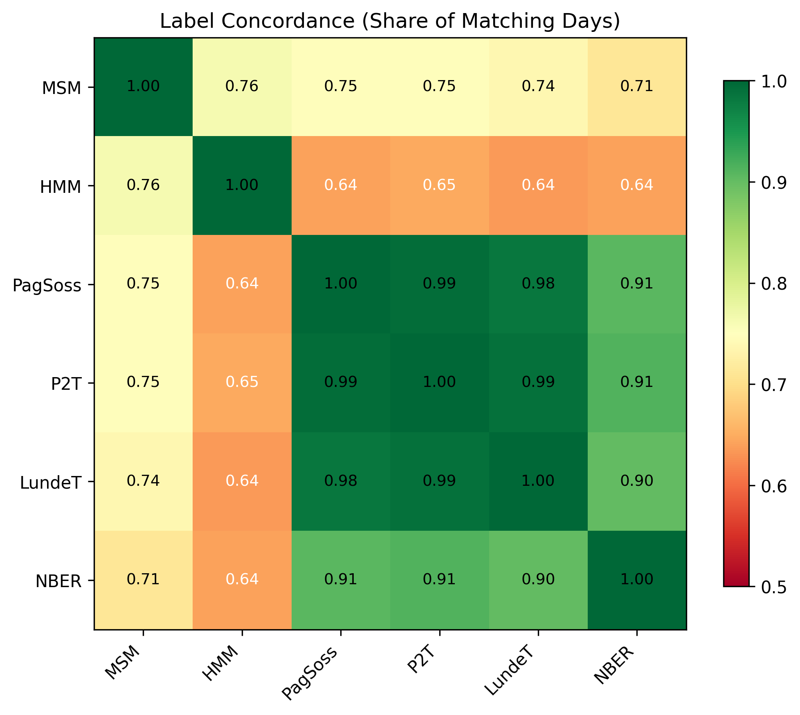
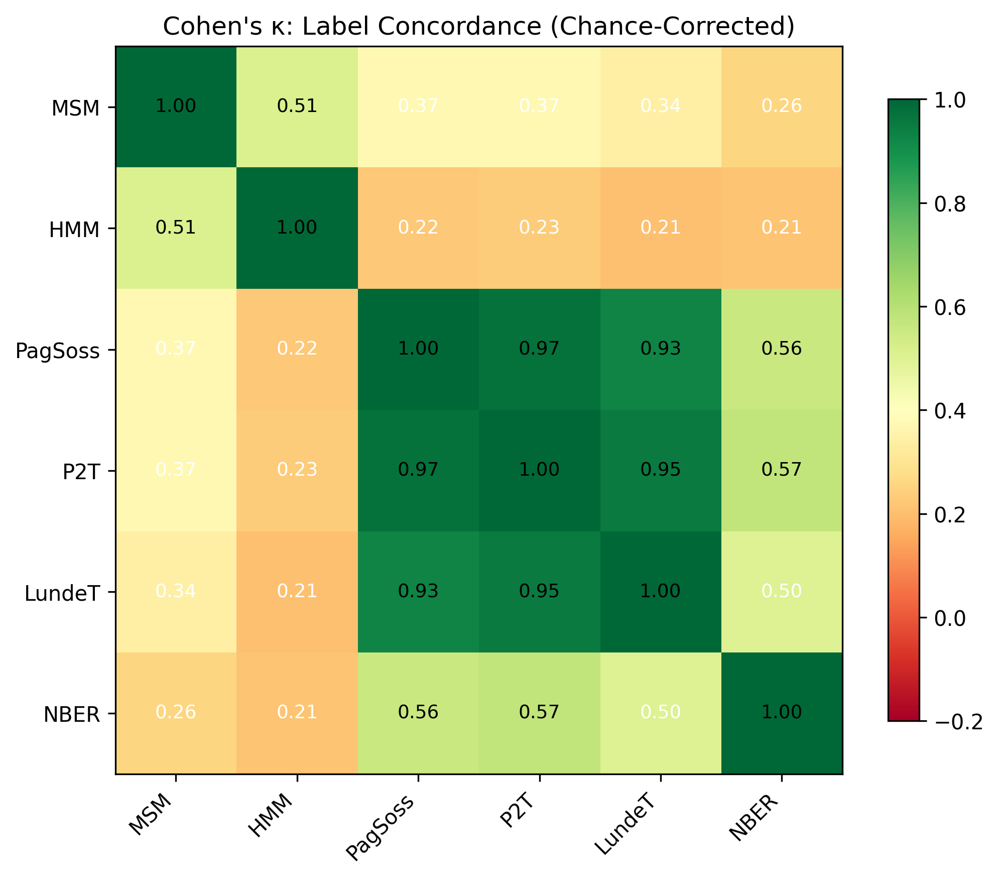
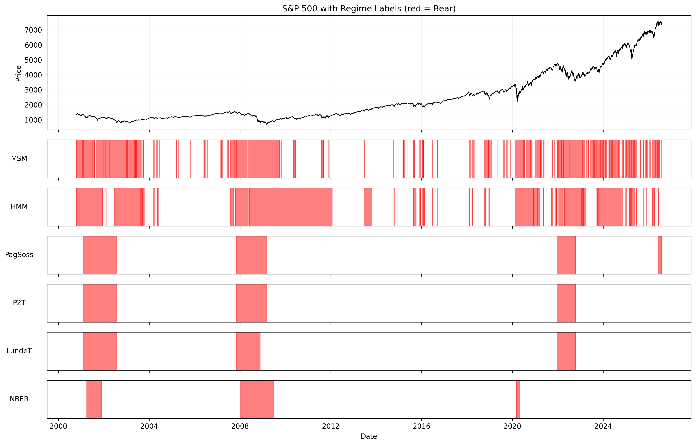

---

## 4. Backtesting & Strategy Evaluation
The economic application of the regime signals via dynamic reallocation into the money market.

### Walk-Forward Schema
Rolling train/test windows over the entire study period. Each row corresponds to one fold; the blue bar marks the training window, the orange bar the OOS test window. The strict chronological separation prevents look-ahead bias.

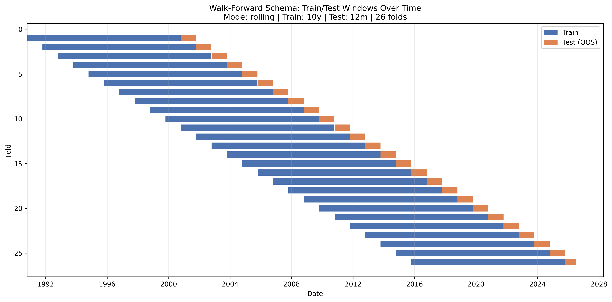

### OOS Bear-Market Coverage (Issue #8)
Per-fold Pagan-Sossounov bear-market exposure of the walk-forward windows: the share of bear days, the number of overlapping bear phases, and whether a complete bear phase (peak and trough) falls inside the window, for the OOS test window and the training window. This diagnostic documents the fold-granularity limitation (few OOS windows contain a full crisis) discussed in `docs/limitations.md`, Section 5. It is complemented by the pooled-OOS objective from Issue #5, which lets crisis periods enter the optimization signal in proportion to their length instead of being averaged away per fold.

|   Fold | Test Start   | Test End   |   Test Bear % |   Test Bear Phases | Test Full Bear Phase   |   Train Bear % |   Train Bear Phases | Train Full Bear Phase   |
|-------:|:-------------|:-----------|--------------:|-------------------:|:-----------------------|---------------:|--------------------:|:------------------------|
|      1 | 2000-10-16   | 2001-10-15 |         100   |                  1 | No                     |            1.2 |                   2 | Yes                     |
|      2 | 2001-10-16   | 2002-10-15 |          76.6 |                  1 | No                     |           11   |                   1 | No                      |
|      3 | 2002-10-16   | 2003-10-15 |           0   |                  0 | No                     |           18.7 |                   1 | Yes                     |
|      4 | 2003-10-16   | 2004-10-15 |           0   |                  0 | No                     |           18.7 |                   1 | Yes                     |
|      5 | 2004-10-18   | 2005-10-14 |           0   |                  0 | No                     |           18.7 |                   1 | Yes                     |
|      6 | 2005-10-17   | 2006-10-13 |           0   |                  0 | No                     |           18.7 |                   1 | Yes                     |
|      7 | 2006-10-16   | 2007-10-15 |           0   |                  0 | No                     |           18.7 |                   1 | Yes                     |
|      8 | 2007-10-16   | 2008-10-15 |          95.3 |                  1 | No                     |           18.7 |                   1 | Yes                     |
|      9 | 2008-10-16   | 2009-10-15 |          38.9 |                  1 | No                     |           28.3 |                   2 | Yes                     |
|     10 | 2009-10-16   | 2010-10-15 |           0   |                  0 | No                     |           32.2 |                   2 | Yes                     |
|     11 | 2010-10-18   | 2011-10-14 |           0   |                  0 | No                     |           31   |                   2 | Yes                     |
|     12 | 2011-10-17   | 2012-10-15 |           0   |                  0 | No                     |           21.1 |                   2 | Yes                     |
|     13 | 2012-10-16   | 2013-10-15 |           0   |                  0 | No                     |           13.5 |                   1 | Yes                     |
|     14 | 2013-10-16   | 2014-10-15 |           0   |                  0 | No                     |           13.5 |                   1 | Yes                     |
|     15 | 2014-10-16   | 2015-10-15 |           0   |                  0 | No                     |           13.5 |                   1 | Yes                     |
|     16 | 2015-10-16   | 2016-10-14 |           0   |                  0 | No                     |           13.5 |                   1 | Yes                     |
|     17 | 2016-10-17   | 2017-10-13 |           0   |                  0 | No                     |           13.5 |                   1 | Yes                     |
|     18 | 2017-10-16   | 2018-10-15 |           0   |                  0 | No                     |           13.5 |                   1 | Yes                     |
|     19 | 2018-10-16   | 2019-10-15 |           0   |                  0 | No                     |            3.9 |                   1 | No                      |
|     20 | 2019-10-16   | 2020-10-15 |           0   |                  0 | No                     |            0   |                   0 | No                      |
|     21 | 2020-10-16   | 2021-10-15 |           0   |                  0 | No                     |            0   |                   0 | No                      |
|     22 | 2021-10-18   | 2022-10-14 |          80.5 |                  1 | Yes                    |            0   |                   0 | No                      |
|     23 | 2022-10-17   | 2023-10-13 |           0   |                  0 | No                     |            8   |                   1 | Yes                     |
|     24 | 2023-10-16   | 2024-10-15 |           0   |                  0 | No                     |            8   |                   1 | Yes                     |
|     25 | 2024-10-16   | 2025-10-15 |           0   |                  0 | No                     |            8   |                   1 | Yes                     |
|     26 | 2025-10-16   | 2026-07-31 |          20.7 |                  1 | Yes                    |            8   |                   1 | Yes                     |

Across the 26 walk-forward folds, 2 OOS test windows contain at least one complete Pagan-Sossounov bear phase (peak and trough inside the 12-month window), while 6 folds overlap at least one bear phase and 20 folds carry no bear day at all.

Because the 3-month minimum-phase filter and the 12-month fold length rarely coincide, most crisis exposure enters the folds as partial (window-truncated) bear phases rather than as fully contained episodes, whereas every training window (10 years) spans several complete bear phases.

A bear run that is still open at the global data boundary cannot be confirmed complete, so the classification is conservative for any fold whose window reaches the end of the sample.

### Equity Curves in Comparison

### Annualized Performance Metrics
Normalized metrics (CAGR, Sharpe, Sortino, Calmar) for comparison across evaluation periods of different lengths.

| Strategy    | CAGR   | Ann. Volatility   |   Sharpe Ratio |   Sortino Ratio | Max Drawdown   |   Calmar Ratio |   OOS Days |   OOS Years |
|:------------|:-------|:------------------|---------------:|----------------:|:---------------|---------------:|-----------:|------------:|
| Buy_Hold    | +5.68% | 11.16%            |          0.551 |           0.719 | -35.08%        |          0.162 |       6484 |        25.7 |
| MSM         | +4.60% | 6.03%             |          0.776 |           0.872 | -10.91%        |          0.422 |       6484 |        25.7 |
| HMM         | +2.95% | 5.50%             |          0.557 |           0.573 | -17.02%        |          0.174 |       6484 |        25.7 |
| HMM_Uni     | +4.57% | 6.04%             |          0.77  |           0.866 | -11.01%        |          0.415 |       6484 |        25.7 |
| LSTM        | +6.60% | 9.53%             |          0.718 |           0.865 | -27.71%        |          0.238 |       6484 |        25.7 |
| Transformer | +4.36% | 7.39%             |          0.614 |           0.633 | -27.71%        |          0.157 |       6484 |        25.7 |

### Classification Metrics (vs. NBER Recessions as Ground Truth)
Comparison of the models as binary recession classifiers (precision, recall, F1).

| Model       |   Precision |   Recall |    F1 |   TN |   FP |   FN |   TP |
|:------------|------------:|---------:|------:|-----:|-----:|-----:|-----:|
| MSM         |       0.228 |    0.922 | 0.366 | 4071 | 1828 |   46 |  540 |
| HMM         |       0.2   |    0.985 | 0.332 | 3590 | 2309 |    9 |  577 |
| HMM_Uni     |       0.228 |    0.922 | 0.366 | 4075 | 1824 |   46 |  540 |
| LSTM        |       0.329 |    0.618 | 0.43  | 5162 |  737 |  224 |  362 |
| Transformer |       0.243 |    0.98  | 0.389 | 4110 | 1789 |   12 |  574 |

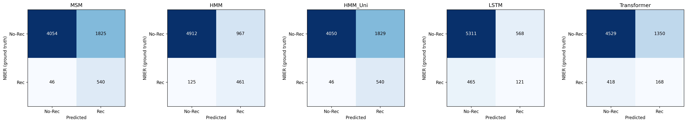

**ROC and precision-recall curves** (threshold-independent comparison via `*_Prob`):

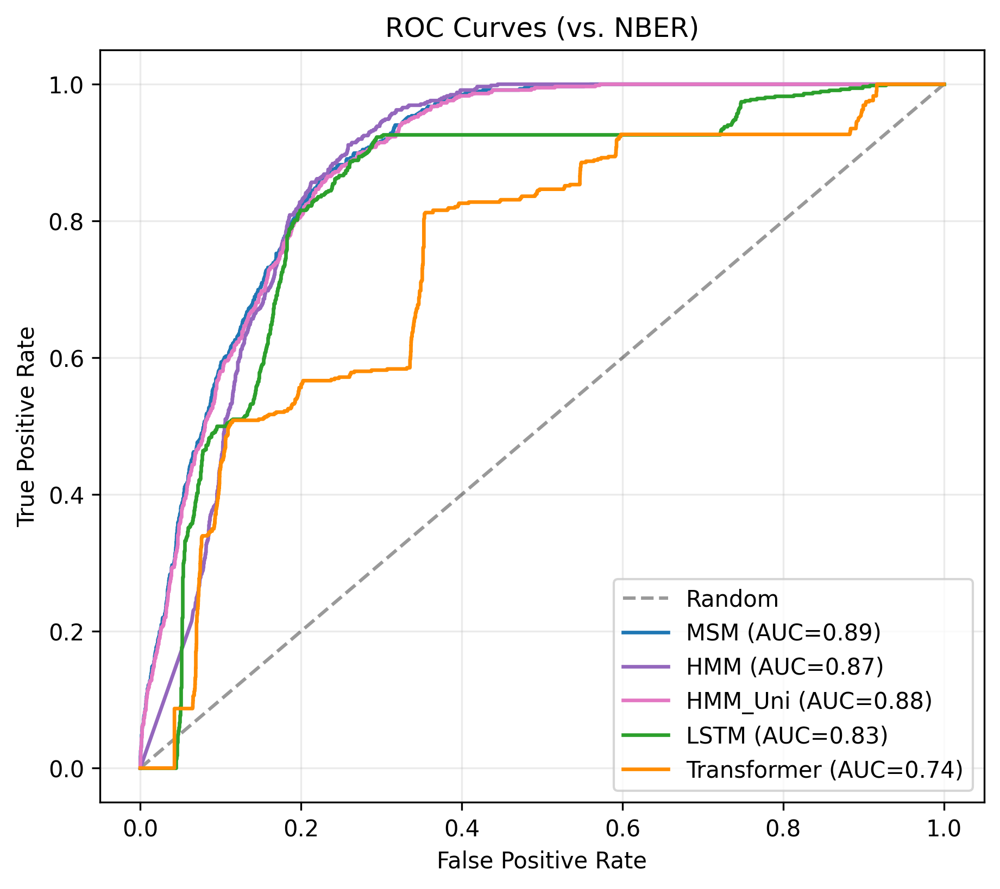
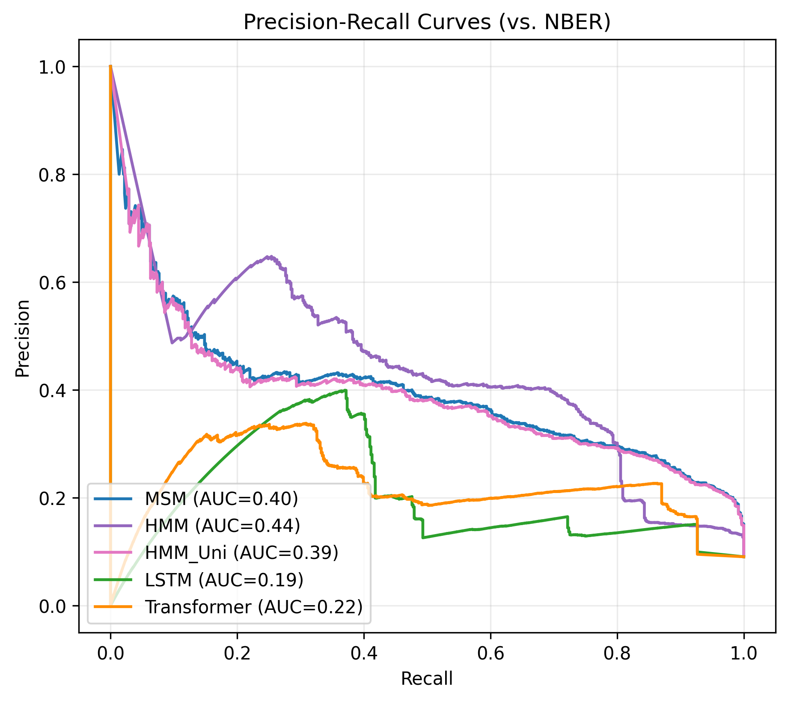

### Signal Churning & Whipsaw Analysis
Quantification of the switching frequency and the share of very short regime phases ("whipsaws").

| Model       |   Signal Switches |   Whipsaws (<5d) | Whipsaw Share   |   Mean Phase (Days) |   Median Phase (Days) | Cumul. Costs   |
|:------------|------------------:|-----------------:|:----------------|--------------------:|----------------------:|:---------------|
| MSM         |               324 |              159 | 48.9%           |                20   |                     5 | 32.40%         |
| HMM         |               129 |               52 | 40.0%           |                49.9 |                     6 | 12.90%         |
| HMM_Uni     |               318 |              153 | 48.0%           |                20.3 |                     5 | 31.80%         |
| LSTM        |                20 |                0 | 0.0%            |               308.8 |                    80 | 2.00%          |
| Transformer |                52 |               27 | 50.9%           |               122.4 |                     3 | 5.20%          |

### Regime Probability Heatmap
Bear probabilities of all models over time.

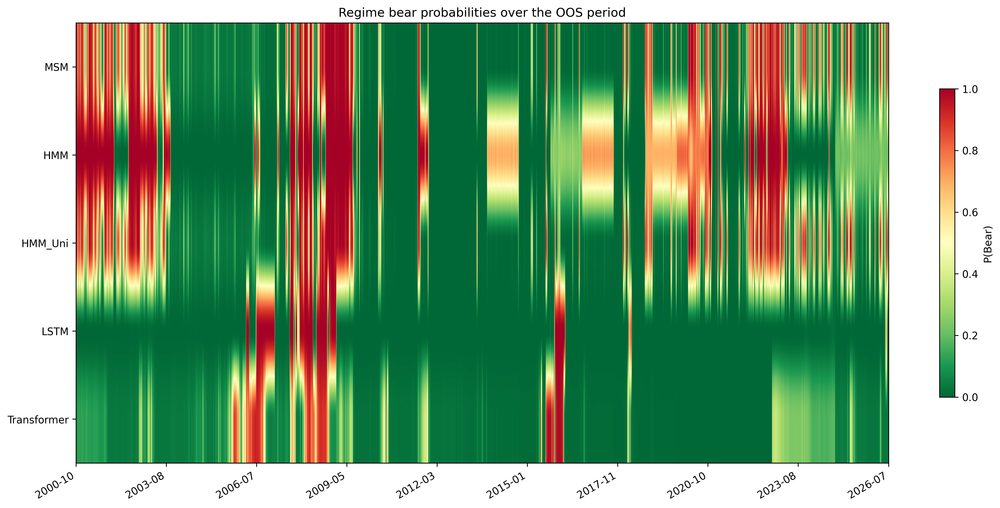

### Threshold Sensitivity
Variation of the decision threshold per model. Shows how robust final wealth, max drawdown, and the number of regime switches are to a modified bull/bear classification boundary (thesis ch. 4.1, smoothing).

**MSM**

|   Threshold | Final Wealth   | Max Drawdown   |   Switches |
|------------:|:---------------|:---------------|-----------:|
|        0.25 | 1,490,045 €    | -12.13%        |        302 |
|        0.3  | 1,320,762 €    | -16.68%        |        314 |
|        0.35 | 1,331,008 €    | -20.19%        |        320 |
|        0.4  | 1,346,314 €    | -21.55%        |        314 |
|        0.5  | 1,429,409 €    | -25.39%        |        326 |

**HMM**

|   Threshold | Final Wealth   | Max Drawdown   |   Switches |
|------------:|:---------------|:---------------|-----------:|
|        0.4  | 944,274 €      | -12.03%        |        125 |
|        0.45 | 963,681 €      | -11.35%        |        119 |
|        0.5  | 979,029 €      | -12.07%        |        115 |
|        0.55 | 997,183 €      | -12.51%        |        105 |
|        0.6  | 979,315 €      | -12.72%        |        105 |

**HMM_Uni**

|   Threshold | Final Wealth   | Max Drawdown   |   Switches |
|------------:|:---------------|:---------------|-----------:|
|        0.4  | 1,320,707 €    | -24.79%        |        316 |
|        0.45 | 1,336,356 €    | -24.41%        |        326 |
|        0.5  | 1,456,268 €    | -25.57%        |        332 |
|        0.55 | 1,436,087 €    | -23.24%        |        332 |
|        0.6  | 1,647,478 €    | -26.67%        |        338 |

**LSTM**

|   Threshold | Final Wealth   | Max Drawdown   |   Switches |
|------------:|:---------------|:---------------|-----------:|
|         0.2 | 2,329,131 €    | -27.71%        |         32 |
|         0.3 | 2,586,400 €    | -27.71%        |         20 |
|         0.4 | 2,755,995 €    | -27.71%        |         28 |
|         0.5 | 2,589,496 €    | -27.71%        |         26 |

**Transformer**

|   Threshold | Final Wealth   | Max Drawdown   |   Switches |
|------------:|:---------------|:---------------|-----------:|
|        0.3  | 1,157,708 €    | -27.71%        |        106 |
|        0.4  | 1,412,444 €    | -27.71%        |         82 |
|        0.45 | 1,353,306 €    | -27.71%        |         90 |
|        0.5  | 1,572,319 €    | -27.71%        |         66 |
|        0.6  | 1,765,204 €    | -27.71%        |         56 |

### Time-to-Recovery
All drawdown phases beyond the minimum depth (per `extended.ttr_min_dd`) with peak, trough, and recovery date as well as duration in trading days. An open (not yet recovered) phase is marked as "open" in the recovery field.

**Buy_Hold**

| Peak       | Trough     | Recovery   | Max DD   |   Drawdown Duration (d) |   Recovery Duration (d) |   Total (d) |
|:-----------|:-----------|:-----------|:---------|------------------------:|------------------------:|------------:|
| 2000-11-01 | 2000-12-20 | 2001-02-01 | -5.10%   |                      49 |                      43 |          92 |
| 2001-02-02 | 2002-07-23 | 2004-03-05 | -24.04%  |                     536 |                     591 |        1127 |
| 2004-03-08 | 2004-05-10 | 2004-11-04 | -6.37%   |                      63 |                     178 |         241 |
| 2007-11-01 | 2009-03-09 | 2011-04-28 | -34.97%  |                     494 |                     780 |        1274 |
| 2011-07-25 | 2011-08-08 | 2011-10-14 | -6.59%   |                      14 |                      67 |          81 |
| 2013-05-22 | 2013-06-24 | 2013-10-22 | -5.37%   |                      33 |                     120 |         153 |
| 2015-03-23 | 2015-08-25 | 2016-04-13 | -8.39%   |                     155 |                     232 |         387 |
| 2016-08-01 | 2016-11-14 | 2017-04-17 | -5.64%   |                     105 |                     154 |         259 |
| 2018-01-29 | 2018-02-08 | 2018-08-24 | -6.93%   |                      10 |                     197 |         207 |
| 2018-08-30 | 2018-12-24 | 2019-03-21 | -11.45%  |                     116 |                      87 |         203 |
| 2020-02-21 | 2020-03-18 | 2020-06-08 | -18.31%  |                      26 |                      82 |         108 |
| 2020-09-03 | 2020-10-30 | 2020-12-08 | -5.20%   |                      57 |                      39 |          96 |
| 2021-12-28 | 2022-10-14 | 2024-11-29 | -27.55%  |                     290 |                     777 |        1067 |
| 2024-12-09 | 2025-04-08 | 2025-07-03 | -12.22%  |                     120 |                      86 |         206 |
| 2026-02-26 | 2026-03-27 | 2026-04-17 | -6.69%   |                      29 |                      21 |          50 |

**MSM**

| Peak       | Trough     | Recovery   | Max DD   |   Drawdown Duration (d) |   Recovery Duration (d) |   Total (d) |
|:-----------|:-----------|:-----------|:---------|------------------------:|------------------------:|------------:|
| 2001-02-02 | 2003-05-20 | 2003-09-18 | -5.82%   |                     837 |                     121 |         958 |
| 2006-01-17 | 2006-07-18 | 2006-09-20 | -5.08%   |                     182 |                      64 |         246 |
| 2007-06-05 | 2009-11-04 | 2010-04-21 | -7.68%   |                     883 |                     168 |        1051 |
| 2010-05-04 | 2010-07-02 | 2010-09-13 | -5.64%   |                      59 |                      73 |         132 |
| 2013-05-22 | 2013-08-21 | 2013-11-29 | -5.70%   |                      91 |                     100 |         191 |
| 2015-02-26 | 2015-09-28 | 2016-03-16 | -7.59%   |                     214 |                     170 |         384 |
| 2016-08-01 | 2016-11-14 | 2017-04-18 | -5.76%   |                     105 |                     155 |         260 |
| 2018-01-29 | 2018-05-02 | 2018-08-27 | -5.92%   |                      93 |                     117 |         210 |
| 2018-08-30 | 2019-01-14 | 2019-03-21 | -5.95%   |                     137 |                      66 |         203 |
| 2020-09-03 | 2021-02-26 | 2021-07-02 | -6.85%   |                     176 |                     126 |         302 |
| 2021-11-10 | 2022-07-14 | 2023-12-13 | -10.56%  |                     246 |                     517 |         763 |
| 2024-09-03 | 2025-06-20 | 2025-10-02 | -7.99%   |                     290 |                     104 |         394 |
| 2025-10-29 | 2026-07-30 | open       | -8.03%   |                     274 |                     nan |         nan |

**HMM**

| Peak       | Trough     | Recovery   | Max DD   |   Drawdown Duration (d) |   Recovery Duration (d) |   Total (d) |
|:-----------|:-----------|:-----------|:---------|------------------------:|------------------------:|------------:|
| 2002-01-11 | 2002-06-13 | 2004-02-11 | -8.25%   |                     153 |                     608 |         761 |
| 2004-03-08 | 2004-08-12 | 2004-12-13 | -7.74%   |                     157 |                     123 |         280 |
| 2015-03-23 | 2016-02-03 | 2017-05-24 | -8.71%   |                     317 |                     476 |         793 |
| 2018-01-29 | 2018-12-20 | 2019-06-07 | -9.06%   |                     325 |                     169 |         494 |
| 2020-02-21 | 2021-03-19 | 2021-05-06 | -5.11%   |                     392 |                      48 |         440 |
| 2021-09-03 | 2021-10-11 | 2021-11-05 | -5.28%   |                      38 |                      25 |          63 |
| 2021-11-10 | 2023-10-04 | open       | -16.61%  |                     693 |                     nan |         nan |

**HMM_Uni**

| Peak       | Trough     | Recovery   | Max DD   |   Drawdown Duration (d) |   Recovery Duration (d) |   Total (d) |
|:-----------|:-----------|:-----------|:---------|------------------------:|------------------------:|------------:|
| 2001-02-02 | 2003-05-20 | 2003-09-18 | -5.82%   |                     837 |                     121 |         958 |
| 2006-01-17 | 2006-07-18 | 2006-09-20 | -5.08%   |                     182 |                      64 |         246 |
| 2007-06-05 | 2009-11-04 | 2010-04-14 | -7.06%   |                     883 |                     161 |        1044 |
| 2010-05-04 | 2010-07-02 | 2010-09-13 | -5.64%   |                      59 |                      73 |         132 |
| 2013-05-22 | 2013-08-21 | 2013-11-29 | -5.70%   |                      91 |                     100 |         191 |
| 2015-02-26 | 2015-09-28 | 2016-03-29 | -7.59%   |                     214 |                     183 |         397 |
| 2016-08-01 | 2016-11-14 | 2017-04-18 | -5.76%   |                     105 |                     155 |         260 |
| 2018-01-29 | 2018-05-02 | 2018-08-27 | -5.92%   |                      93 |                     117 |         210 |
| 2018-08-30 | 2019-01-14 | 2019-03-21 | -5.95%   |                     137 |                      66 |         203 |
| 2020-09-03 | 2021-02-26 | 2021-07-02 | -6.85%   |                     176 |                     126 |         302 |
| 2021-11-10 | 2022-07-14 | 2023-12-26 | -10.56%  |                     246 |                     530 |         776 |
| 2024-09-03 | 2025-06-20 | 2025-10-02 | -7.99%   |                     290 |                     104 |         394 |
| 2025-10-29 | 2026-07-30 | open       | -8.03%   |                     274 |                     nan |         nan |

**LSTM**

| Peak       | Trough     | Recovery   | Max DD   |   Drawdown Duration (d) |   Recovery Duration (d) |   Total (d) |
|:-----------|:-----------|:-----------|:---------|------------------------:|------------------------:|------------:|
| 2001-11-14 | 2002-07-23 | 2003-06-16 | -18.68%  |                     251 |                     328 |         579 |
| 2003-06-17 | 2003-08-05 | 2003-12-04 | -7.21%   |                      49 |                     121 |         170 |
| 2004-03-08 | 2004-05-10 | 2004-11-04 | -6.37%   |                      63 |                     178 |         241 |
| 2009-01-05 | 2009-03-09 | 2009-08-03 | -18.97%  |                      63 |                     147 |         210 |
| 2010-05-04 | 2010-07-02 | 2010-09-13 | -5.36%   |                      59 |                      73 |         132 |
| 2011-07-25 | 2011-08-08 | 2011-10-14 | -6.59%   |                      14 |                      67 |          81 |
| 2013-05-22 | 2013-06-24 | 2013-10-22 | -5.37%   |                      33 |                     120 |         153 |
| 2015-03-23 | 2015-08-25 | 2016-06-02 | -8.39%   |                     155 |                     282 |         437 |
| 2016-08-01 | 2016-11-14 | 2017-04-17 | -5.64%   |                     105 |                     154 |         259 |
| 2018-01-29 | 2018-02-08 | 2018-08-24 | -6.93%   |                      10 |                     197 |         207 |
| 2018-08-30 | 2018-12-24 | 2019-03-21 | -11.45%  |                     116 |                      87 |         203 |
| 2020-02-21 | 2020-03-18 | 2020-06-08 | -18.31%  |                      26 |                      82 |         108 |
| 2020-09-03 | 2020-10-30 | 2020-12-08 | -5.20%   |                      57 |                      39 |          96 |
| 2021-12-28 | 2022-10-14 | 2025-09-05 | -27.55%  |                     290 |                    1057 |        1347 |

**Transformer**

| Peak       | Trough     | Recovery   | Max DD   |   Drawdown Duration (d) |   Recovery Duration (d) |   Total (d) |
|:-----------|:-----------|:-----------|:---------|------------------------:|------------------------:|------------:|
| 2004-03-08 | 2004-05-10 | 2004-11-04 | -6.37%   |                      63 |                     178 |         241 |
| 2007-11-01 | 2009-11-04 | 2010-03-16 | -5.25%   |                     734 |                     132 |         866 |
| 2010-05-04 | 2010-07-02 | 2010-09-13 | -5.36%   |                      59 |                      73 |         132 |
| 2011-07-25 | 2011-08-08 | 2011-10-14 | -6.59%   |                      14 |                      67 |          81 |
| 2013-05-22 | 2013-06-24 | 2013-10-22 | -5.37%   |                      33 |                     120 |         153 |
| 2015-03-23 | 2015-08-25 | 2016-04-13 | -8.39%   |                     155 |                     232 |         387 |
| 2016-08-01 | 2016-11-14 | 2017-04-17 | -5.64%   |                     105 |                     154 |         259 |
| 2018-01-29 | 2018-02-08 | 2018-08-24 | -6.93%   |                      10 |                     197 |         207 |
| 2018-08-30 | 2018-11-12 | 2020-02-05 | -8.26%   |                      74 |                     450 |         524 |
| 2020-02-21 | 2020-03-12 | 2021-07-23 | -14.02%  |                      20 |                     498 |         518 |
| 2021-12-28 | 2022-10-14 | open       | -27.55%  |                     290 |                     nan |         nan |

### Crisis Performance
Return and max drawdown during historical crisis periods: the central evidence for the tail-risk protection of the regime-switching models.

| Crisis                              | ('Return', 'Buy_Hold')   | ('Return', 'HMM')   | ('Return', 'HMM_Uni')   | ('Return', 'LSTM')   | ('Return', 'MSM')   | ('Return', 'Transformer')   | ('Max Drawdown', 'Buy_Hold')   | ('Max Drawdown', 'HMM')   | ('Max Drawdown', 'HMM_Uni')   | ('Max Drawdown', 'LSTM')   | ('Max Drawdown', 'MSM')   | ('Max Drawdown', 'Transformer')   |
|:------------------------------------|:-------------------------|:--------------------|:------------------------|:---------------------|:--------------------|:----------------------------|:-------------------------------|:--------------------------|:------------------------------|:---------------------------|:--------------------------|:----------------------------------|
| COVID Crash (2020-02 to 2020-03)    | -8.55%                   | +0.73%              | +0.73%                  | -8.55%               | +0.73%              | -8.16%                      | -18.53%                        | -1.81%                    | -1.81%                        | -18.53%                    | -1.81%                    | -14.25%                           |
| Dot-Com (2000-03 to 2002-10)        | -15.77%                  | -1.60%              | -2.45%                  | -4.82%               | -2.45%              | +6.04%                      | -24.81%                        | -8.40%                    | -6.22%                        | -19.02%                    | -6.22%                    | -0.08%                            |
| EU Debt Crisis (2011-07 to 2011-11) | +4.10%                   | +0.01%              | +2.32%                  | +4.10%               | +2.32%              | +4.10%                      | -7.24%                         | 0.00%                     | -4.74%                        | -7.24%                     | -4.74%                    | -7.24%                            |
| GFC (2007-10 to 2009-03)            | -26.99%                  | -1.39%              | -2.99%                  | -2.35%               | -2.99%              | -1.74%                      | -35.08%                        | -2.80%                    | -4.04%                        | -19.46%                    | -4.04%                    | -4.56%                            |
| Rate Hikes (2022-01 to 2022-10)     | -24.20%                  | -7.66%              | -6.33%                  | -24.20%              | -6.33%              | -24.20%                     | -26.98%                        | -8.74%                    | -8.34%                        | -26.98%                    | -8.34%                    | -26.98%                           |

### Switch Timing Relative to the Drawdown Peak
Time lag between the model's first bear signal and the drawdown trough of the buy-and-hold portfolio per crisis. Positive = model reacted early, negative = too late.

| Crisis                              | Model       | DD Trough   | First Bear Signal   |   Lead (Days) |
|:------------------------------------|:------------|:------------|:--------------------|--------------:|
| Dot-Com (2000-03 to 2002-10)        | MSM         | 2002-07-23  | 2000-10-16          |           645 |
| GFC (2007-10 to 2009-03)            | MSM         | 2009-03-09  | 2007-10-01          |           525 |
| EU Debt Crisis (2011-07 to 2011-11) | MSM         | 2011-08-08  | 2011-08-04          |             4 |
| COVID Crash (2020-02 to 2020-03)    | MSM         | 2020-03-18  | 2020-02-24          |            23 |
| Rate Hikes (2022-01 to 2022-10)     | MSM         | 2022-10-14  | 2022-01-05          |           282 |
| Dot-Com (2000-03 to 2002-10)        | HMM         | 2002-07-23  | 2000-10-16          |           645 |
| GFC (2007-10 to 2009-03)            | HMM         | 2009-03-09  | 2007-10-19          |           507 |
| EU Debt Crisis (2011-07 to 2011-11) | HMM         | 2011-08-08  | 2011-07-01          |            38 |
| COVID Crash (2020-02 to 2020-03)    | HMM         | 2020-03-18  | 2020-02-24          |            23 |
| Rate Hikes (2022-01 to 2022-10)     | HMM         | 2022-10-14  | 2022-01-18          |           269 |
| Dot-Com (2000-03 to 2002-10)        | HMM_Uni     | 2002-07-23  | 2000-10-16          |           645 |
| GFC (2007-10 to 2009-03)            | HMM_Uni     | 2009-03-09  | 2007-10-01          |           525 |
| EU Debt Crisis (2011-07 to 2011-11) | HMM_Uni     | 2011-08-08  | 2011-08-04          |             4 |
| COVID Crash (2020-02 to 2020-03)    | HMM_Uni     | 2020-03-18  | 2020-02-24          |            23 |
| Rate Hikes (2022-01 to 2022-10)     | HMM_Uni     | 2022-10-14  | 2022-01-05          |           282 |
| Dot-Com (2000-03 to 2002-10)        | LSTM        | 2002-07-23  | 2000-10-16          |           645 |
| GFC (2007-10 to 2009-03)            | LSTM        | 2009-03-09  | 2007-10-01          |           525 |
| EU Debt Crisis (2011-07 to 2011-11) | LSTM        | 2011-08-08  |                     |           nan |
| COVID Crash (2020-02 to 2020-03)    | LSTM        | 2020-03-18  |                     |           nan |
| Rate Hikes (2022-01 to 2022-10)     | LSTM        | 2022-10-14  |                     |           nan |
| Dot-Com (2000-03 to 2002-10)        | Transformer | 2002-07-23  | 2000-10-16          |           645 |
| GFC (2007-10 to 2009-03)            | Transformer | 2009-03-09  | 2007-10-01          |           525 |
| EU Debt Crisis (2011-07 to 2011-11) | Transformer | 2011-08-08  |                     |           nan |
| COVID Crash (2020-02 to 2020-03)    | Transformer | 2020-03-18  | 2020-03-13          |             5 |
| Rate Hikes (2022-01 to 2022-10)     | Transformer | 2022-10-14  |                     |           nan |

### Drawdown Profile

### Rolling Sharpe Ratio
Time-varying, risk-adjusted return comparison over a rolling 252-day window.

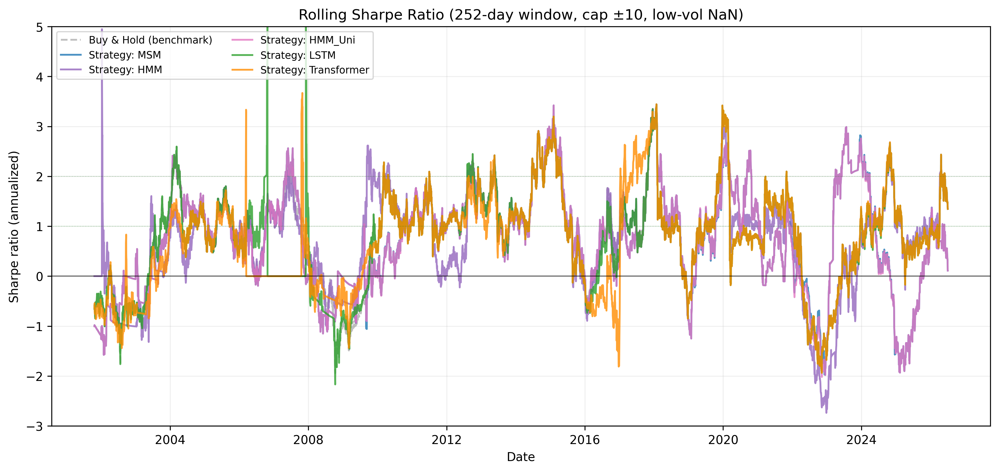

### Comprehensive Metrics Matrix
Detailed statistical analysis including risk-adjusted metrics (Sharpe, Sortino, Calmar).

| Strategy    | Total Return   | CAGR (p.a.)   | Volatility   | Max Drawdown   |   Sharpe Ratio |   Sortino Ratio |   Calmar Ratio |   Regime Switches | Total Costs (Fees)   |   Ulcer Index |
|:------------|:---------------|:--------------|:-------------|:---------------|---------------:|----------------:|---------------:|------------------:|:---------------------|--------------:|
| Buy Hold    | 314.19%        | 5.67%         | 11.16%       | -35.08%        |           0.55 |            0.72 |           0.16 |                 0 | 0.00%                |          9.05 |
| MSM         | 218.07%        | 4.59%         | 6.03%        | -10.91%        |           0.78 |            0.87 |           0.42 |               324 | 32.50%               |          3.77 |
| HMM         | 111.49%        | 2.95%         | 5.50%        | -17.02%        |           0.56 |            0.57 |           0.17 |               129 | 13.00%               |          5.76 |
| HMM Uni     | 215.57%        | 4.56%         | 6.04%        | -11.01%        |           0.77 |            0.87 |           0.41 |               318 | 31.90%               |          3.78 |
| LSTM        | 417.38%        | 6.58%         | 9.53%        | -27.71%        |           0.72 |            0.87 |           0.24 |                20 | 2.10%                |          6.36 |
| Transformer | 199.99%        | 4.35%         | 7.39%        | -27.71%        |           0.61 |            0.63 |           0.16 |                52 | 5.30%                |          7.16 |

### Transaction Costs

This figure shows the cumulative transaction costs over time. Steep increases indicate unstable regime switches ("churning").

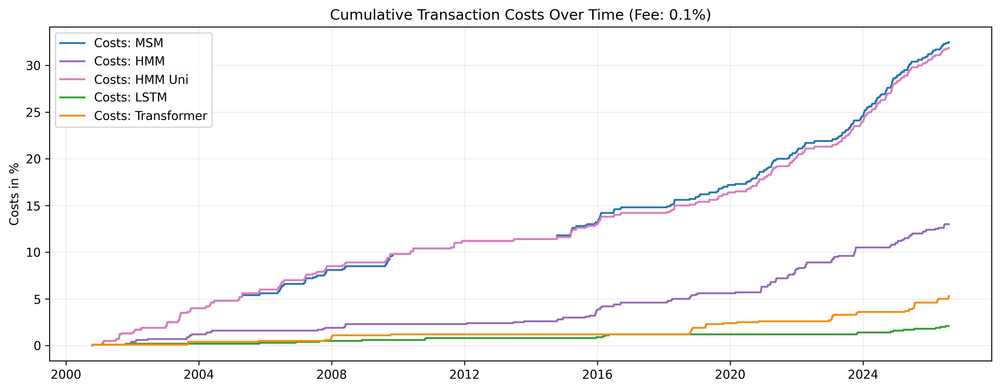

Stress test: Sequence of Returns Risk (SORR)
In addition, the survival time of the capital was simulated in a withdrawal phase (retirement scenario).

### SORR Simulation: Comparison of the Withdrawal Scenarios

This table compares different stress scenarios (standard, aggressive, low capital).

|                                | Terminal Capital   | Status            |
|:-------------------------------|:-------------------|:------------------|
| ('Standard', 'Buy Hold')       | 681,766.49 €       | Capital preserved |
| ('Standard', 'MSM')            | 619,195.05 €       | Capital preserved |
| ('Standard', 'HMM')            | 284,202.40 €       | Capital preserved |
| ('Standard', 'HMM Uni')        | 604,112.38 €       | Capital preserved |
| ('Standard', 'LSTM')           | 1,154,247.76 €     | Capital preserved |
| ('Standard', 'Transformer')    | 601,130.36 €       | Capital preserved |
| ('Aggressive', 'Buy Hold')     | 0.00 €             | Depleted (2026)   |
| ('Aggressive', 'MSM')          | 133,616.16 €       | Capital preserved |
| ('Aggressive', 'HMM')          | 0.00 €             | Depleted (2023)   |
| ('Aggressive', 'HMM Uni')      | 117,251.86 €       | Capital preserved |
| ('Aggressive', 'LSTM')         | 437,928.10 €       | Capital preserved |
| ('Aggressive', 'Transformer')  | 151,720.48 €       | Capital preserved |
| ('Low_Capital', 'Buy Hold')    | 200,682.17 €       | Capital preserved |
| ('Low_Capital', 'MSM')         | 225,843.36 €       | Capital preserved |
| ('Low_Capital', 'HMM')         | 54,535.64 €        | Capital preserved |
| ('Low_Capital', 'HMM Uni')     | 216,409.27 €       | Capital preserved |
| ('Low_Capital', 'LSTM')        | 477,652.76 €       | Capital preserved |
| ('Low_Capital', 'Transformer') | 225,855.25 €       | Capital preserved |

Capital development of the different scenarios:

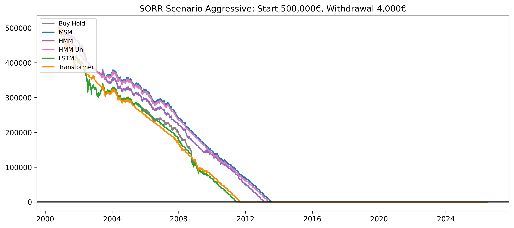
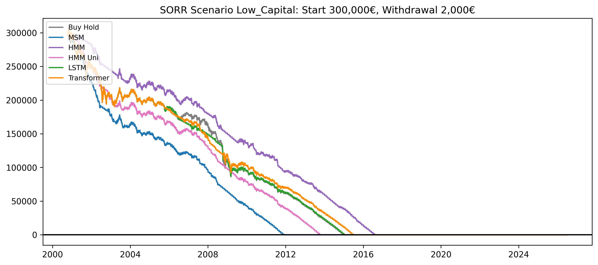

### MCS: Stationary Bootstrap Robustness Check

To assess statistical significance, 10,000 artificial market paths were simulated via stationary bootstrap (Politis & Romano 1994).
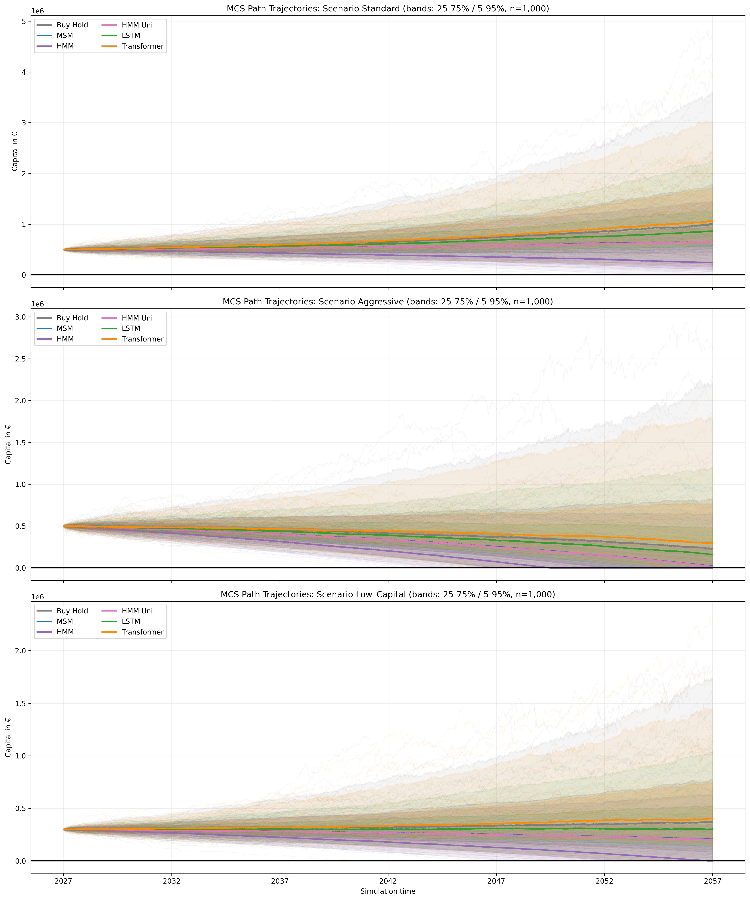
|                                | Ruin Probability   | Median Terminal Capital   |
|:-------------------------------|:-------------------|:--------------------------|
| ('Standard', 'MSM')            | 0.57%              | 643,114.83 €              |
| ('Standard', 'LSTM')           | 0.60%              | 1,533,695.49 €            |
| ('Standard', 'Buy Hold')       | 3.30%              | 1,040,838.23 €            |
| ('Standard', 'HMM')            | 8.88%              | 230,544.64 €              |
| ('Standard', 'HMM Uni')        | 0.60%              | 634,031.59 €              |
| ('Standard', 'Transformer')    | 2.97%              | 566,456.74 €              |
| ('Aggressive', 'HMM')          | 89.54%             | 0.00 €                    |
| ('Aggressive', 'MSM')          | 48.97%             | 9,310.10 €                |
| ('Low_Capital', 'HMM')         | 51.99%             | 0.00 €                    |
| ('Aggressive', 'Buy Hold')     | 33.04%             | 270,638.40 €              |
| ('Low_Capital', 'MSM')         | 11.82%             | 193,529.15 €              |
| ('Aggressive', 'LSTM')         | 17.01%             | 615,995.99 €              |
| ('Aggressive', 'HMM Uni')      | 49.73%             | 1,657.00 €                |
| ('Low_Capital', 'Buy Hold')    | 14.07%             | 390,858.40 €              |
| ('Aggressive', 'Transformer')  | 54.89%             | 0.00 €                    |
| ('Low_Capital', 'HMM Uni')     | 12.46%             | 188,836.04 €              |
| ('Low_Capital', 'LSTM')        | 4.43%              | 643,501.35 €              |
| ('Low_Capital', 'Transformer') | 20.18%             | 157,518.56 €              |

Distribution of the terminal capital values:

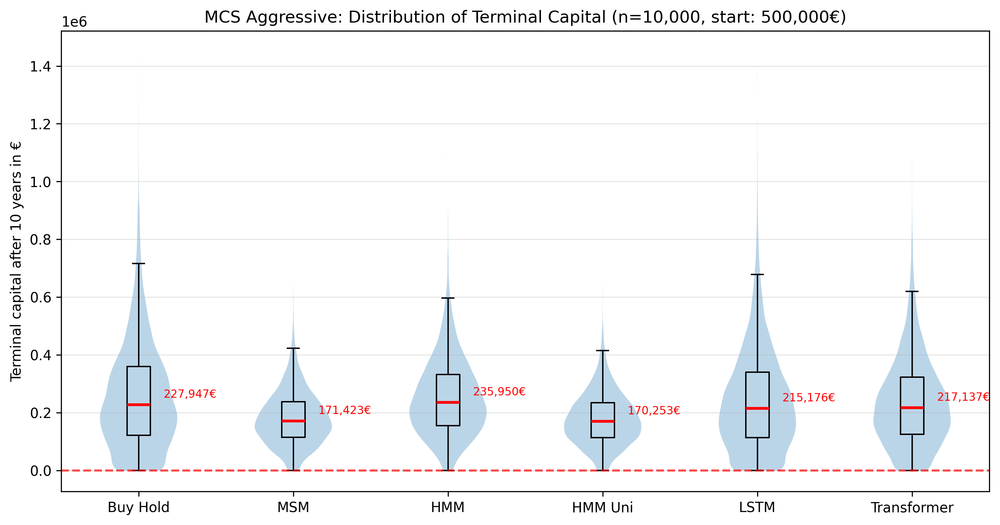
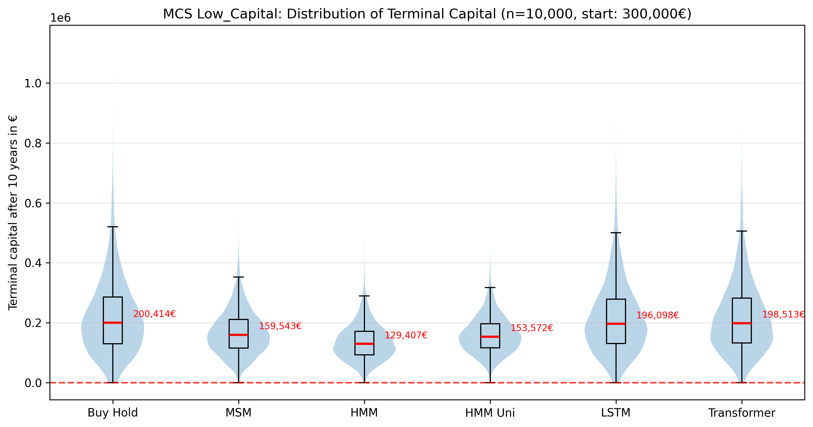

Probability corridors:

The shaded areas show the 5% to 95% confidence interval of the capital development.
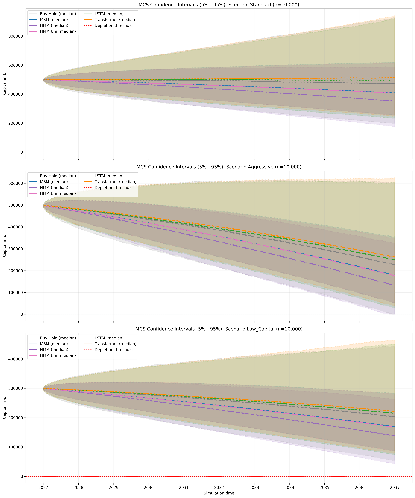

### Depletion Rate with 95% Confidence Interval
Wilson CI for the ruin probability (P[terminal capital ≤ 0]) per scenario × strategy.

|                                | Depletion Rate   | 95% CI Lower   | 95% CI Upper   | n_ruin / n_paths   |
|:-------------------------------|:-----------------|:---------------|:---------------|:-------------------|
| ('Standard', 'MSM')            | 0.57%            | 0.44%          | 0.74%          | 57/10000           |
| ('Standard', 'LSTM')           | 0.60%            | 0.47%          | 0.77%          | 60/10000           |
| ('Standard', 'Buy_Hold')       | 3.30%            | 2.97%          | 3.67%          | 330/10000          |
| ('Standard', 'HMM')            | 8.88%            | 8.34%          | 9.45%          | 888/10000          |
| ('Standard', 'HMM_Uni')        | 0.60%            | 0.47%          | 0.77%          | 60/10000           |
| ('Standard', 'Transformer')    | 2.97%            | 2.65%          | 3.32%          | 297/10000          |
| ('Aggressive', 'HMM')          | 89.54%           | 88.92%         | 90.12%         | 8954/10000         |
| ('Aggressive', 'MSM')          | 48.97%           | 47.99%         | 49.95%         | 4897/10000         |
| ('Low_Capital', 'HMM')         | 51.99%           | 51.01%         | 52.97%         | 5199/10000         |
| ('Aggressive', 'Buy_Hold')     | 33.04%           | 32.12%         | 33.97%         | 3304/10000         |
| ('Low_Capital', 'MSM')         | 11.82%           | 11.20%         | 12.47%         | 1182/10000         |
| ('Aggressive', 'LSTM')         | 17.01%           | 16.29%         | 17.76%         | 1701/10000         |
| ('Aggressive', 'HMM_Uni')      | 49.73%           | 48.75%         | 50.71%         | 4973/10000         |
| ('Low_Capital', 'Buy_Hold')    | 14.07%           | 13.40%         | 14.77%         | 1407/10000         |
| ('Aggressive', 'Transformer')  | 54.89%           | 53.91%         | 55.86%         | 5489/10000         |
| ('Low_Capital', 'HMM_Uni')     | 12.46%           | 11.83%         | 13.12%         | 1246/10000         |
| ('Low_Capital', 'LSTM')        | 4.43%            | 4.04%          | 4.85%          | 443/10000          |
| ('Low_Capital', 'Transformer') | 20.18%           | 19.40%         | 20.98%         | 2018/10000         |

### Hypothesis Tests (Paired Wilcoxon, α = 0.05)
**H1: Regime switching reduces MaxDD vs. buy and hold:**

|                                | Headline   | Median MaxDD (Model)   | Median MaxDD (B&H)   | Δ Median   |   Wilcoxon p | H1 (α=0.05)   |
|:-------------------------------|:-----------|:-----------------------|:---------------------|:-----------|-------------:|:--------------|
| ('Standard', 'MSM')            |            | -24.89%                | -37.53%              | +12.63 pp  |     0        | confirmed     |
| ('Standard', 'HMM')            |            | -58.44%                | -37.53%              | -20.91 pp  |     1        | rejected      |
| ('Standard', 'HMM_Uni')        |            | -25.30%                | -37.53%              | +12.23 pp  |     0        | confirmed     |
| ('Standard', 'LSTM')           |            | -28.24%                | -37.53%              | +9.29 pp   |     0        | confirmed     |
| ('Standard', 'Transformer')    |            | -33.29%                | -37.53%              | +4.23 pp   |     2.22e-81 | confirmed     |
| ('Aggressive', 'MSM')          | yes        | -98.27%                | -62.00%              | -36.27 pp  |     1        | rejected      |
| ('Aggressive', 'HMM')          | yes        | -100.00%               | -62.00%              | -38.00 pp  |     1        | rejected      |
| ('Aggressive', 'HMM_Uni')      | yes        | -99.70%                | -62.00%              | -37.70 pp  |     1        | rejected      |
| ('Aggressive', 'LSTM')         | yes        | -38.94%                | -62.00%              | +23.07 pp  |     0        | confirmed     |
| ('Aggressive', 'Transformer')  | yes        | -100.00%               | -62.00%              | -38.00 pp  |     1        | rejected      |
| ('Low_Capital', 'MSM')         |            | -45.92%                | -43.41%              | -2.51 pp   |     8.82e-07 | confirmed     |
| ('Low_Capital', 'HMM')         |            | -100.00%               | -43.41%              | -56.59 pp  |     1        | rejected      |
| ('Low_Capital', 'HMM_Uni')     |            | -47.25%                | -43.41%              | -3.84 pp   |     0.0228   | confirmed     |
| ('Low_Capital', 'LSTM')        |            | -31.67%                | -43.41%              | +11.75 pp  |     0        | confirmed     |
| ('Low_Capital', 'Transformer') |            | -56.58%                | -43.41%              | -13.17 pp  |     1        | rejected      |

**H2: The Transformer dominates econometrics and LSTM in terminal wealth:**

|                                            | Headline   | Median Transformer   | Median MSM   | Δ Median   |   Wilcoxon p | H2 (α=0.05)   | Median HMM   | Median HMM_Uni   | Median LSTM   |
|:-------------------------------------------|:-----------|:---------------------|:-------------|:-----------|-------------:|:--------------|:-------------|:-----------------|:--------------|
| ('Standard', 'Transformer vs. MSM')        |            | 566,457 €            | 643,115 €    | -76,658 €  |        1     | rejected      | nan          | nan              | nan           |
| ('Standard', 'Transformer vs. HMM')        |            | 566,457 €            | nan          | +335,912 € |        0     | confirmed     | 230,545 €    | nan              | nan           |
| ('Standard', 'Transformer vs. HMM_Uni')    |            | 566,457 €            | nan          | -67,575 €  |        1     | rejected      | nan          | 634,032 €        | nan           |
| ('Standard', 'Transformer vs. LSTM')       |            | 566,457 €            | nan          | -967,239 € |        1     | rejected      | nan          | nan              | 1,533,695 €   |
| ('Aggressive', 'Transformer vs. MSM')      | yes        | 0 €                  | 9,310 €      | -9,310 €   |        0.951 | rejected      | nan          | nan              | nan           |
| ('Aggressive', 'Transformer vs. HMM')      | yes        | 0 €                  | nan          | +0 €       |        0     | confirmed     | 0 €          | nan              | nan           |
| ('Aggressive', 'Transformer vs. HMM_Uni')  | yes        | 0 €                  | nan          | -1,657 €   |        0.444 | rejected      | nan          | 1,657 €          | nan           |
| ('Aggressive', 'Transformer vs. LSTM')     | yes        | 0 €                  | nan          | -615,996 € |        1     | rejected      | nan          | nan              | 615,996 €     |
| ('Low_Capital', 'Transformer vs. MSM')     |            | 157,519 €            | 193,529 €    | -36,011 €  |        1     | rejected      | nan          | nan              | nan           |
| ('Low_Capital', 'Transformer vs. HMM')     |            | 157,519 €            | nan          | +157,519 € |        0     | confirmed     | 0 €          | nan              | nan           |
| ('Low_Capital', 'Transformer vs. HMM_Uni') |            | 157,519 €            | nan          | -31,317 €  |        1     | rejected      | nan          | 188,836 €        | nan           |
| ('Low_Capital', 'Transformer vs. LSTM')    |            | 157,519 €            | nan          | -485,983 € |        1     | rejected      | nan          | nan              | 643,501 €     |

### Break-Even Transaction Costs
At what cost rate (in basis points per reallocation) does active switching lose its return advantage over buy and hold?

| Model       |   Final @10bps |   B&H Final |   Break-Even (bps) |
|:------------|---------------:|------------:|-------------------:|
| MSM         |          3.18  |       4.141 |                  5 |
| HMM         |          2.114 |       4.141 |                  0 |
| HMM_Uni     |          3.155 |       4.141 |                  5 |
| LSTM        |          5.173 |       4.141 |                150 |
| Transformer |          2.999 |       4.141 |                  0 |

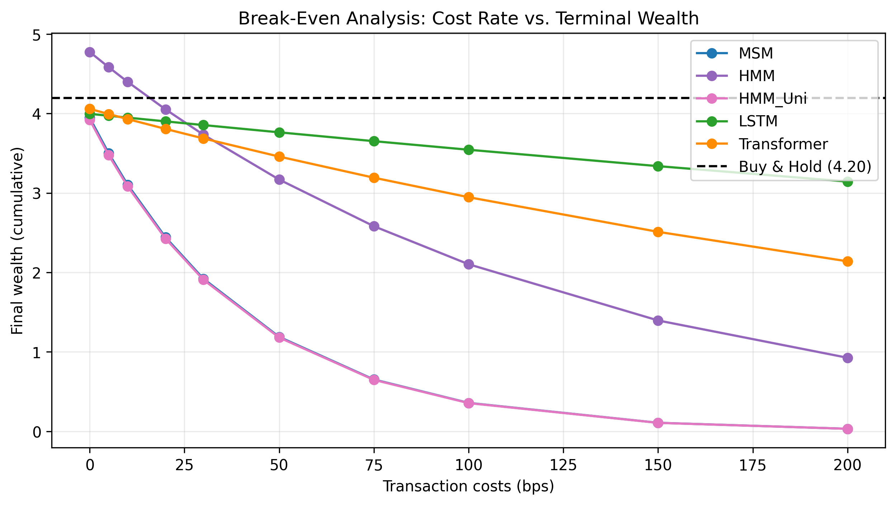

### Withdrawal Rate Sensitivity (3.5% / 4% / 5%)
Robustness of the SORR results under varying annual withdrawals.

| Strategy    | ('Terminal Capital', '3.5%')   | ('Terminal Capital', '4.0%')   | ('Terminal Capital', '5.0%')   | ('Status', '3.5%')   | ('Status', '4.0%')   | ('Status', '5.0%')   |
|:------------|:-------------------------------|:-------------------------------|:-------------------------------|:---------------------|:---------------------|:---------------------|
| Buy_Hold    | 855,415 €                      | 681,766 €                      | 334,470 €                      | Capital preserved    | Capital preserved    | Capital preserved    |
| HMM         | 380,857 €                      | 284,202 €                      | 90,893 €                       | Capital preserved    | Capital preserved    | Capital preserved    |
| HMM_Uni     | 725,828 €                      | 604,112 €                      | 360,682 €                      | Capital preserved    | Capital preserved    | Capital preserved    |
| LSTM        | 1,333,328 €                    | 1,154,248 €                    | 796,088 €                      | Capital preserved    | Capital preserved    | Capital preserved    |
| MSM         | 740,590 €                      | 619,195 €                      | 376,406 €                      | Capital preserved    | Capital preserved    | Capital preserved    |
| Transformer | 713,483 €                      | 601,130 €                      | 376,425 €                      | Capital preserved    | Capital preserved    | Capital preserved    |

---

## Research Notes & Methodology
- **Cash component:** On a "bear" signal, the strategy reallocates into the current money market rate (**^IRX**).
- **Look-ahead bias prevention:** All signals are shifted by one day for the backtesting (`shift(1)`) to simulate real trading conditions.
- **Feature set:** The models use returns, volatility (20d), SMA distance, momentum, VIX, and yield spread.
- **Cost simulation:** A flat fee of 10 basis points (0.1%) is charged per reallocation.
- **SORR specifics:** For withdrawals during "bull" phases, an additional liquidity fee of 0.1% is charged on the withdrawal amount (asset sales). In "bear" phases (cash), this fee does not apply.

---

## Model Persistence

Model persistence status for this pipeline run:

- **Persistence:** ENABLED
- **Model directory:** `../models`

| Model | File | Status |
|:---|:---|:---|
| MSM | `msm_regime_model.pkl` | Newly trained |
| HMM | `hmm_regime_model.pkl` | Newly trained |
| LSTM | `lstm_regime_model.keras` | Newly trained |
| TRANSFORMER | `transformer_regime_model.pt` | Newly trained |

> **Note:** With persistence enabled, pre-trained models are loaded from `../models` if the files exist. Otherwise, training runs normally and the result is stored for future runs. When hyperparameters change, the corresponding model files must be deleted.

---

**Last updated:** 2026-08-08 15:03 
**End date:** `2026-07-31` 
**Fast mode status at runtime:** FALSE (Full Run) 
**Walk-forward validation:** ENABLED (mode: rolling, train: 10y, test: 12m, step: 12m) 
**Model persistence:** ENABLED 
*Generated by the Backtest Service (reporting).*
